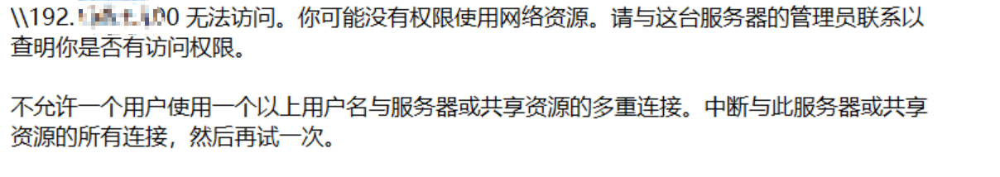

# Samb


## 新增samb用户root

```shell
smbpasswd -a root
```

## 启用 `root` 用户

```shell
smbpasswd -e root
```

## 检查 Samba 配置

```shell
testparm
```

## 设置正确的文件夹权限

```shell
chown root:root /mnt/sda4/mi-share
chmod 700 /mnt/sda4/mi-share
```

## 删除缓存

```shell
rm -rf ~/.smbcredentials
```

## 重启

```shell
service samba4 restart
```

## 修改密码

> **特别注意。 重置密码后， 需要重启samba4**

```shell
smbpasswd root
```

Windows连接成功过一次后，服务器修改了账户密码，用新密码登录提示以下信息



用管理员身份打开**cmd**，并且执行**`net use * /del /y`** 即可中断开所有连接。然后用新密码重新连接即可


