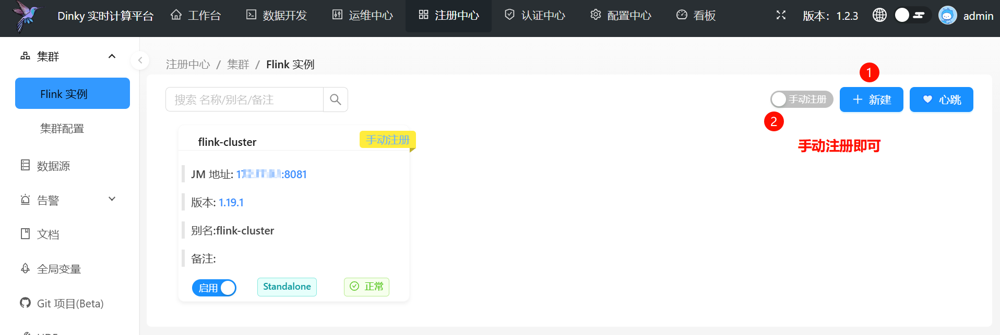
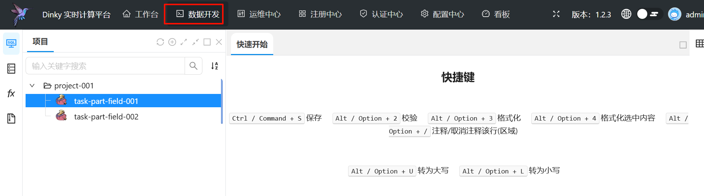

# Flink_CDC同步MySQL到StarRocks初体验
## [安装flink](https://nightlies.apache.org/flink/flink-cdc-docs-release-3.3/zh/docs/get-started/quickstart/mysql-to-starrocks/)

> 建议搭建初期, 使用官网提供的flink cdc sql在sql-client.sh中测试,根据错误提示添加对应的包

```bash
mkdir -p /app
wget https://archive.apache.org/dist/flink/flink-1.19.1/flink-1.19.1-bin-scala_2.12.tgz
tar -zxvf flink-1.19.1-bin-scala_2.12.tgz
cd flink-1.19.1
echo "execution.checkpointing.interval: 3000" >> /app/flink-1.19.1/conf/config.yaml
cd /app/flink-1.19.1/lib
# flink 1.19推荐下载3.3.0 connector包,如果直接使用flink,不使用dinky,完全没问题
# 由于我这边使用的dinky是1.2.3版本,3.3.0 connector包不兼容. 所以使用测试通过的包,如下
wget https://repo1.maven.org/maven2/com/ververica/flink-sql-connector-mysql-cdc/2.1.0/flink-sql-connector-mysql-cdc-2.1.0.jar
chmod +rwxrwxrwx flink-sql-connector-mysql-cdc-2.1.0.jar

wget https://repo1.maven.org/maven2/com/starrocks/flink-connector-starrocks/1.2.10_flink-1.19/flink-connector-starrocks-1.2.10_flink-1.19.jar
chmod +rwxrwxrwx flink-connector-starrocks-1.2.10_flink-1.19.jar
wget https://repo1.maven.org/maven2/mysql/mysql-connector-java/8.0.27/mysql-connector-java-8.0.27.jar
chmod +rwxrwxrwx mysql-connector-java-8.0.27.jar
# 至此, 依赖包齐活
# flink默认是localhost访问,如果要允许其他IP访问.
# 需要修改 bind-host: localhost,localhost改为0.0.0.0 多处需要修改
# 需要修改 rest下的address为0.0.0.0

# 启动flink,执行1次增加1个task slot, 可以多次执行
# 每次启动的task slot 可以在config/config.yaml文件中修改numberOfTaskSlots的值
/app/flink-1.19.1/bin/start-cluster.sh

# 至此,flink准备完毕
```

## 安装MySQL和starrocks

docker-compose.yml

```yaml
version: '2.1'
services:
  StarRocks:
    image: starrocks/allin1-ubuntu:3.2.6
    environment:
      # 如果没有指定密码,启动后进入容器后,执行ALTER USER 'root' IDENTIFIED BY 'eishees4saez3kaepei3Yi8am2oonguG';进行修改也行
      - STARROCKS_ROOT_PASSWORD=eishees4saez3kaepei3Yi8am2oonguG
    ports:
      - "8080:8080"
      - "9030:9030"
  MySQL:
    image: debezium/example-mysql:1.1
    ports:
      - "3306:3306"
    environment:
      - MYSQL_ROOT_PASSWORD=fiesug4Oji0be1ohk6oyae3EomaNg8uc
      - MYSQL_USER=mysqluser
      - MYSQL_PASSWORD=Aix5Airohth1ma3oSh3meHiijei6Usah
```

安装并启动

```bash
docker-compose up -d
```

## 安装dinky

> 经过发现这个版本的镜像,重启后不会报错.相对稳定

```bash
docker run -itd --network=nginx_ngu_network \
 --name dinky dinkydocker/dinky-standalone-server:1.1.0-flink1.18
```

### dinky配置

```bash
docker exec -it dinky bash 
cd extends/flink1.19
wget https://repo1.maven.org/maven2/com/starrocks/flink-connector-starrocks/1.2.10_flink-1.19/flink-connector-starrocks-1.2.10_flink-1.19.jar
# 此处用的版本和flink中引用的不一样.但是经过测试,是完全兼容的,可放心食用
wget https://repo1.maven.org/maven2/com/ververica/flink-sql-connector-mysql-cdc/2.4.1/flink-sql-connector-mysql-cdc-2.4.1.jar
# 至此, dinky中的jar包配置完成
# 退出容器
exit
# 重启dinky
docker restart dinky
```

### 访问dinky http://localhost:8888

> 用户名: admin 密码 :dinky123!@# 
>
> 登录后尽快修改密码

### dinky控制台配置单独安装的flink



### 新建任务并提交即可



### 任务示例

```sql
CREATE TABLE IF NOT EXISTS `orders1_src` (
  `order_id` BIGINT NOT NULL,
  `dt` DATE NULL,
  `user_id` INT NULL,
  `good_id` INT NULL,
  PRIMARY KEY (`order_id`) NOT ENFORCED
)
with
  (
    'username' = 'root',
    'password' = 'taedohlahsoow7ebiath6Iaf2uokagah',
    'database-name' = 'tmp_test',
    'table-name' = 'orders1',
    'connector' = 'mysql-cdc',
    'hostname' = '172.20.0.10',
    'port' = '3306',
    'server-time-zone' = 'Asia/Shanghai',
    'debezium.poll.interval.ms' = '200', -- Binlog轮询间隔（200ms）
    'scan.incremental.snapshot.chunk.size' = '1000', -- 减少快照分块大小
    'heartbeat.interval' = '1s' -- 心跳间隔（保活连接）  .默认为0.如果设为 0，可能因连接闲置被数据库服务器关闭
  );

CREATE TABLE IF NOT EXISTS `orders1_sink` (
  `order_id` BIGINT NOT NULL,
  `dt` DATE NULL,
  `user_id` INT NULL,
  `good_id` INT NULL,
  `good_name` STRING NULL,
  PRIMARY KEY (`order_id`) NOT ENFORCED
)
with
  (
    'sink.max-retries' = '10',
    'password' = 'kuutooP2Daeghezi0thieyej5quiFace',
    'sink.properties.strip_outer_array' = 'true',
    'load-url' = '10.0.0.2:8030',
    'database-name' = 'quickstart',
    'jdbc-url' = 'jdbc:mysql://10.0.0.2:9030',
    'sink.properties.format' = 'json',
    'username' = 'root',
    'sink.buffer-flush.interval-ms' = '15000',
    'connector' = 'starrocks',
    'table-name' = 'orders1',
    'sink.properties.format' = 'json',
    'sink.properties.strip_outer_array' = 'true',
    'sink.properties.partial_update' = 'true',
    'sink.properties.columns' = 'order_id,dt,user_id,good_id',
    -- 关键参数：控制写入频率
    'sink.buffer-flush.interval-ms' = '1000', -- 1秒刷写一次
    'sink.buffer-flush.max-rows' = '64000', -- 每批次最多64000行
    'sink.properties.format' = 'json',
    'sink.properties.strip_outer_array' = 'true'
  );

insert into
  orders1_sink (order_id, dt, user_id, good_id)
select
  s.order_id,
  s.dt,
  s.user_id,
  s.good_id
from
  orders1_src s;
```


## 遇到的问题记录

### 1. dink提交任务,无异常,也没有执行成功
首选在dinky提交任务,因为直观简单.
如果遇到提交任务后,无异常,也没有执行成功的问题排查.在flink的sql-clent.sh中运行调试,会看到对应的错误日志

### 2. 如果选用的mysql镜像是mariadb:11.7.2,需要设置时区和binlog

- 设置时区+8

- 设置binlog

  - ```bash
    cd /etc/mysql/mariadb.conf.d
    cat > 61-binlog.cnf << 'EOF'
    [mysqld]
    # 启用二进制日志
    log_bin = mysql-bin
    # 设置二进制日志格式为 ROW
    binlog_format = ROW
    # 设置服务器ID（主从复制需要）
    server_id = 1
    EOF
    ```

  - 退出容器,并且重启即可  `docker restart mariadb`

## 其他

### 停止所有的flink, 慎用

```bash
jps -l | grep -i flink | awk '{print $1}' | xargs kill -9
```

### MySQL相关

```sql
-- 确认 binlog_format 已改为 ROW
SHOW VARIABLES LIKE 'binlog_format';

--是否开启binlog
SHOW VARIABLES LIKE 'log_bin';

-- 查看时区
SELECT @@global.time_zone, @@session.time_zone;
```

不要直接修改my.cnf , 从容器中在/etc/mysql看到my.cnf来自于`my.cnf -> /etc/alternatives/my.cnf`

配置在`mariadb.conf.d`下新增或修改
