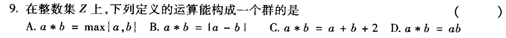
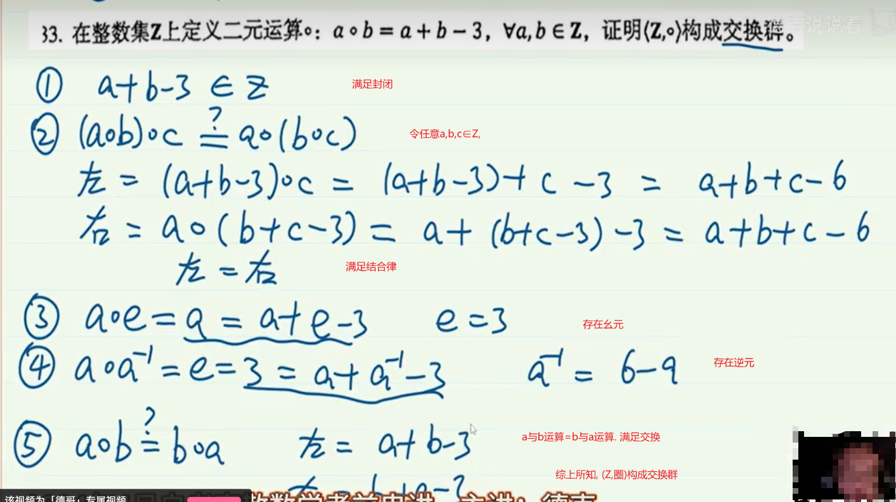

2011年4月

------

2011年7月

> 参考答案: C

---

>

---

---

单位元就是幺元

公式有两个

> 特别注意: a取个体域上的任意值

- a*e=a

- a*a⁻¹=e

---

---

---

## 群

群满足以下几个特性:

- 封闭性 a和b运算后的结果还在作用域中 , 如A集合={1} , a*b=a, 如 1x1=1
- 结合律
- 有幺元
- 有逆元

在群的基础上, 如果满足交换, 则构成 **交换群**

---

