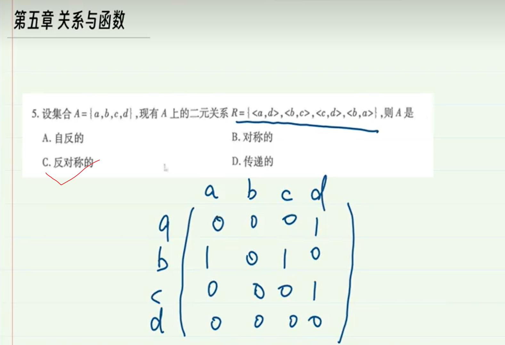
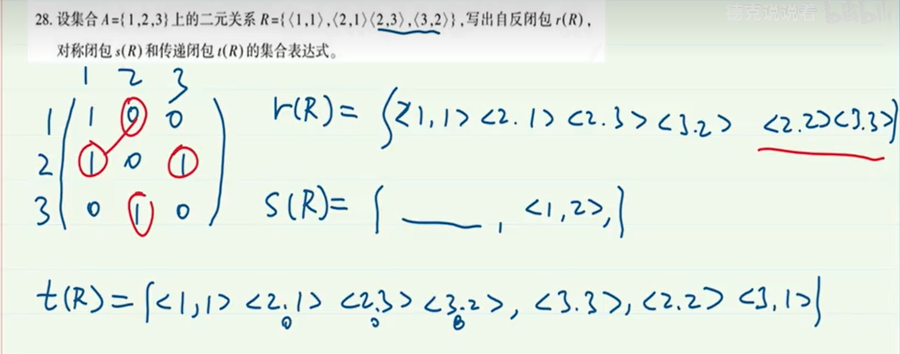
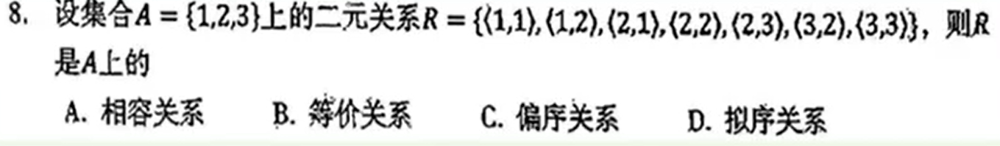
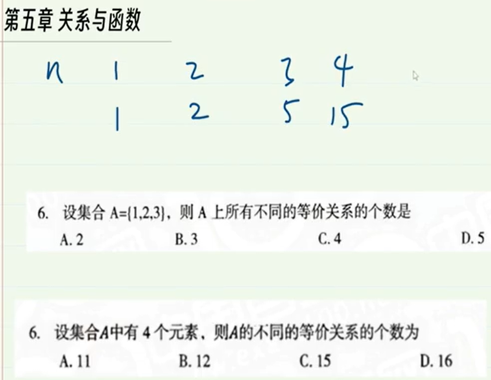
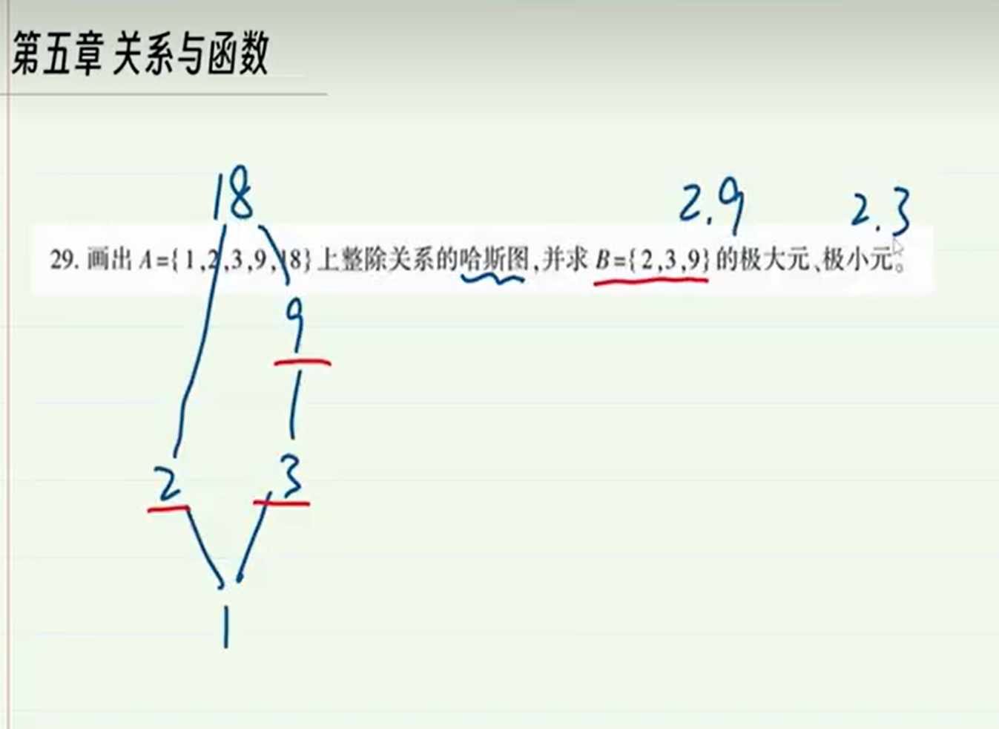
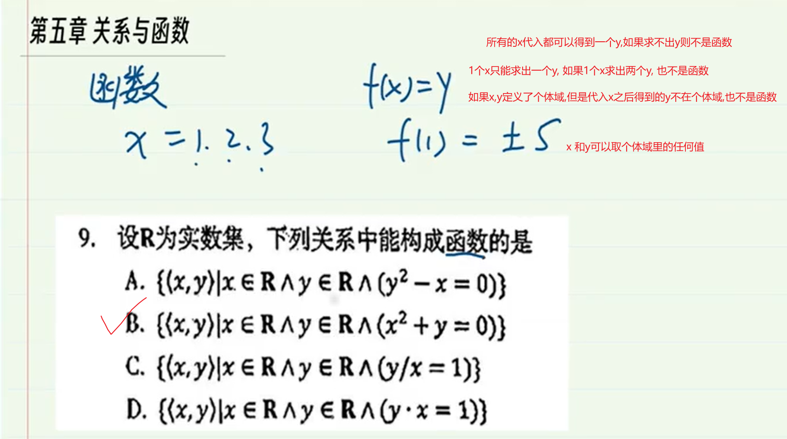
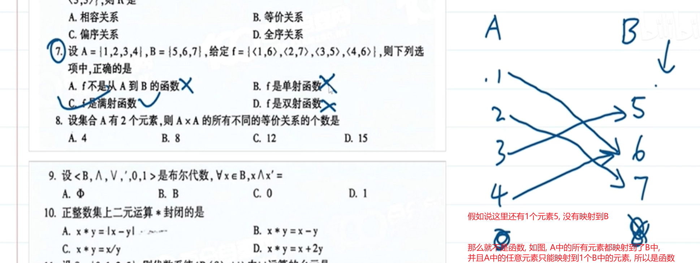

> 解析
>
> 自反性: 每个元素都有环, 首先a元素不存在环<a,a>,所以不是自反的
>
> 反自反性: 用矩阵分析,主对角线全是0
>
> 对称性: 主对角线两边的元素完全对称,对角线上的元素没要求
>
> 反对称性: 
>
> 传递性就是二元关系R中的任意两个元素求复合关系,得到的结果都在R中, 如题 <b,c>复合<c,d>得到<b,d>, 在R中没找到,所以不存在传递性

---

---

---

---

---

> 非常注意: 上面说的, 对于函数, 一个x不会存在两个y,反过来讲, 一个y可以存在多个x,比如y=f(x) , y=x的平方
>
> 注意: x取满是函数的基本条件.也就是说,x可以取个体域内的任意值

---

---

