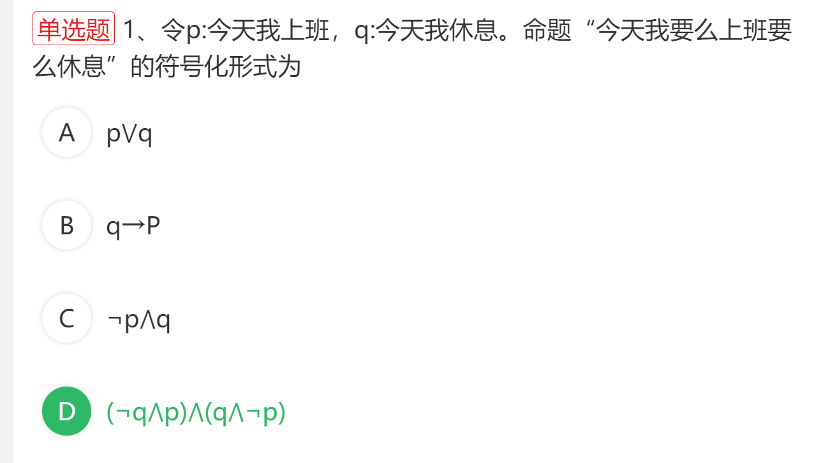

2023年10月

> 解析: 只有…才, 是典型的后推前. 其他的全都是前推后
>
> 解题注意点: 
>
> - 是否为 只有….才, 注意这个一定是后推前
> - 把命题符号代入到命题中, 避免顺序看错了
> - 带不的非命题一定要注意, 别搞错了. 
> - 做完题后别着急做下一题, 适当看看其他选项, 避免武断答题
> - 遇到要么…要么… 要高度重视. 很有可能是异或, 不要选错.
> - 答完题后把符号化转换为命题,看看有没有违和感. 符号化后一定要符合题意

