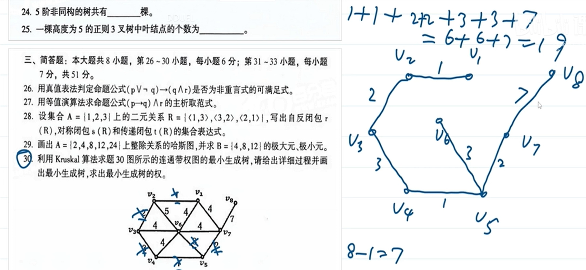
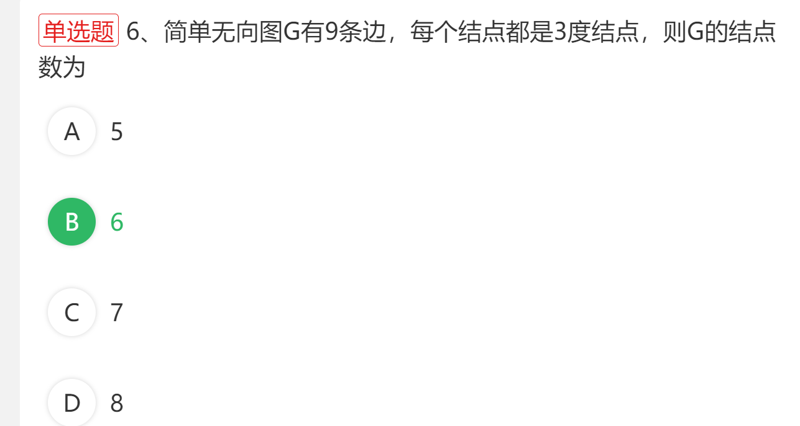
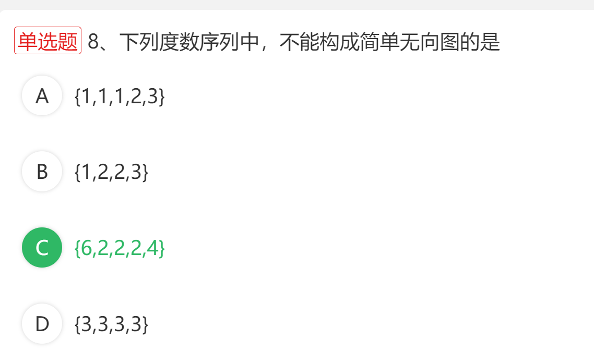
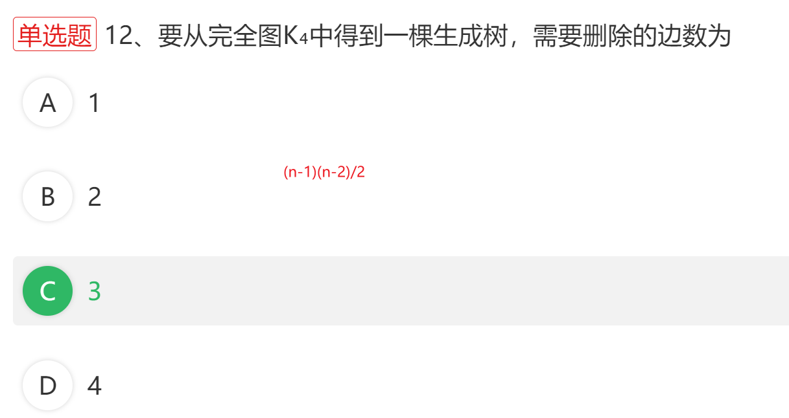

> 解析:
>
> 对于克鲁斯尔算法求最小生成树的题目
>
> 1. 保留所有的点, 去除所有的边
> 2. 然后从权数最小的开始还原边, 如果还原边后,没有形成圈,就保留, 形成了圈,就删除这个导致形成圈的边
> 3. 边数=结点数-1, 所以当边的数量还原到结点数-1时, 最小生成树已画出
>
> 
>
> 最小生成树的权=最小生成树每条边上的权数之和

---

> 解析: 结点数之和=2*边数     3n = 2X9  => n = 6

---

> 解析: 任意结点的最大度数为结点数-1, C选项中结点数为5,所以任意结点的最大度数是4
>

---

---

