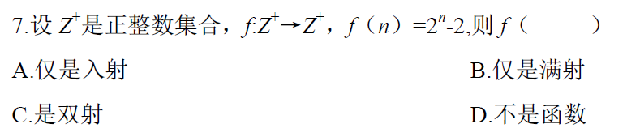
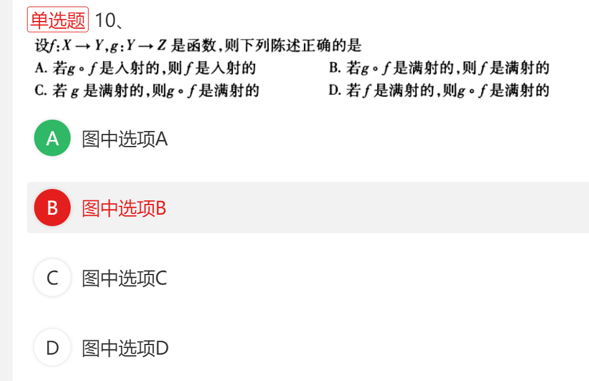
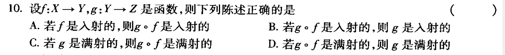
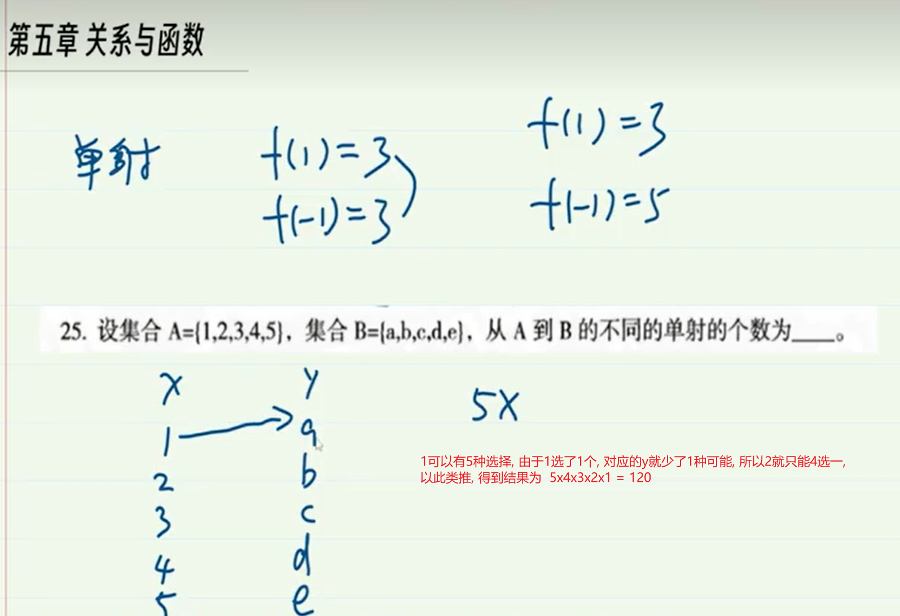
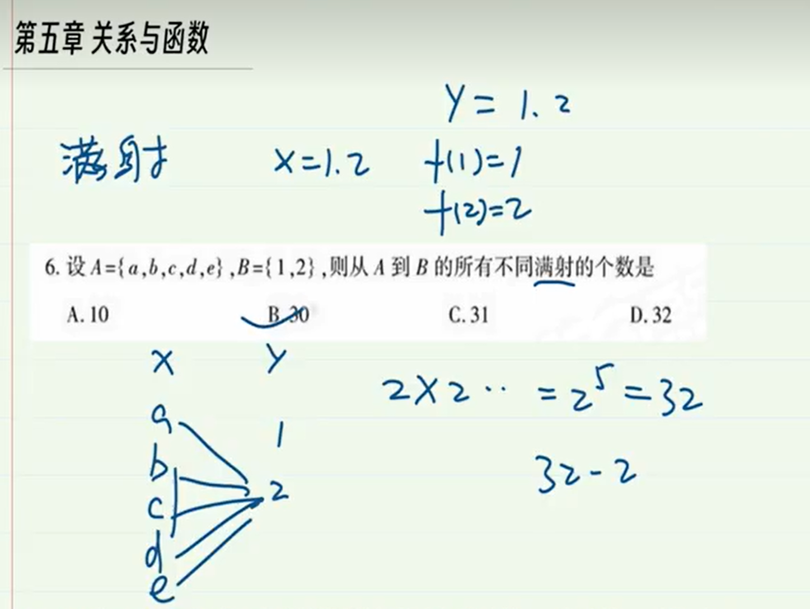
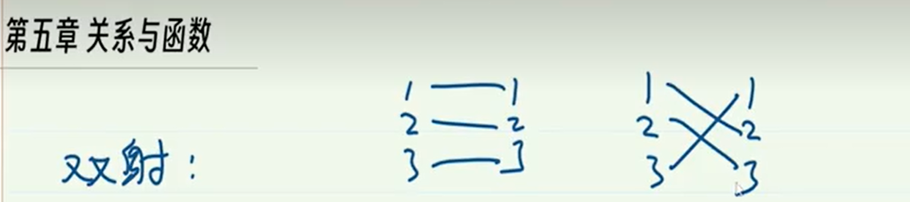
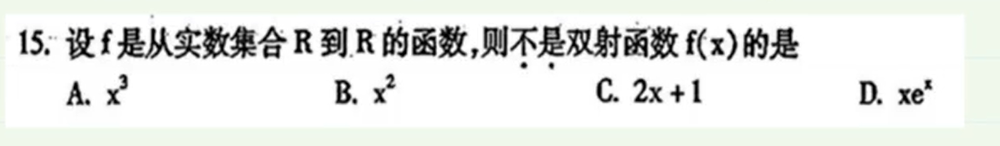
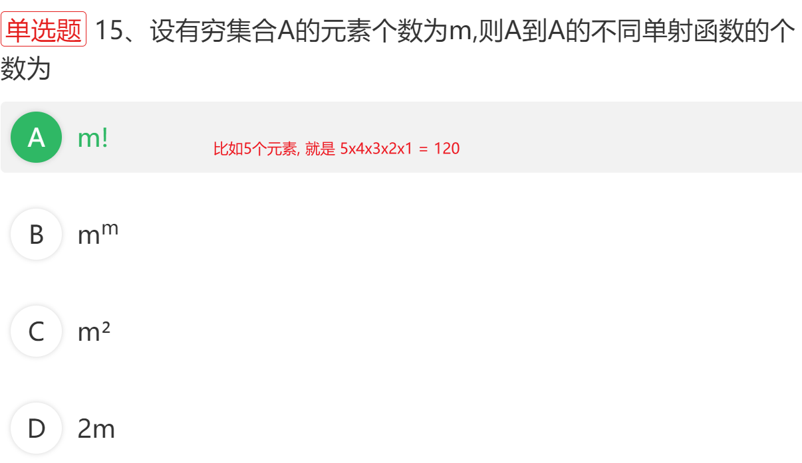

2010年4月真题

> 参考答案: D
>
> 2的0次方-2=-2, -2 不是正整数. 所以不满足题目. 则f不是函数.
>
> 判断射的前提是必须满足函数. 都不是个函数了,就没必要判断射

---

全国 2010 年 7 月

> 参考答案: A

---

2011年4月

>  

---

2011年7月

> 参考答案: D

---

---

> 单射就是任意x,对应的f(x)的值都不相同,例如f(1)=3和f(-1)=3是个函数,但不是单射,因为多个x的值对应了一个y

---

满射: y取满,表示y中的任意一个元素都能被某个x做函数运算得到

 

双射=单射+双射,既满足单射,同时又满足满射. 一一对应

> 参考答案: B
>
> 不是双射等价于, 不是单射或者不是满射. C答案, x=-1 和 x=1得到的结果都是1, 这不满足单射.所以不是双射

---

