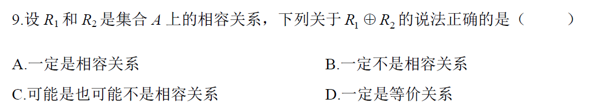
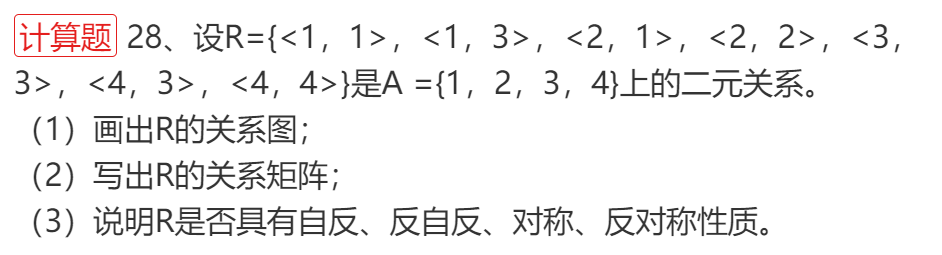

2010年4月真题

> 参考答案: C
>
> 解析: 

[判定参考](https://www.cnblogs.com/yhzyl/p/15837018.html)

- 自反性：
  - 关系矩阵:主对角线上所有元素值都为1
  - 关系图:每个结点存在自环
- 反自反
  - 关系矩阵:主对角线上所有元素值为0
  - 关系图:每个结点都没有自环
- 对称性
  - 关系矩阵:沿主对角线对称，对角线上元素没有要求
  - 关系图:边只存在自环以及双向箭头(即若存在2到3的关系，必然存在3到2的关系)两种
- 反对称性
  - 关系矩阵沿主对角线对称的任意两个元素，要么全0，要么一个0一个1，不存在全1的情况，对角线上元素没有规定
  - 关系图两个顶点间只存在一条边，或者不存在边，每个元素允许存在自环但不强求必须存在
- 非对称性
  - 关系矩阵沿主对角线对称的任意两个元素，要么全0，要么一个0一个1，不存在全1的情况，对角线上元素必须全为0
  - 关系图两个顶点间只存在一条边，或者不存在边，每个元素都无自环
- 传递性
  - 任意两个元素做复合运算,结果还在这个集合中, 说明具有对称性,比如关系R={<1,2>,<2,1>,<1,1>}
  -  关系图中若存在a到b的有向边及b到c的有向边，则必定存在a到c的有向边，验证所有边满足这个性质的才具有传递性

---

> 参考答案: B

---

2010年4月真题

> 参考答案  
>
> { ＜1，1 ＞， ＜2，2＞，＜ 1，2 ＞，＜ 2，1 ＞}，{{1，2}}，（或（＜ 1，1 ＞，＜2，2 ＞}，{{1}，{2}}）

---

全国 2010 年 7 月

> 参考答案: B

---

2010年4月真题

> 参考答案: D

---

2011年4月

---

2011年7月

> 参考答案: C

---

2011年4月

---

2011年7月

---

