2010年4月真题

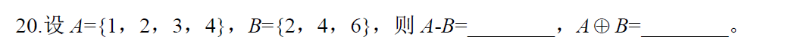

> 参考答案: 
>
> A-B 很简单,就是从A中存在于B中的元素全部去掉. 答案自然就是{1,3}
>
> 特别注意 第二个运算, 不仅仅是+, 表示两个集合相加,并且去掉交集= (AUB)-(A∩B)

---

全国2011年4月

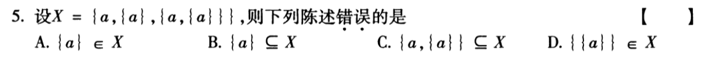

> 参考答案: D
>
> 解析: 集合中包含了集合的情况极其容器混淆.为了防止混淆,可以用替换的方式区分
>
> X集合替换后等价于X={a,b,c}
>
> 其中a=a, b={a}, c={a,{a}} 
> 再来看答案 A: b 属于X  正确,    B: b是X的真子集, 正确, C:c是X的真子集,正确.  排除法选D
>
> 再看D哪里错了, 不存在{{a}}这么个元素在X中

---

全国2011年4月

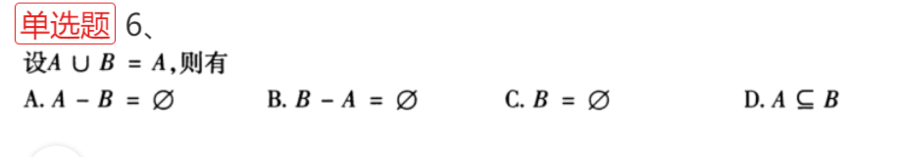

>参考答案: B 
>
>AUB=A,说明A>=B, 也就是A可能比B大,也可能是A和B一样
>
>A选项, A中去掉B集合, 可能为空集, 也可能还有A中其他的元素,比如A>B的情况
>
>B选项, B集合的元素全在A中, B-A, 表示把B中元素全部减去, 得到的一定是空集
>
>C选项, B可以不为空
>
>D选项错. B属于A

---

2011年4月

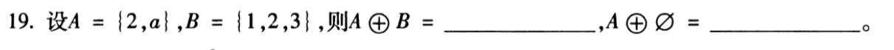

> 参考答案:
>
> {1,3,a}
>
> {2,a}

---

2011年4月

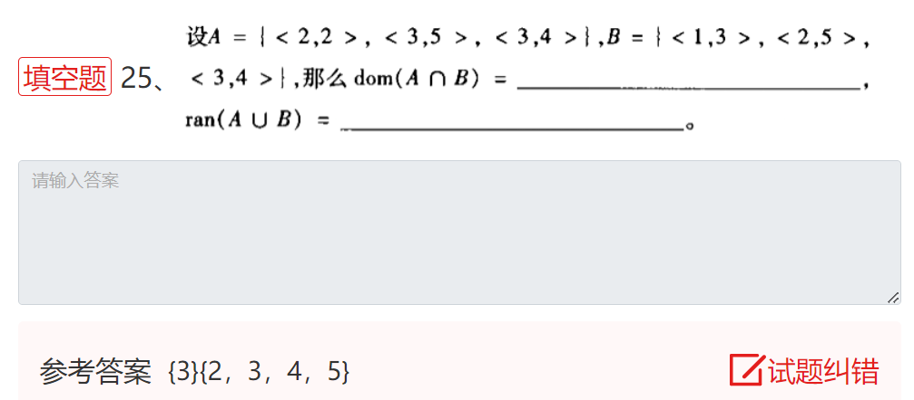

>  解析: 
>
>  dom表示有序对的定义域, 结果是集合
>
>  ram表示有序对的值域, 结果是集合
>
>  A∩B=找到两个集合重复的集合={<3,4>},  dom{<3,4>}就是{3}, 也就是取集合中每个有序对的第一个元素
>
>  A∪B=两个集合合并并且重复项保留一个={<1,3>,<2,2>,<2,5>,<3,4>}, ran(A∪B)就是求AB并集后的每个有序对的第二个元素的集合,所以得到结果为{2,3,4,5}

---

2011年7月

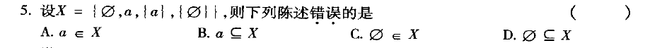

> 参考答案 B

---

2011年7月

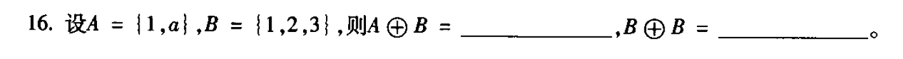

> 参考答案: 
> {2,3,a}
> ∅

---

2011年7月

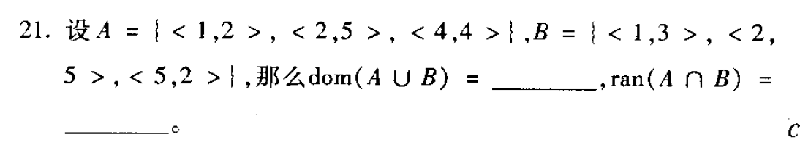

> 参考答案: 
>
> {1，2，4，5}
>
> {5}

---

> 解析:
>
> 并集的dom直接取两个集合中每个元素的第一个元素组成的新集合,然后重复元素保留一个,从小到大排序得到一个新集合即可
>
> 交集的ran,先求交集, 取每个有序对的第二个元素,重复元素保留一个,排序得到新集合

---

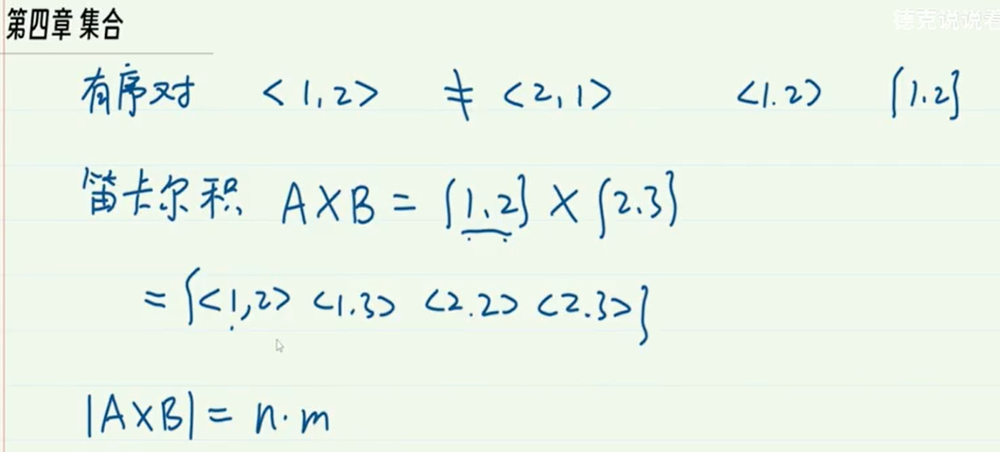

---

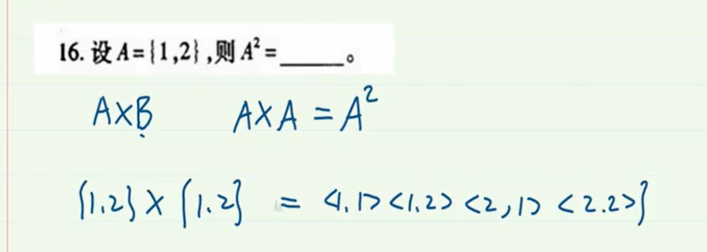

---

> 

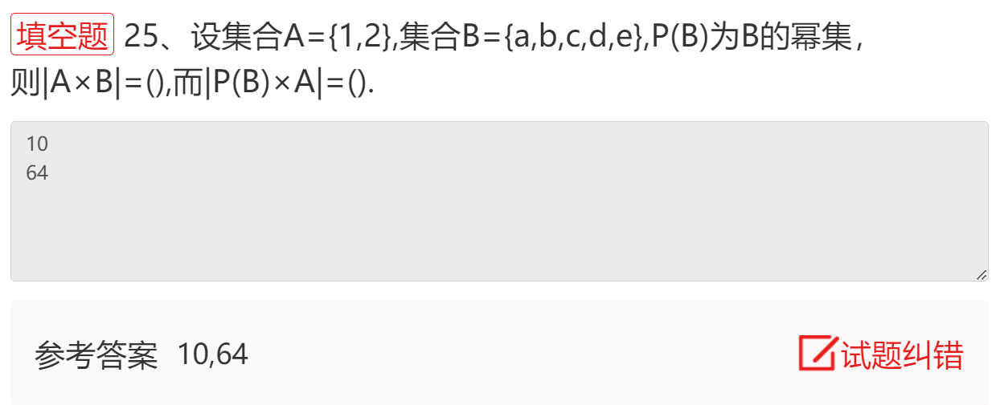
