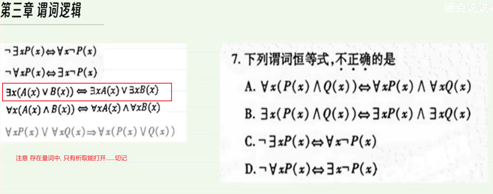

全国 2010 年 7 月

> 参考答案: A
>
> 简记: log2Z+是单射

---

一个n阶连通图G,则其关联矩阵的非零元素个数最少为2(n-1)个

---

减法不满足交换律. 比如1-2≠2-1,那肯定就不满足结合律

特别注意: 减法的绝对值, 满足交换律,但是绝对值的减法也不满足结合律 比如 |1-2-3| ≠|3-2-1|

加法,乘法 满足交换律 结合律

---

一棵5阶无向树T,其非同构的树共有3棵

---

做真题的过程中, 发现有这样的规律:     (A⋁B)⋀(GVH)=(A⋁G) ⋀ (A⋁H) ⋀ (B⋁G) ⋀ (B⋁H)

笛卡尔积定理公式

Ax(BUC) = (AxB)U(AXC)

AX(B∩C)=(AxB)∩(AxC)

(AUB)xC=(AxC)U(BxC)

(A∩B)XC=(AxC)∩(BxC)

---

**全部的合取,存在的析取可以双向打开.必考**

---

任意两个不同小项的合取式必为矛盾式.每个小项有1个成真赋值, 有2的n次方-1个成假赋值

任意两个不同大项的析取式必为重言式

小项 0  每个元素之间是合取式,如P⋀Q⋀R , 小m表示, 如m100  只需要记住这个. 大项反过来即可.

大项1  每个元素之间是析取式,如PVQVR,大M表示,如M001

---

无向图 任意顶点的最大度数=顶点数-1   顶点数之和=2边数

---

设A={3z|z∈Z},运算为实数加法+和乘法*,则构成的代数系统是环

---

素数又叫做质数,20以内的素数:  2,3,5,7,11,13,17,19, 即约数是他自己和1

---

一个连通且无回路的无向图称为树

> 树不存在回路. 所以肯定不存在环

- 无回路,且任何两个顶点有唯一一条路
- 无回路,且有n个结点, n-1条边   , 即  边数 = 结点数-1
- 连通的, 但是删除任何一条边后便不再连通
- 无回路,但是增加任何一条边,将得到唯一的一个回路

> 需要注意的是: 要带上无回路/连通的, 这样的约束条件, 后面的才成立.反之不成立,如下图

---

比如, 有n个节点,n-1条边.不一定是树.  下图中存在了回路. 所以要加无回路的限制条件

-

---

一个n阶无向简单图G,它的边最多有 n(n-1)/2条

---

一个5阶无向树,其非同构的树共有3棵树

6阶的有4棵树 P161

---

一个n阶连通图G,则其关联矩阵的非零元素个数最少为 2(n-1)个

---

