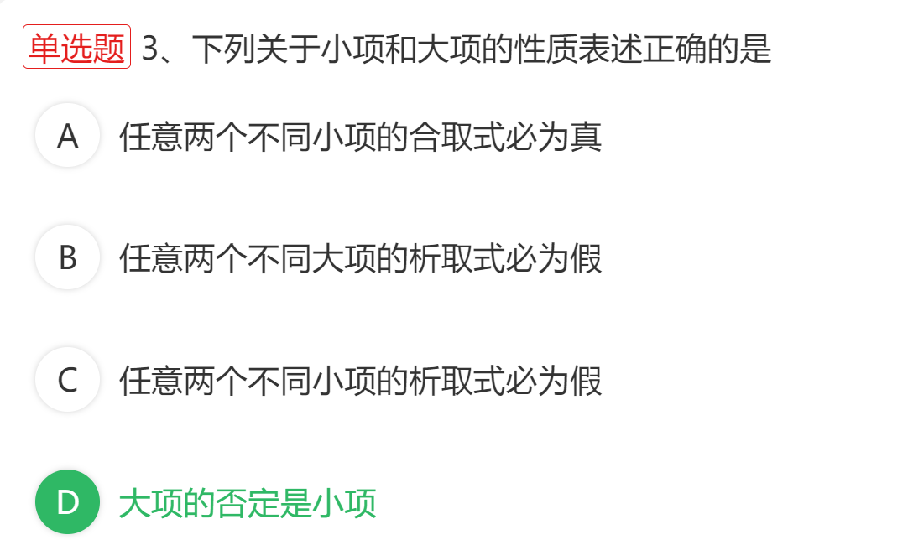

1. 选择题: 命题符号化,看到一个之后不要直接选, 保险起见,再用一下排除法,验证其他的错误.避免选错

2. 求范式的时候, 原式一定要抄写正确, 即草稿纸上抄写完原式后, 要核对一遍, 并且书写工整,避免字体缭乱,导致算错,注意大小写

3. 等值演算得到的合取范式一定要排序

4. 快速得出答案的题一定要留点时间检查一下.避免鲁莽

5. 等值演算主范式的时候注意符号用双向箭头,表示相互可推导 <=>

   

