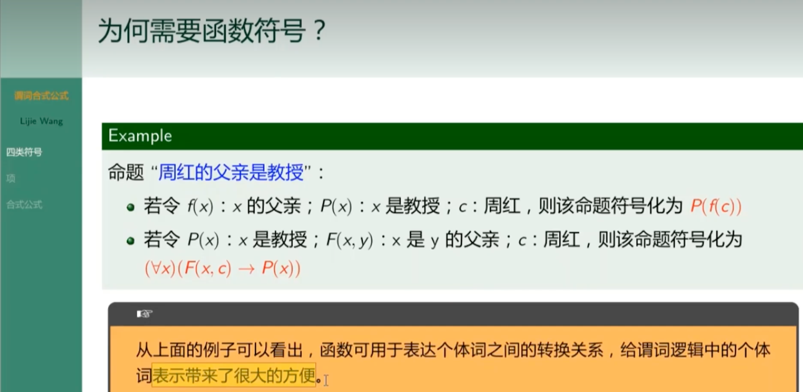
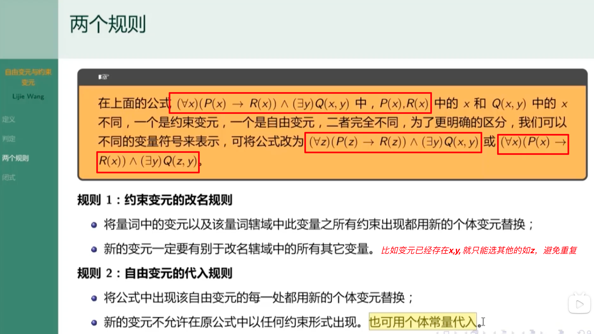
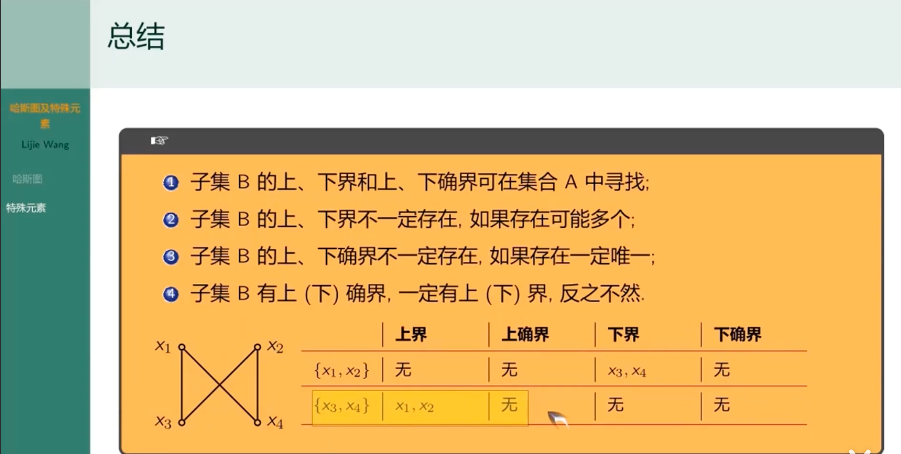
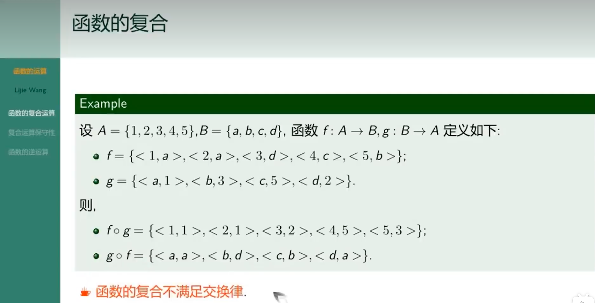

## 个体词

---

## 谓词

---

## 复合命题的谓词符号化

### 总结

 

## 量词

---

---

---

## 符号函数

---

### 自由变元和约束变元

---

#### 举例

###  两个规则

---

 

## 闭式

 

##   自反性与反自反性

---

 

## 对称性与反对称性

## 传递性

##  关系性质的保守性

---

## 闭包求解

---

## 利用关系运算求闭包

---

## 哈斯图

---

## 最大元和最小元

---

## 极大元和极小元

---

### 总结

## 上下（确）界关系总结

 

---

## 全序关系的哈斯图

---

## 良序关系

## 函数

---

###  函数的数量

---

### 关系和函数的差别

 

### 函数类型

---

### 函数的复合

---

---

### 保守性

 
