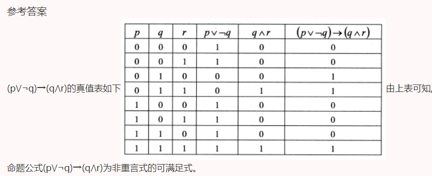

### 是否为非重言式的可满足式

##### 简答题  26、用真值表法判定命题公式(pV¬q)→(q⋀r)是否为非重言式的可满足式

> 2023年4月
>
> 不是矛盾式,则成为可满足式
>
> =>由定义得:可满足式有1
>
> 分析题目: 重言式:即全为1, 非重言式则有0
>
> 简单记忆: 非真言式有0,可满足式有1

真值表的要领: 写完表格.记得核对每一个变元,以及每一个连接词. 

易错点: p q混淆, 忘记¬或者多写¬

> 扩展, 用等值验算+真值表法求主析取范式,主合取范式

主合取范式:

> (pVqVr)⋀(pVqV¬r)⋀(¬pVqVr)⋀(¬pVqV¬r)⋀(¬pV¬qVr)

主析取范式:

> (¬p⋀q⋀¬r)V(¬p⋀q⋀r)V(p⋀q⋀r)

---
由真值表可知: 真值表全值-主析取范式=主合取范式

另外: 永真式的主合取范式是T

##### 简答题  27、用等值演算法求命题公式(p→q)Λr的主析取范式。

