# UML 

内容来自哔哩哔哩 【「软件设计师」 上午题 #8 UML】[https://www.bilibili.com/video/BV1a44y1K7HH?p=17&vd_source=9b8c66469d7ef16dfa8f33c398331cdb](https://www.bilibili.com/video/BV1a44y1K7HH?p=17&vd_source=9b8c66469d7ef16dfa8f33c398331cdb)

2024年11月16日22:14

---

## 泛化、关联

---

## 依赖、关联、聚集（聚合）、组合、泛化、实现

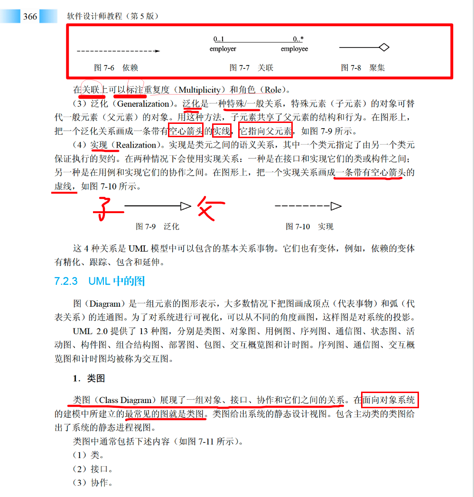

---

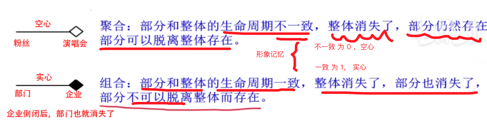

---

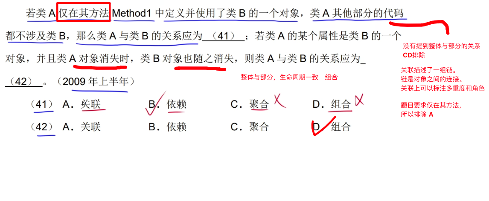

---

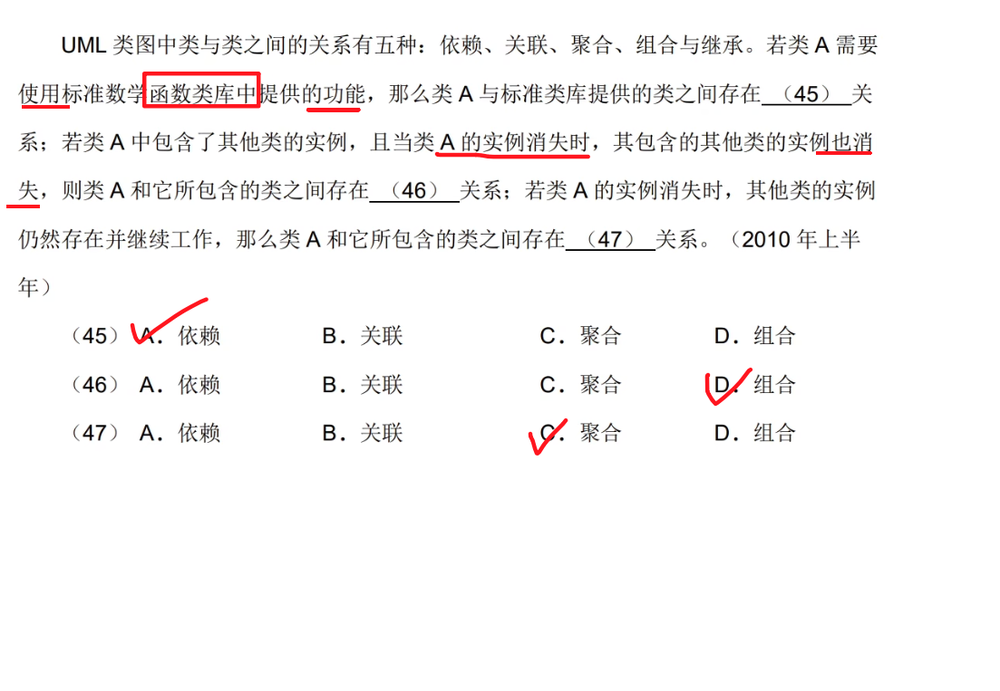

---

---

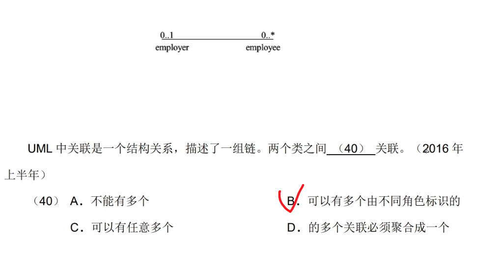

---

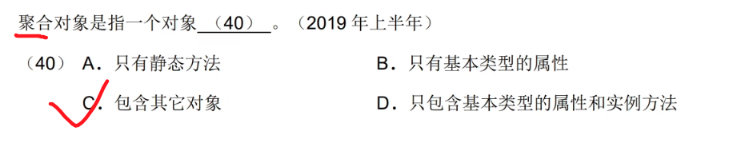

---

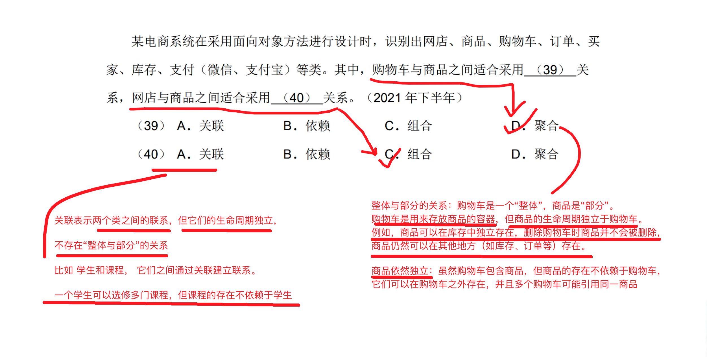

---

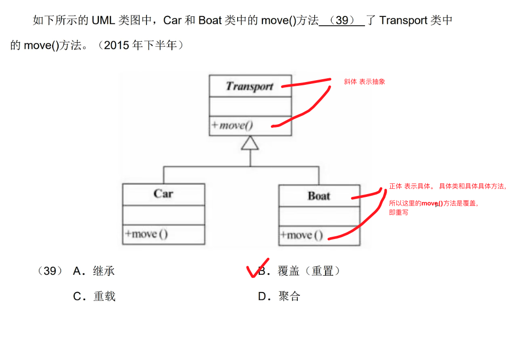

---

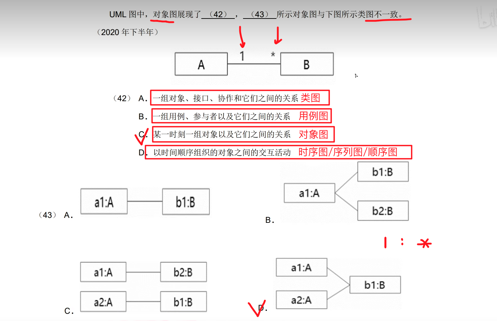

----

## 包含关系

2024年11月18日21:56:01

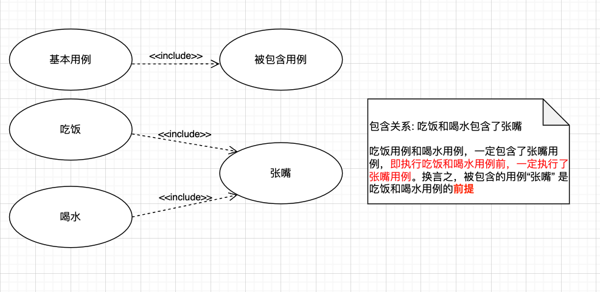

---

## 扩展关系

zst原话：一个用例执行时，可能发生一些特殊的情况或者可选的情况，这些情况就是这个**基本用例**的**扩展用例**

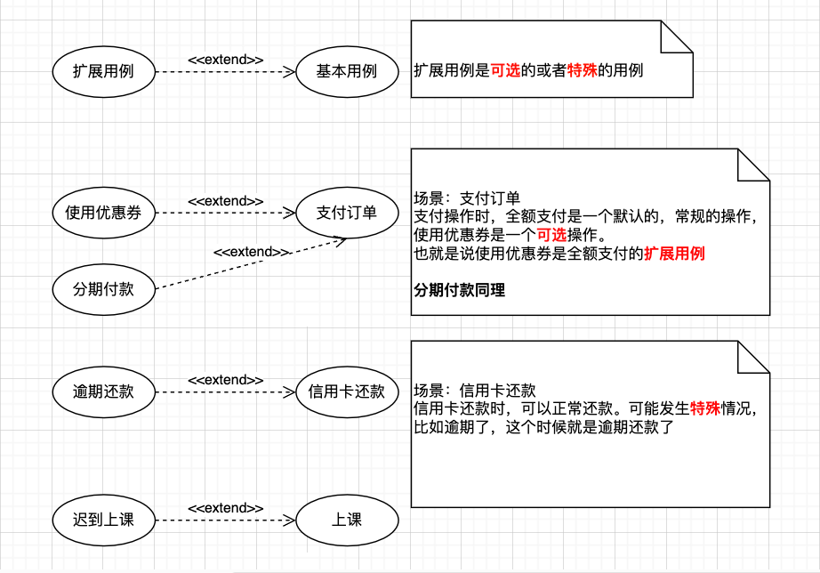

---

## 泛化

