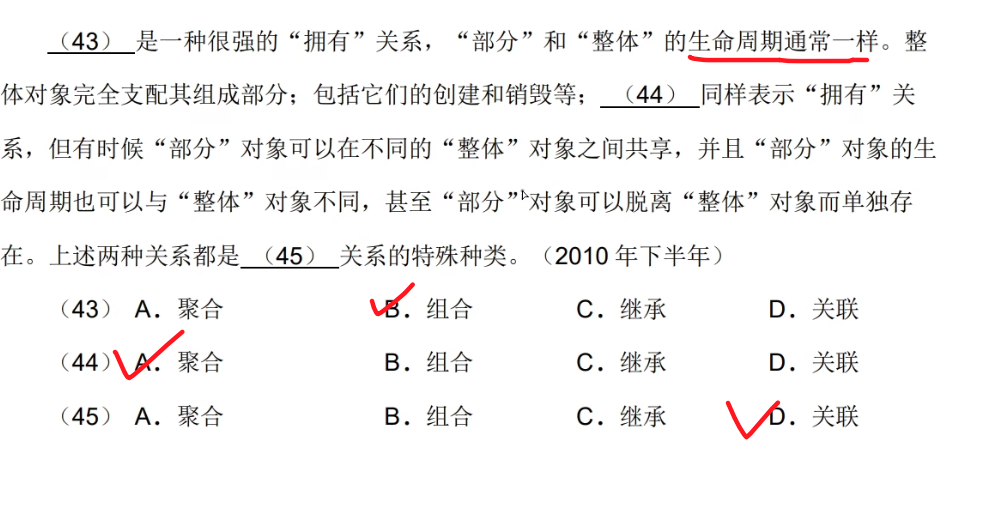

# UML 

内容来自哔哩哔哩 【「软件设计师」 上午题 #8 UML】[https://www.bilibili.com/video/BV1a44y1K7HH?p=17&vd_source=9b8c66469d7ef16dfa8f33c398331cdb](https://www.bilibili.com/video/BV1a44y1K7HH?p=17&vd_source=9b8c66469d7ef16dfa8f33c398331cdb)

2024年11月16日22:14

---

## 泛化、关联

---

## 依赖、关联、聚集（聚合）、组合、泛化、实现

---

---

---

---

---

---

---

---

---

----

## 包含关系（include）

- **本质**：**强制性**的依赖关系，表示基础用例**必须**执行包含的用例，否则功能不完整。
- **箭头方向**：从基础用例指向被包含用例（虚线箭头 + `<<include>>`）。
- **示例**：
  - 基础用例：**"网上购物"**
  - 包含用例：**"支付"**
  - **解释**：用户完成购物时，必须执行支付流程，否则订单无法成立。

------

## 扩展关系（extend）

### 关键字

1. 如果/假设/若
2. 只有

- **本质**：**条件性**的扩展关系，表示基础用例在特定条件下**可能**执行扩展用例，非必需。
- **箭头方向**：从扩展用例指向基础用例（虚线箭头 + `<<extend>>`）。
- **示例**：
  - 基础用例：**"登录"**
  - 扩展用例：**"找回密码"**
  - **解释**：只有当用户忘记密码时，才会触发“找回密码”流程，否则不执行。

------

## 泛化关系（generalization）

- **本质**：**继承关系**，子用例继承父用例的行为，并可扩展或覆盖父用例的功能。
- **箭头方向**：从子用例指向父用例（实线空心三角箭头）。
- **示例**：
  - 父用例：**"支付"**
  - 子用例：**"支付宝支付"**、**"信用卡支付"**
  - **解释**：不同支付方式是“支付”的具体实现，继承支付的共性（如输入金额）。

---

---

