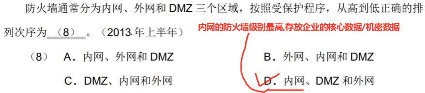
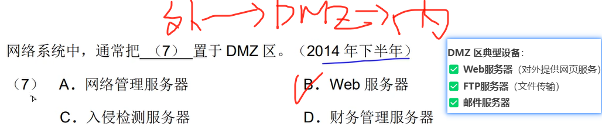

# 14 信息安全

---

---

---

---

---

---

---

---

| 防火墙类型         | 工作层级      | 关键特性                       | 典型场景              |
| :----------------- | :------------ | :----------------------------- | :-------------------- |
| **包过滤**         | 网络层/传输层 | 检查IP/TCP头（如端口、IP地址） | 路由器内置防火墙      |
| **应用级网关**     | 应用层        | **深度检查HTTP/FTP等应用数据** | Web应用防护、邮件过滤 |
| **状态检测防火墙** | 传输层        | 跟踪连接状态（如TCP握手）      | 企业网络边界          |

---

## 病毒

---

---

---

---

---

---

---

---

---

---

---

---

---

---

---

---

---

---

---

---

---

---

---

---

---

---

---

