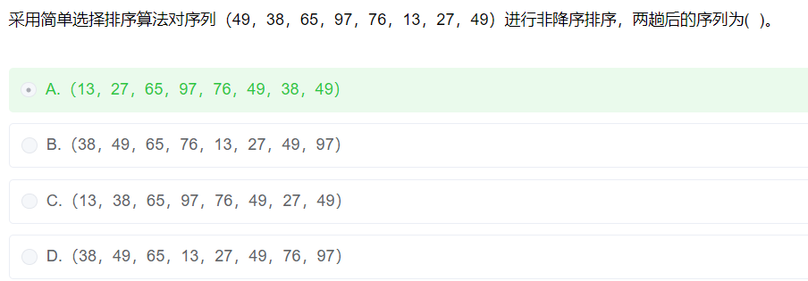

## 简单选择排序

从左到右, 在数组中找到最小值,和第一位交换位置,然后在剩下的数中再找出最小的值放在剩下数的第一位,重复以上操作,直到只剩下最后一个数,结束. 得到了从小到大的有序数组

如原数组（49，38，65，97，76，13，27，49）

1. 第一趟: 找出数组中的最小值为13, 13和第一个数49交换位置,得到第一趟的结果如下

   （13，38，65，97，76，49，27，49）

2. 对剩下的数(38，65，97，76，49，27，49)进行排序,得到第二趟的结果如下

   （13，27，65，97，76，49，38，49）

总结: 经过n趟,则得到了n个有序的数, 假设数组有m个数, 需要经过m-1次趟

24年5月真题:

解析: 题目要求对序列进行**简单选择排序**,非降序即升序, 两趟后的序列, 由结论快速得知, 两趟后能得到两个最小的有序数, 肉眼看去找到最小的两个数是13和27,秒选A

---

---

