# 上午题 #6 数据库

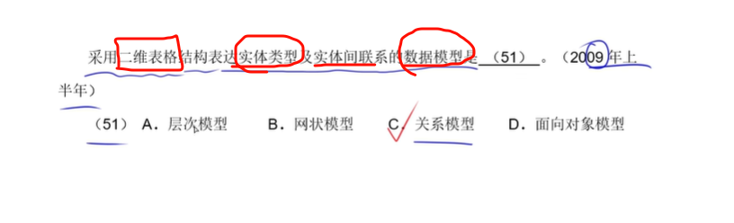

---

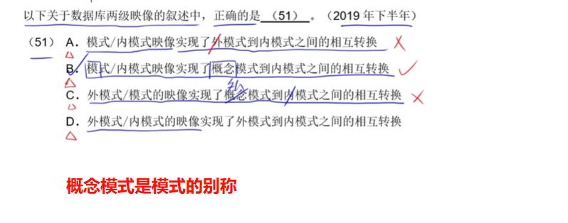

---

## 关系代数表达式

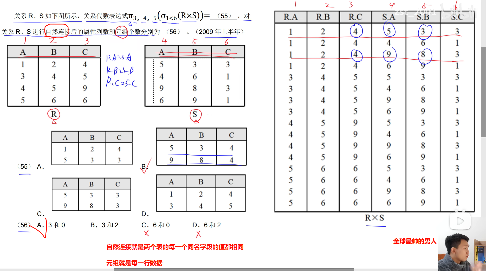

---

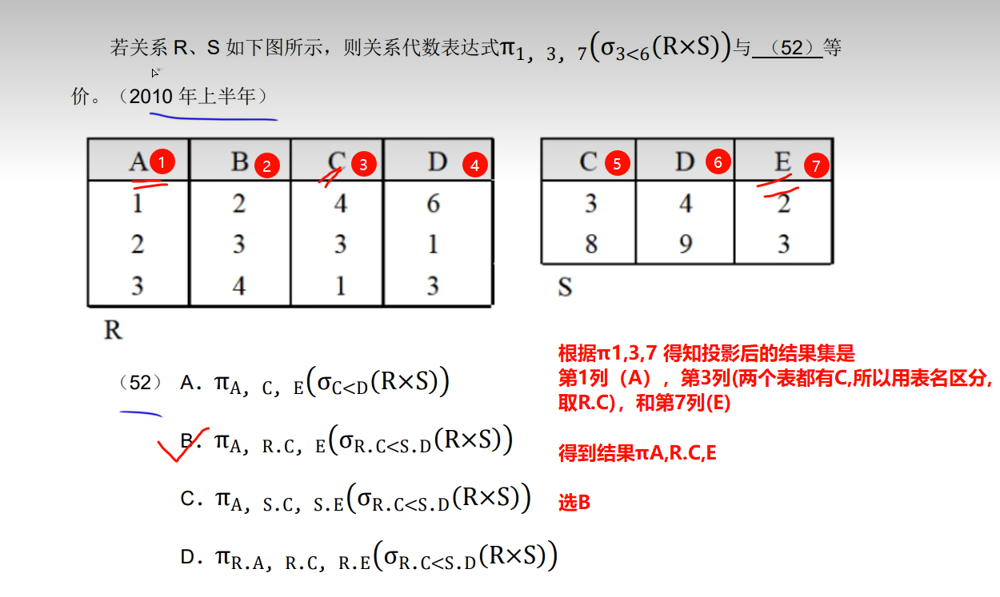

---

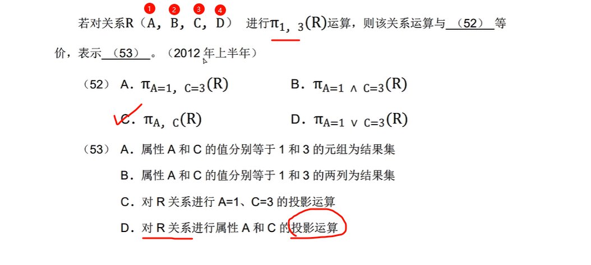

---

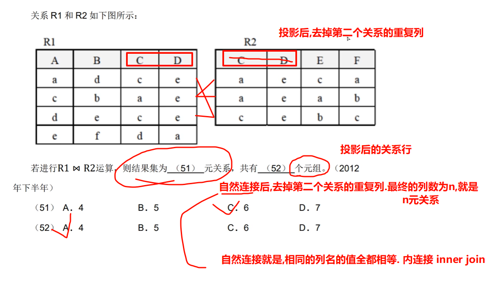

---

---

## 连接

### 经典题型-自然连接

自然连接前的关系是, 进行自然连接后(已经去掉了重复列),从1开始数.最后投影

---

## 无损连接和保持函数依赖

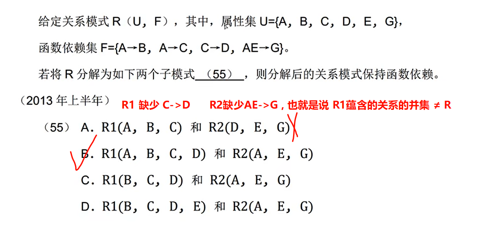

---

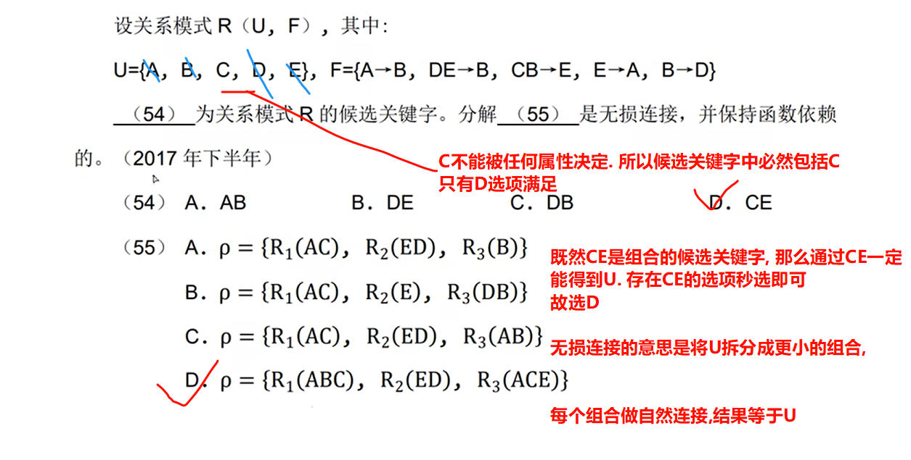

---

## 复合属性与多值属性

### 典型例子及本质区别

---

#### 多值

> 多个属性是独立的, 去掉任何一个也是完整的

##### 1个人有多个电话号码

- 同一属性"电话号码",有多个独立的值
- 号码之间是并且关系.无上下级关系
- 每个号码可以单独使用,也可以多选
- 任意号码可以新增/删除/修改.属性仍然保持完整性

##### 1个人有多个电子邮箱

##### 1个人有多个技能

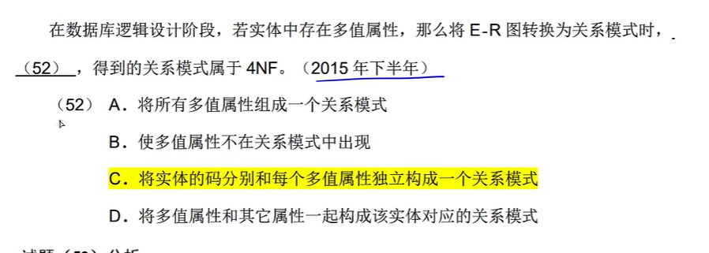

---

#### 复合

> 多个属性之间需要组合才能表达完整意义

**例子**：姓氏("张") + 名字("三")

##### 完整姓名

- 由姓氏和名字组合成完整姓名
- 子属性有明确语义关系
- 组合后才有完整意义

##### 地址

**例子**：中国+北京市+海淀区+中关村南大街5号

- 由多级行政区划组成
- 子属性有层级关系
- 组合后形成完整地址

##### 身份证号码

**例子**：110105+19900307+3721+X

- 由地区码、生日码、顺序码、校验码组成
- 各部分有特定编码规则
- 组合后才有唯一标识意义

##### 产品规格

**例子**：手机=屏幕(6.1")+CPU(A15)+内存(8GB)
**分析**：

- 由多个技术参数组成
- 子属性共同描述产品
- 缺一不可完整描述

---

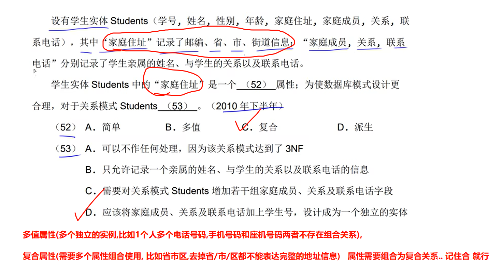

---

## 分E-R图冲突有3类

> 这有这3种,没有其他

### 属性冲突

属性的类型、取值范围、取值单位等不一致

### 命名冲突

不同的命名在不同的分E-R图中表达的意思是同一个

### 结构冲突

同一个实体在不同的E-R图中有不同的属性,同一个对象在某个E-R图中被抽象为实体, 在某个E-R图中又被抽象为属性

### **关键区分技巧**

- **属性冲突**: **定义或取值规则不一致**（不是名字问题，也不是属性缺失问题）

- **命名冲突**：**叫法不同**,纠结“叫什么名字”（比如该叫职工号还是教师号？）。
- **结构冲突**：**属性集合定义不同**, 纠结“该有哪些属性”（为什么人力部门不记录职称？教学部门不记录性别？）

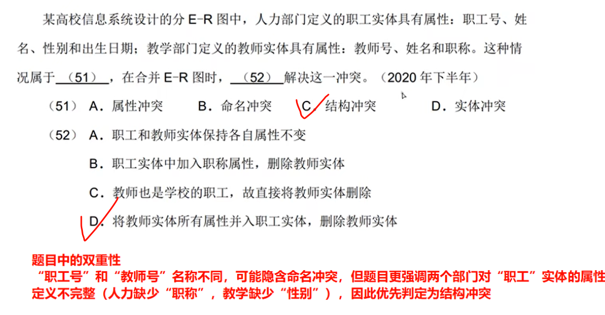

---

### **三者的终极区分技巧**

| 冲突类型     | 问题焦点                       | 判断关键词             | 示例                   |
| :----------- | :----------------------------- | :--------------------- | :--------------------- |
| **属性冲突** | 属性的数据类型或取值规则不一致 | “类型不同”“格式不同”   | 职工号：整数 vs 字符串 |
| **命名冲突** | 属性或实体名称不统一           | “名字不同”“叫法不一致” | 职工号 vs 工号         |
| **结构冲突** | 同一实体的属性集合不一致       | “缺少属性”“多出属性”   | 人力无职称，教学无性别 |

## 数据库设计阶段与规范化

**先问需求定边界，再画E-R概念清；**
**逻辑转表规范化，物理存得快又稳。**

| **阶段**     | **核心任务**                         | **关键输出**                     |
| :----------- | :----------------------------------- | :------------------------------- |
| **需求分析** | 确定系统边界、收集业务规则和数据需求 | 需求说明文档、数据字典、数据流图 |
| **概念设计** | 建立抽象模型（如E-R图）              | E-R图、概念模型                  |
| **逻辑设计** | 将概念模型转为关系模型，并进行规范化 | 关系模式（表结构）、范式化       |
| **物理设计** | 优化存储结构（索引、分区等）         | 物理存储方案、SQL调优            |

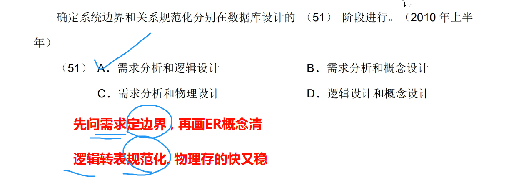

---

**程序文档是开发人员根据设计结果编写代码后的产物**。不属于数据库设计阶段

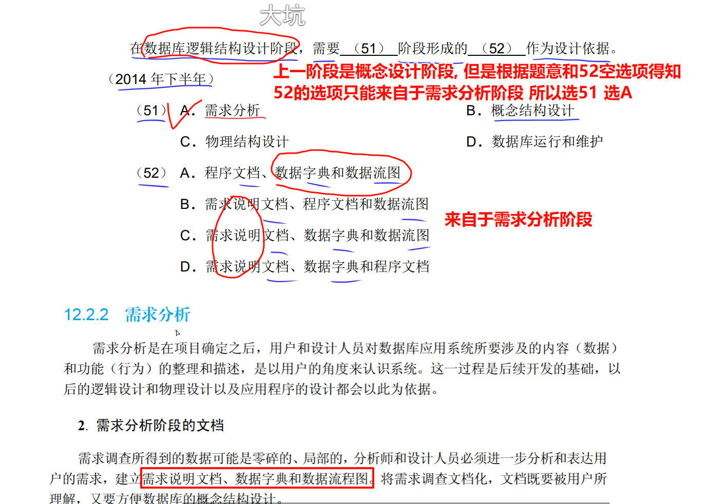

---

---

## 

---

---

## 

---

## 

---

