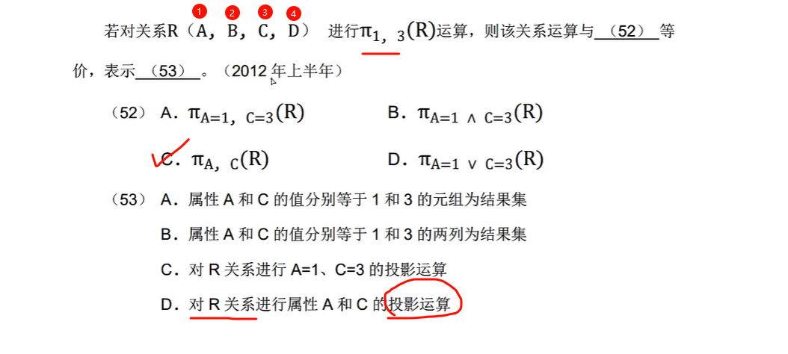
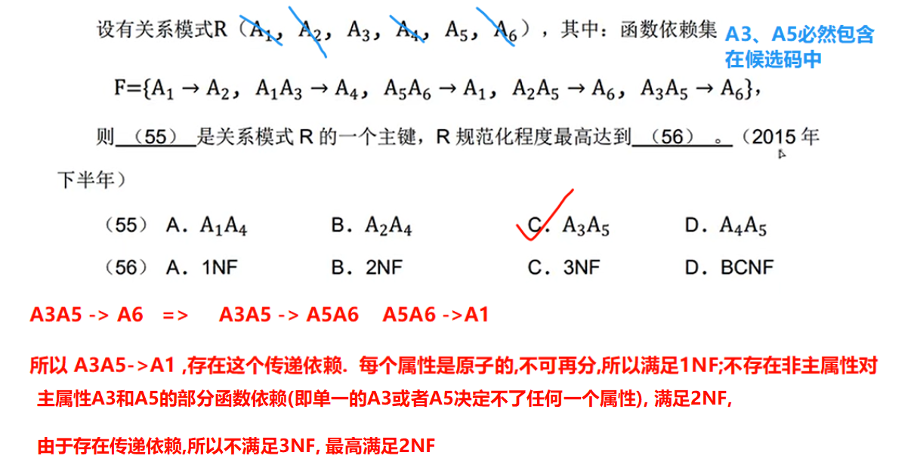

# 上午题 #6 数据库

---

## 三级模式

---

## 两级映像

> 注意： 就只有两级。不存在其他，比如外到内

（1）**模式/内模式的映像**。存在于概念级和内部级之间，实现了概念模式到内模式之间的相互转换。
（2）**外模式/模式的映像**。存在于外部级和概念级之间，实现了外模式到概念模式之间的相互转换。

---

---

## 关系代数表达式

---

---

---

---

---

>  注意: **^ 是并且的意思. σ2>'7'表示的是第2列的值大于7**

---

---

---

## 连接

### 经典题型-自然连接

自然连接前的关系是, 进行自然连接后(已经去掉了重复列),从1开始数.最后投影

---

### 经典题型-笛卡尔积

---

## SQL控制语句

---

## 视图

---

---

## 候选关键字/主属性/非主属性

### 详细分析

给定关系模式R<U,F>，U={A,B,C,D}，F={AB→C,C→B}。关系R有几个候选关键字,且分别有哪些主属性和非主属性?

1. **关系模式 R<U, F>**：这里 U 是属性的集合 {A, B, C, D}，F 是函数依赖的集合 {AB→C, C→B}。
2. **候选关键字（Candidate Key）**：能唯一标识关系中元组的最小属性集合。即，候选关键字的闭包包含所有属性 U，且其任何真子集的闭包都不能包含所有属性。
3. **主属性（Prime Attribute）**：属于任何一个候选关键字的属性。
4. **非主属性（Non-Prime Attribute）**：不属于任何候选关键字的属性。

#### 寻找候选关键字

为了找到所有的候选关键字，我们需要找出所有属性集的最小组合，其闭包能覆盖所有属性 {A, B, C, D}。我们可以从单个属性开始，逐步增加属性，直到找到满足条件的组合。

##### 1. 计算单个属性的闭包

- {A}+：
  - 初始：A
  - 无法通过 F 中的函数依赖扩展，因为没有以 A 为左侧的依赖。
  - {A}+ = {A} ≠ U
- {B}+：
  - 初始：B
  - 无法通过 F 扩展。
  - {B}+ = {B} ≠ U
- {C}+：
  - 初始：C
  - 使用 C→B：{C, B}
  - 无法进一步扩展。
  - {C}+ = {B, C} ≠ U
- {D}+：
  - 初始：D
  - 无法扩展。
  - {D}+ = {D} ≠ U

单个属性都无法覆盖所有属性，因此需要尝试多个属性的组合。

##### 2. 尝试两个属性的组合

- {A, B}+：
  - 初始：A, B
  - 使用 AB→C：{A, B, C}
  - 使用 C→B：已经在集合中。
  - 无法进一步扩展。
  - {A, B}+ = {A, B, C} ≠ U （缺少 D）
- {A, C}+：
  - 初始：A, C
  - 使用 C→B：{A, B, C}
  - 使用 AB→C：已经在集合中。
  - 无法进一步扩展。
  - {A, C}+ = {A, B, C} ≠ U
- {A, D}+：
  - 初始：A, D
  - 无法直接应用任何函数依赖。
  - {A, D}+ = {A, D} ≠ U
- {B, C}+：
  - 初始：B, C
  - 使用 C→B：已经在集合中。
  - 无法进一步扩展。
  - {B, C}+ = {B, C} ≠ U
- {B, D}+：
  - 初始：B, D
  - 无法应用函数依赖。
  - {B, D}+ = {B, D} ≠ U
- {C, D}+：
  - 初始：C, D
  - 使用 C→B：{B, C, D}
  - 无法进一步扩展。
  - {C, D}+ = {B, C, D} ≠ U （缺少 A）

两个属性的组合都无法覆盖所有属性，需要尝试三个属性。

##### 3. 尝试三个属性的组合

- {A, B, D}+：

  - 初始：A, B, D
  - 使用 AB→C：{A, B, C, D} = U
  - 已经覆盖所有属性。
  - {A, B, D}+ = {A, B, C, D} = U

  这是一个超键，需要检查是否可以去掉某个属性仍能覆盖 U。

  - 检查 {A, D}+ = {A, D} ≠ U
  - 检查 {B, D}+ = {B, D} ≠ U
  - 检查 {A, B}+ = {A, B, C} ≠ U

  无法去掉任何属性，因此 {A, B, D} 是一个候选关键字。

- {A, C, D}+：

  - 初始：A, C, D
  - 使用 C→B：{A, B, C, D} = U
  - {A, C, D}+ = U

  检查是否可以去掉某个属性：

  - {A, D}+ = {A, D} ≠ U
  - {C, D}+ = {B, C, D} ≠ U
  - {A, C}+ = {A, B, C} ≠ U

  无法去掉任何属性，因此 {A, C, D} 也是一个候选关键字。

- 其他三个属性的组合：

  - {A, B, C}+：
    - 初始：A, B, C
    - 使用 AB→C 和 C→B 已经包含。
    - {A, B, C}+ = {A, B, C} ≠ U （缺少 D）
  - {B, C, D}+：
    - 初始：B, C, D
    - 使用 C→B 已经包含。
    - {B, C, D}+ = {B, C, D} ≠ U （缺少 A）

  这些组合不能覆盖 U。

##### 4. 尝试四个属性的组合

- {A, B, C, D}：
  - 这是一个超键，但不是最小的，因为已经有更小的组合 {A, B, D} 和 {A, C, D} 可以覆盖 U。
  - 因此，{A, B, C, D} 不是候选关键字。

##### 5. 检查是否有其他候选关键字

我们需要确认是否还有其他两个或三个属性的组合可以覆盖 U。

- 我们已经检查了所有两个属性的组合，都无法覆盖 U。
- 对于三个属性，只有 {A, B, D} 和 {A, C, D} 可以覆盖 U，且都是最小的。

因此，候选关键字有两个：{A, B, D} 和 {A, C, D}。

#### 确定主属性和非主属性

- **主属性**：出现在至少一个候选关键字中的属性。**包括在候选关键字中的属性都是主属性,反之是非主属性**
  - {A, B, D} 和 {A, C, D} 中的属性有：A, B, C, D。
    - A 出现在两个候选关键字中。
    - B 出现在 {A, B, D} 中。
    - C 出现在 {A, C, D} 中。
    - D 出现在两个候选关键字中。
  - 因此，所有属性 A, B, C, D 都是主属性。
- **非主属性**：**不属于任何候选关键字的属性**。
  - 这里没有非主属性。

---

---

---

---

---

## 三范式

### 1NF

特点: 每个属性是原子的, 不可再分的 

存在的问题: 存在冗余,存在修改,插入,删除不一致的异常

### 2NF

特点: 不存在非主属性对候选码的部分函数依赖.或者说每个非主属性完全依赖主键(主属性)

存在的问题: 

### 3NF

消除: 消除传递依赖

存在:

### BCNF

### 4NF

---

---

---

---

---

---

## 关系分解

---

---

## 无损连接和保持函数依赖

---

