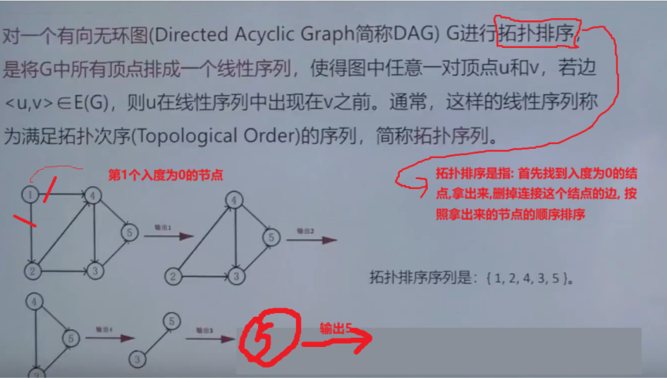
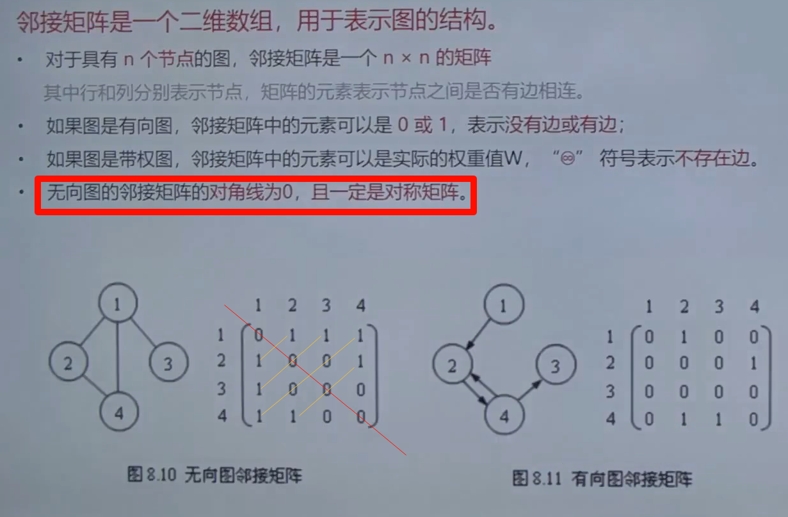
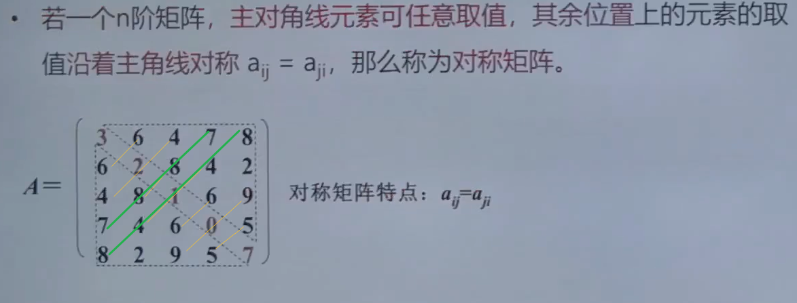
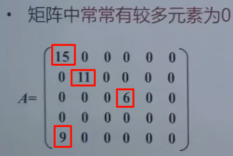
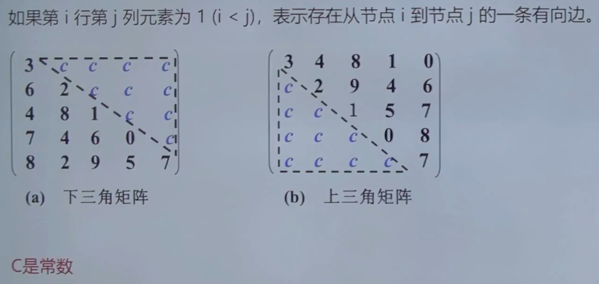
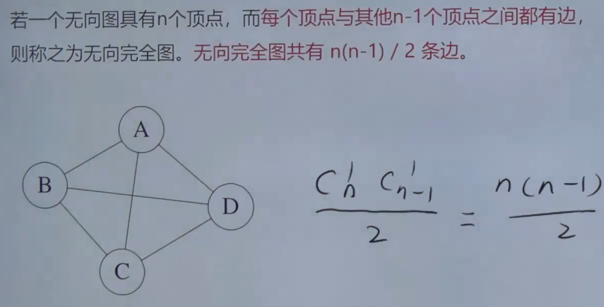
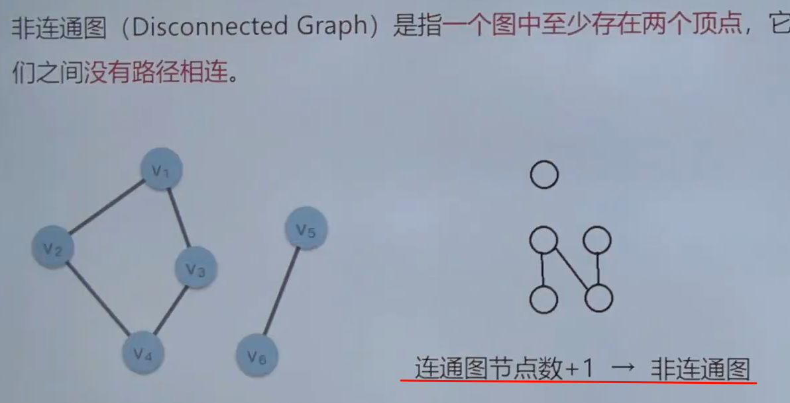

# 数据结构上

## [图的拓扑排序](https://www.bilibili.com/video/BV1qVmmYxEZE/?p=30&spm_id_from=888.80997.embed_other.whitelist&t=763.00766&bvid=BV1qVmmYxEZE&vd_source=388f01bb44f002e4de4c1a3c6ceb7302)

---

## 邻接矩阵

---

## 对称矩阵

## 稀疏矩阵

---

## 三角矩阵

---

## 连通图

---

## 非连通图

> 在边的数量不变的情况下,增加1个节点,就变成了非连通图

---

