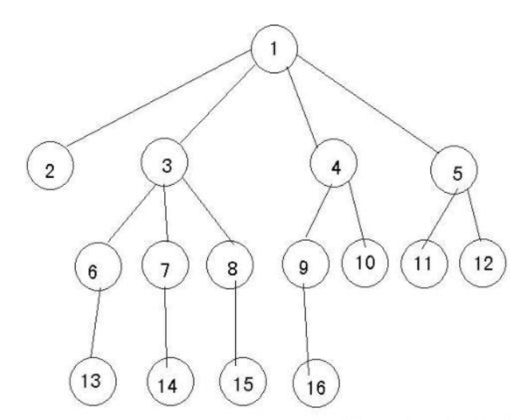

## [转载于如何理解数据结构中树的度https://blog.csdn.net/weixin_45313931/article/details/114496274](https://blog.csdn.net/weixin_45313931/article/details/114496274)

在数据结构中，树是一对多的存在，如下图是一颗树。

结点拥有的子树个数称为结点的度，比如结点①的度为4，结点②的度为0，结点③的度为3。

对于树而言，树的度为树内各结点最大的度，从图中可知，结点①的度是最大的，为4，所以这棵树的度为4。

---

---

