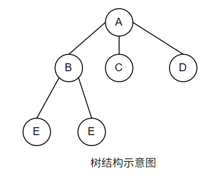

# 树

## 普通树

> 树是n(n>=0)个结点的有限集合
>
> ​	当n=0时, 集合为空,称为**空树**

---

## 二叉树

二叉树和普通树的区别在于, 二叉树中结点的子树分为左子树和右子树,如下

## 满二叉树与完全二叉树

如果一个树的层数为K,结点总数为2^k-1个,则它就是**满二叉树**

在一个深度为h的二叉树中,除第h层(最后一层)外,其他各层都是满的, 并且第h层所有结点都必须从左到右依次放置,**不能留空**,则它就是**完全二叉树**

---

## 二叉树的性质

1. 在二叉树的**第i层**上最多有**2(i-1) **个结点(i>=1)
2. **深度为k**的二叉树**最多**有**2k-1**个**结点**
3. 任何一个二叉树,如果叶子结点数为n0, 度为2的结点数为n2,  则 **n0 = n2+1**
4. 具有n个结点的完全二叉树的深度为[logn2n] + 1

---

## 二叉树的存储

1. 二叉树的顺序存储.在采用顺序存储时,完全二叉树与一般二叉树相比节省了空间,这是因为一般二叉树需要添加一些"虚节点"而造成了空间的浪费

---

