# 上午题 #5 知识产权

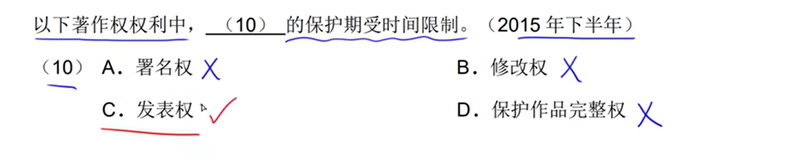

---

### 不受时间限制的著作权：

1. 署名权
2. 修改权
3. 保护作品完整权

---

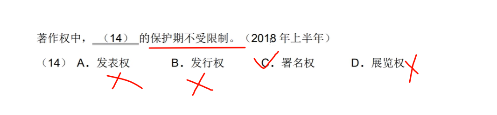

---

### 专利费（保护费：保护防止白嫖）

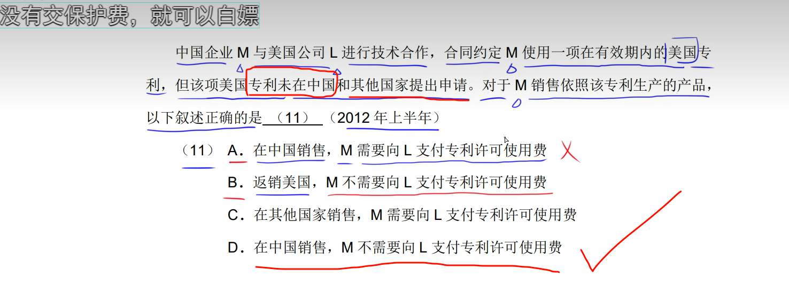

---

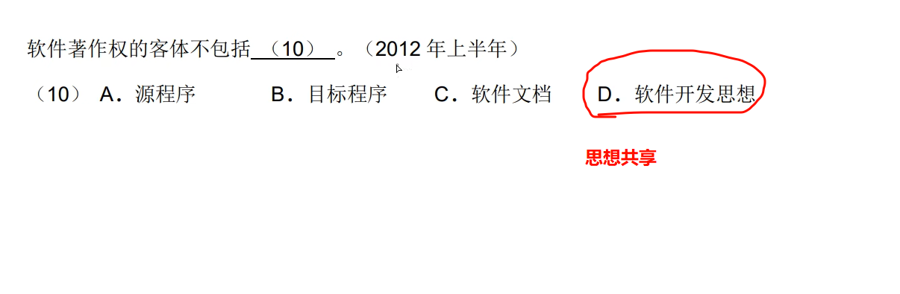

---

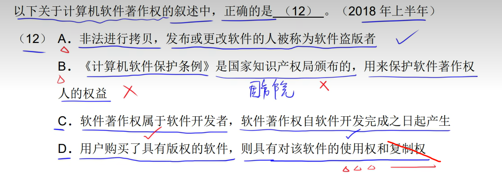

---

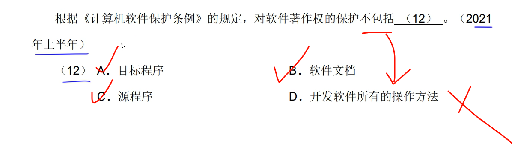

---

### 职务作品

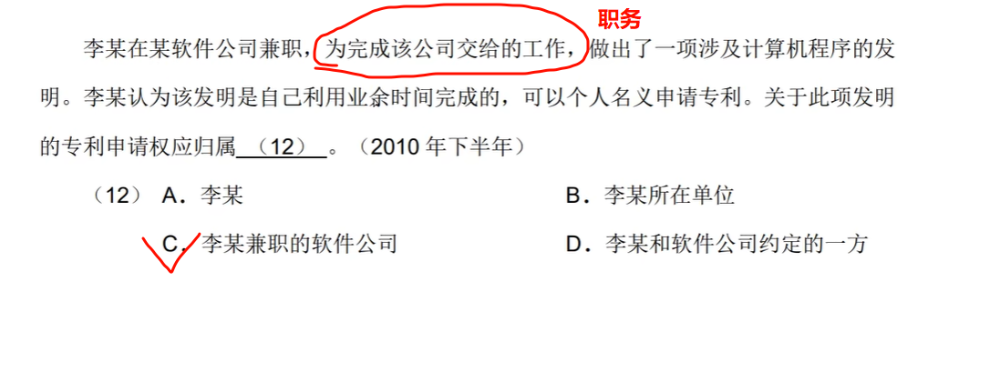

---

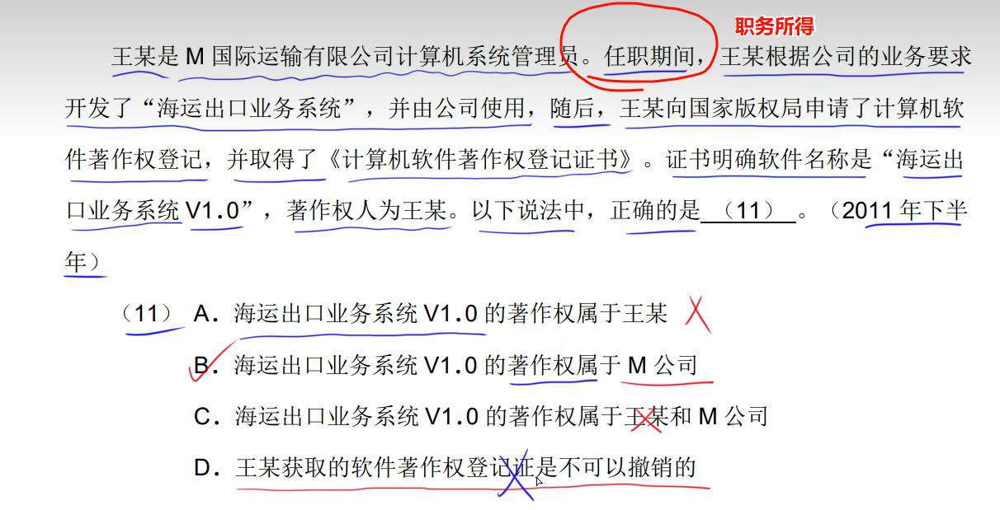

---

---

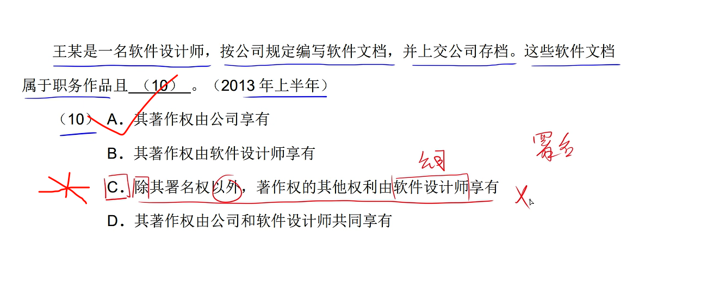

---

### 委托开发

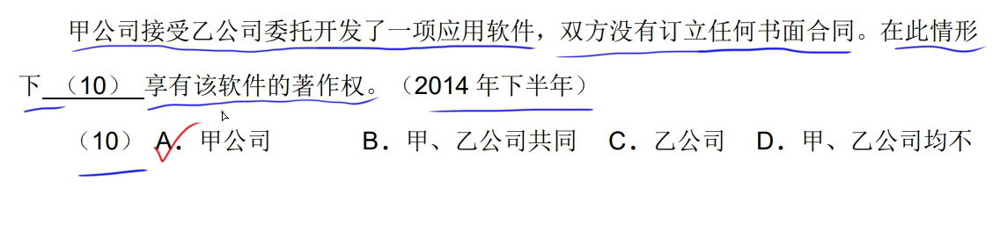

---

---

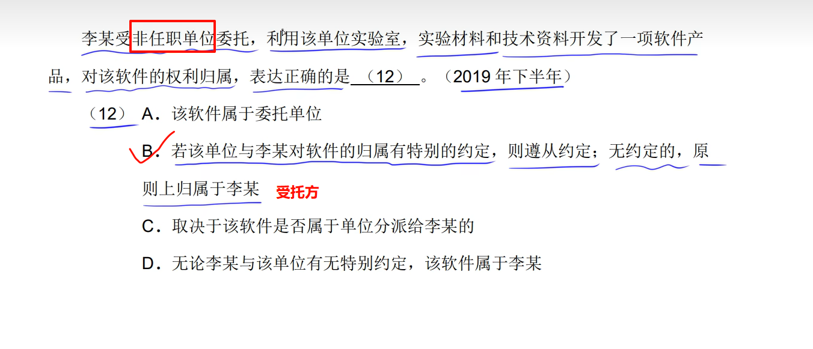

---

### 计算机著作权侵权

### 商业秘密权

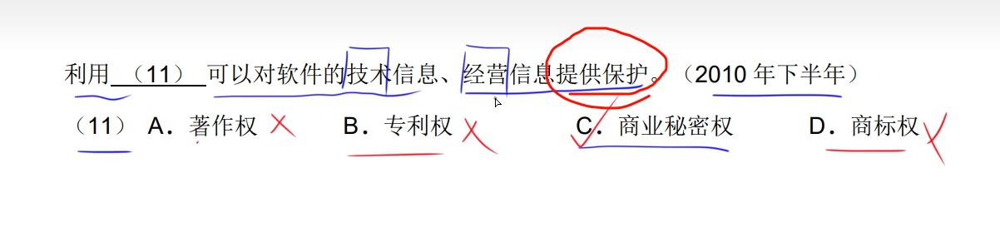

---

### 专利申请权

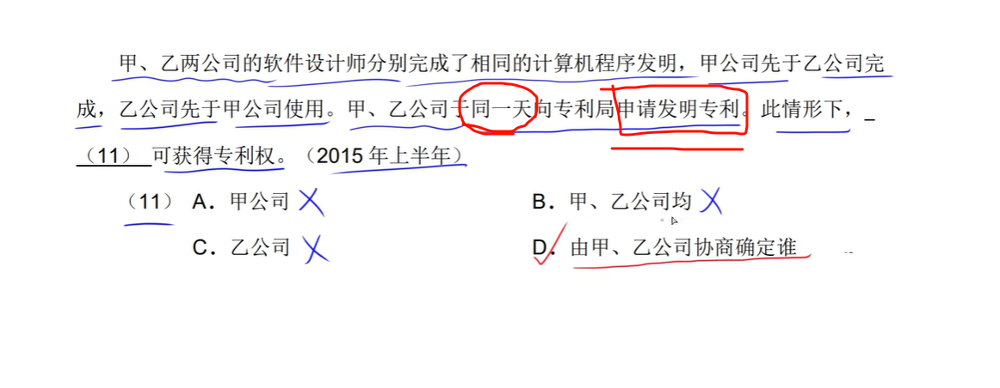

---

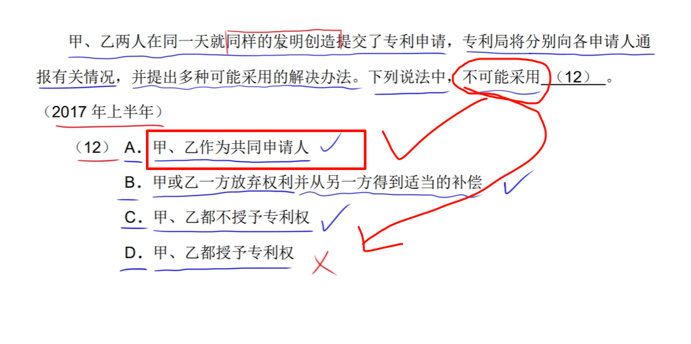

---

### 商标权

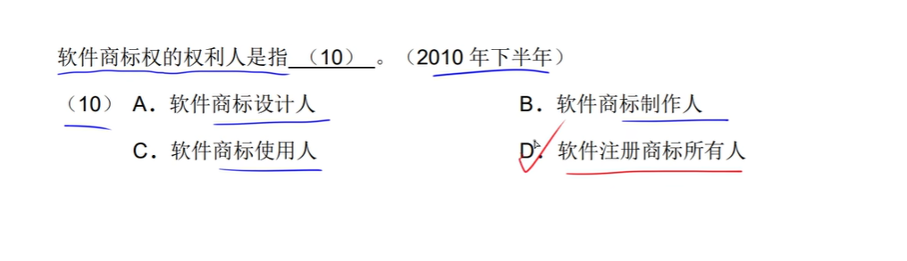

---

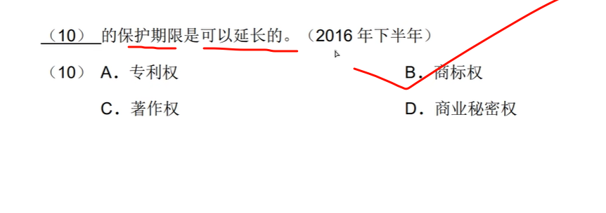

---

---

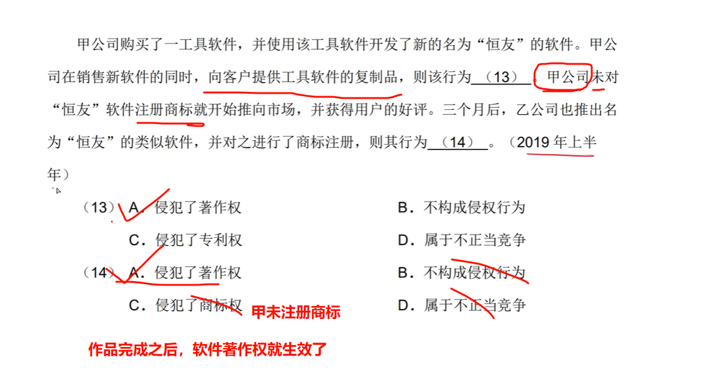

---

### 商标注册

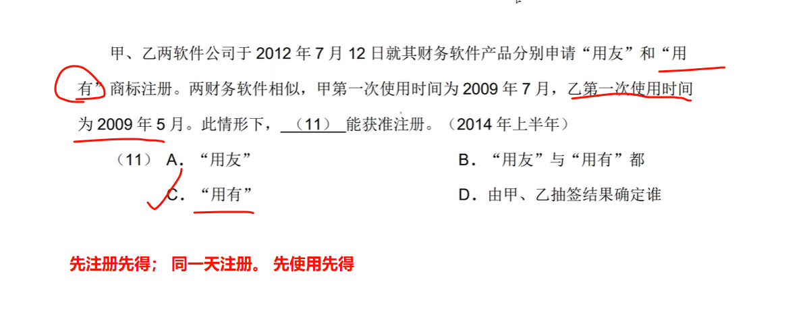

---

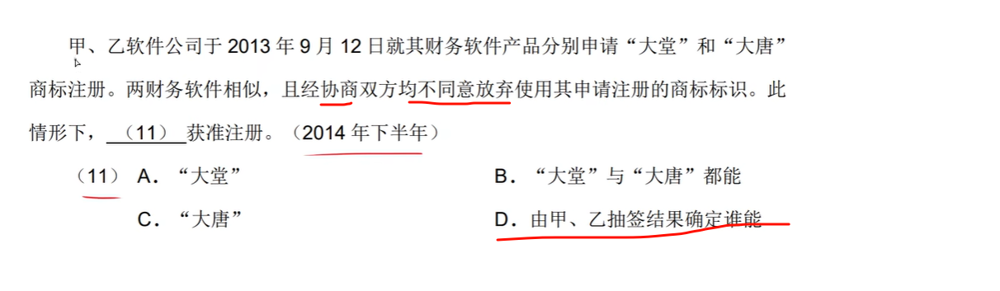

---

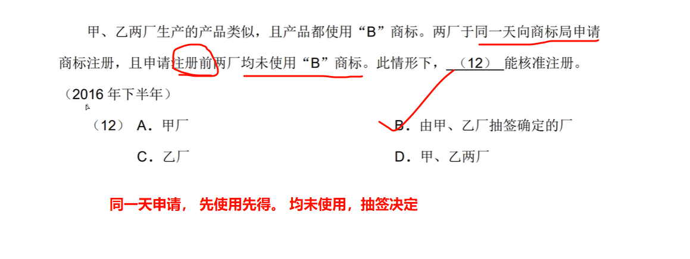

---

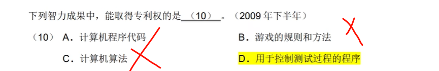

---

### 计算机软件著作权的行使

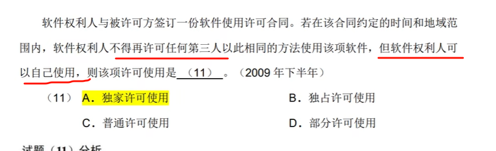

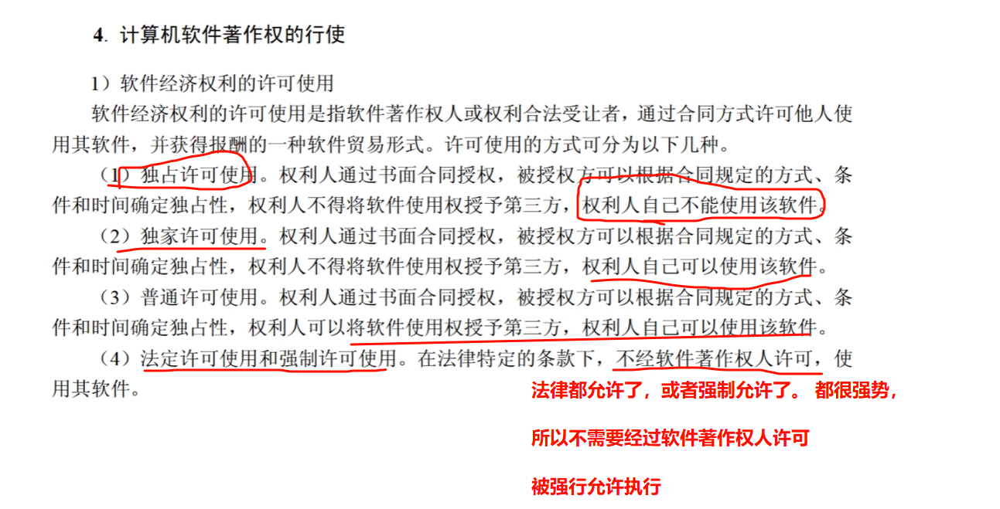

---

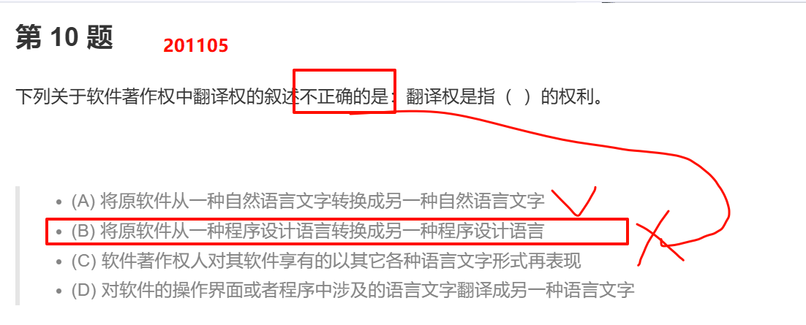

---

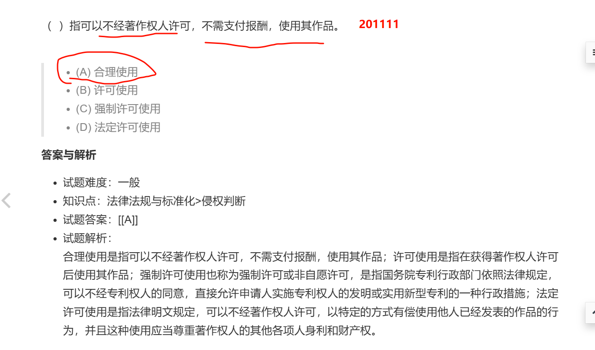

---

---

- **展览权**是原件持有人的特有的权利，著作权人不能以发表权限制其权利（除非有约定）。
- **所有权**是所有人依法对自己财产所享有的占有，使用，收益和处分的权利。

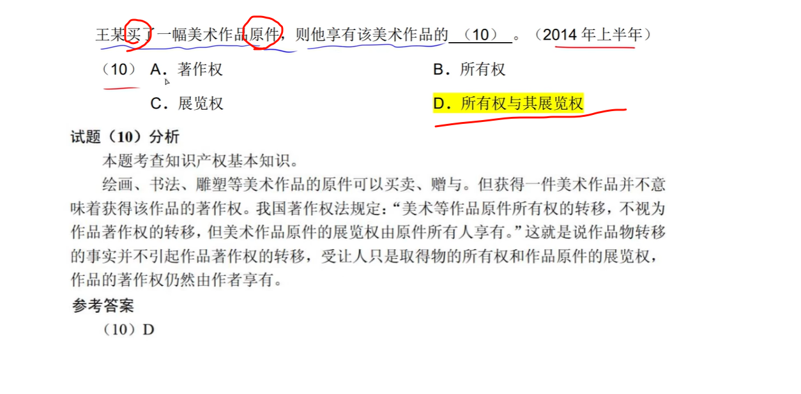

---

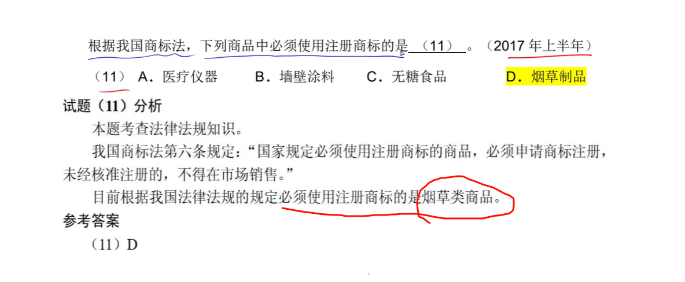

---

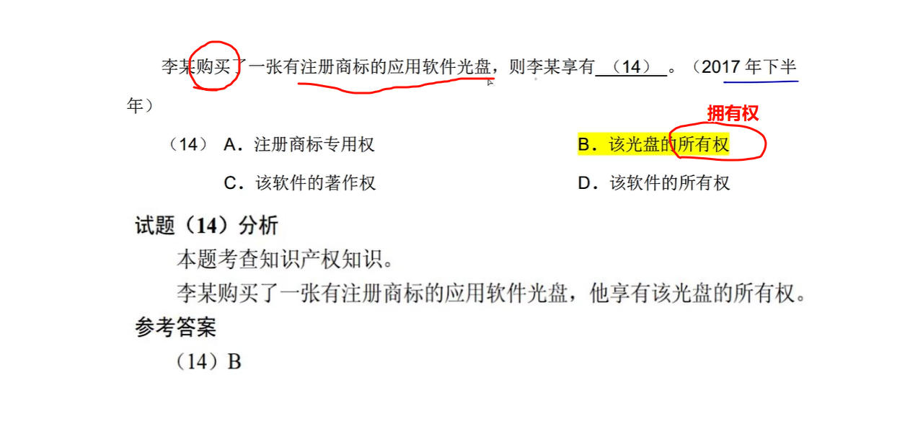

---