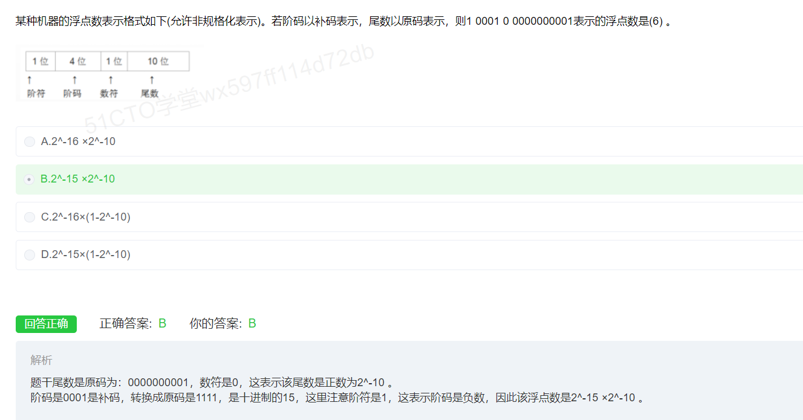

## 编译


---

## 沟通路径


---

## 磁盘调度


---

## 哈夫曼树和哈夫曼编码

>  [一看就懂的视频](https://www.bilibili.com/video/BV1hK4y1k7Wr/?spm_id_from=333.337.search-card.all.click&vd_source=388f01bb44f002e4de4c1a3c6ceb7302)

哈夫曼树，也叫二进制树，由0和1组成， 左边是0右边是1， 并且哈夫曼树的任意结点，要么没有叶子结点，要么由两个叶子结点。 

对于D选项， 缺少001，导致存在了1个叶子结点， 所以不能构成哈夫曼树

---


---

## IO系统


**注意:这里求的是最大段, 每段最大页,以及页的大小**

---

## 总线复用


---

## 内聚类型


---

## 甘特图


---

## 初始大顶项
```
从下往上, 从右向左

己最大，不用调整

左孩子最大，交换当前父节点与其左孩子的值，并考察以左孩子为根的子树是否满足大顶堆的要求，不满足递归向下处理

右孩子最大，交换当前父节点与其右孩子的值，并考察以右孩子为根的子树是否满足大顶堆的要求，不满足递归向下处理
```
> 注意: 构建初始大顶堆**不需要限制**左节点小于右节点


---


## 芯片


## 系统页面

## 资源+进程竞争


6/3+1 = 3  发生死锁的最小值

---

## RUP


---

## 模型


---

## 关系


---

## 绑定


## 图


---

## 桥接模式


---

## 浮点数


