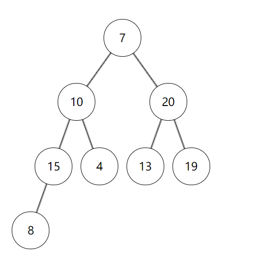

## 正规集

```
1. 正规式：给定元素形成的所有的正则表达式

2. 正规集：所有的正规式产生的结果的集合
```

如果我们有两个字符a、b，那么有以下几种常用正规式写法。


[方法参考](https://developer.aliyun.com/article/805908)

正规式a，表示单一字符a，对应的正规集{a}。

正规式a|b，表示单一字符a或者b，对应有2个元素的正规集{a,b}。

正规式ab，表示由两个字符ab的元素，对应只有1个元素的正规集{ab}。

正规式ab(a|b)，ab是确定的部分，然后再添加a或b，对应正规集{aba,abb}。

正规式a*，*表示任意个，对应正规集{Φ,a,aa,aaa,...}。

正规式(a|b)*，可以表示任意由a、b组成的串的集合，对应正规集{Φ,a,b,ab,aa,bb...}


题目


---


## 编译


---


## 位示图


---


## 并发进程


---

## 进程的页面变换


---


## 海明码


---

## 流水线
> 非顺序执行的时间=耗时短的两个时间相加+总指令条数*耗时最大的时间, 所以得出的结果是, 个位数是两个短的时间之和,高位是最大的时间*总指令条数的乘积


---

## OSI


---

## PKI公钥体系


---


## 沟通路径


---

## 短路


---


## 磁盘调度


---


---

## 流程图 McCabe方法


---

## 栈


---

## 哈夫曼树和哈夫曼编码

>  [一看就懂的视频](https://www.bilibili.com/video/BV1hK4y1k7Wr/?spm_id_from=333.337.search-card.all.click&vd_source=388f01bb44f002e4de4c1a3c6ceb7302)


哈夫曼树，也叫二进制树，由0和1组成， 左边是0右边是1， 并且哈夫曼树的任意结点，要么没有叶子结点，要么由两个叶子结点。 

对于D选项， 缺少001，导致存在了1个叶子结点， 所以不能构成哈夫曼树

---


---

## 二分查找


---

## IO系统


---

## 段页式存储


**注意:这里求的是最大段, 每段最大页,以及页的大小**

---

## 总线复用


## 并发进程与互斥信号


---

## 内聚类型


---

## 甘特图


---

## 初始大顶项
```
从下往上, 从右向左

己最大，不用调整

左孩子最大，交换当前父节点与其左孩子的值，并考察以左孩子为根的子树是否满足大顶堆的要求，不满足递归向下处理

右孩子最大，交换当前父节点与其右孩子的值，并考察以右孩子为根的子树是否满足大顶堆的要求，不满足递归向下处理
```
> 注意: 构建初始大顶堆**不需要限制**左节点小于右节点


解题思路. 先画出题干的[7,10,13,15,4,20,19,8]的二叉树如下:


---

构建初始大顶堆,逐步分析:

**非叶子节点开始,从下往上, 从右向左**

1. 第一个非叶子节点是13, 13和他的孩子节点比较, 得到一个最大节点20, 13和20调换位置, 然后看13的孩子节点是否满足初始大堆, 不满足递归13的孩子节点,由于13没有叶子节点了,所以13不需要递归子节点



2. 从右向左, 开始看10个父节点, 和10的左右孩子比较, 最大值是做孩子节点, 所以10和15交换位置, 现在10处于做孩子位置, 递归10的孩子节点, 是否满足初始大堆, 由于10大于孩子节点8,所以10不用二次调整.得到下图


3. 从下往上, 7与15,20比较, 最大值是20, 所以7与右孩子20交换位置,得到下图


4. 然后递归7的孩子节点是否满足初始大堆, 发现不满足, 找到7,13,19的最大值, 最大值19和父节点7交换位置,得到下图


5. 继续递归7的孩子节点以满足初始大堆, 发现7已经是叶子节点了, 停止递归. 于是得到了最终的初始大堆为[20,15,19,10,4,13,7,8]


第二道题目: 第一个元素脱离堆, 剩余元素再调整成大顶堆, 这其实是按照大顶堆排序的一个过程, 排序过程是, 先将二叉树行程一个大顶堆, 如上, 再将大顶堆的根节点和最后一个叶子节点调换位置,然后再次形成大顶堆, 再将根节点和新的大顶堆的最后一个元素交换位置, 依次递归, 最终形成了一个升序的数组


解析本题, 将初始大堆为[20,15,19,10,4,13,7,8]的第一个元素移除,即将20移出,与8交换位置

得到下图


将这个新的二叉调整成初始大顶堆, 如下图


所以第一个元素脱离堆结构, 对剩余元素再调整成大顶堆后的数组R为[19,15,13,10,4,8,7,20]


---

## 指令


---


## 芯片


## 系统页面


---


## 资源+进程竞争


6/3+1 = 3  发生死锁的最小值

---

## RUP


---

## 模型


---

## 关系


---

## 绑定


## 图


---

## 桥接模式


## 折半查找


---


