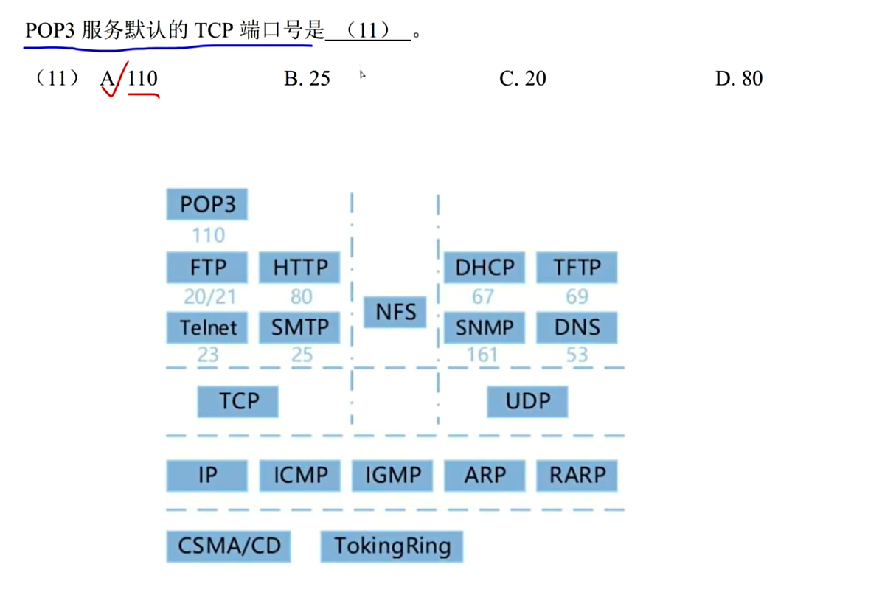

## 正规集

```
1. 正规式：给定元素形成的所有的正则表达式

2. 正规集：所有的正规式产生的结果的集合
```

如果我们有两个字符a、b，那么有以下几种常用正规式写法。


[方法参考](https://developer.aliyun.com/article/805908)

正规式a，表示单一字符a，对应的正规集{a}。

正规式a|b，表示单一字符a或者b，对应有2个元素的正规集{a,b}。

正规式ab，表示由两个字符ab的元素，对应只有1个元素的正规集{ab}。

正规式ab(a|b)，ab是确定的部分，然后再添加a或b，对应正规集{aba,abb}。

正规式a*，*表示任意个，对应正规集{Φ,a,aa,aaa,...}。

正规式(a|b)*，可以表示任意由a、b组成的串的集合，对应正规集{Φ,a,b,ab,aa,bb...}


题目


---


## 编译


---


## 位示图


---


## 并发进程


---

## 进程的页面变换


---


## 海明码


---

## 流水线


---

## OSI


---

## PKI公钥体系


---


## 沟通路径


---

## 短路


---


## 磁盘调度


---


---

## 流程图 McCabe方法


---

## 栈


---

## 哈夫曼树和哈夫曼编码

>  [一看就懂的视频](https://www.bilibili.com/video/BV1hK4y1k7Wr/?spm_id_from=333.337.search-card.all.click&vd_source=388f01bb44f002e4de4c1a3c6ceb7302)


哈夫曼树，也叫二进制树，由0和1组成， 左边是0右边是1， 并且哈夫曼树的任意结点，要么没有叶子结点，要么由两个叶子结点。 

对于D选项， 缺少001，导致存在了1个叶子结点， 所以不能构成哈夫曼树

---


网友解析: https://blog.csdn.net/m0_37483148/article/details/109144984


---

## 二分查找


---

## IO系统


---

## 段页式存储


**注意:这里求的是最大段, 每段最大页,以及页的大小**

---

## 总线复用


## 并发进程与互斥信号


---

## 内聚类型


---

## 甘特图


---

## 初始大顶项


---

## 指令


---


## 芯片


解析: 400FFFFFH - 40000000H  + 1H = 000FFFFFH + 1H = 100000H = 1*$16^{5}$ = $(2^{4})^5$ = $2^{20}$​

256 = $2^{8}$

$2^{20}$ / $2^{8}$ / $2^{10}$ = $2^{20}$ / $2^{18}$ = $2^{2}$ = 4

---


## 系统页面


---


## 资源+进程竞争


6/3+1 = 3  发生死锁的最小值

---

## RUP


---

## 模型


---

## 关系


---

## 绑定


## 图


---

## 桥接模式


## 设计模式

### 命令模式

将一个请求封装为对象, 从而可以从不同的请求对客户进行参数

### 观察者模式

当一个对象的状态发生改变时,依赖于它的对象都得到通知并被自动更新

### 状态模式

允许一个对象其内部状态变化时改变它的行为

### 策略模式

定义一系列的算法,把他们封装起来, 并且使得他们可以相互替换


## 原码 反码 补码

正数的原 反 补 一致

负数的反码: 符号位不变, 其余各位按位取反

负数的补码: 等于 反码+1

最高位是符号位, 0表示正数, 1表示负数

对补码再求一次补码,就得到了原码

+0 和 -0 的补码一样,如下

[+0]原码 = 0000 0000 = [+0]补码

[-0]原码 = 1000 0000, [-0]反码 = 1111 1111 ,[-0] = 补码 = [-0]反码 + 1  =  0000 0000

由于只使用 8 位二进制数表示，结果中的第 9 位会被丢弃，所以最终的补码是 0000000000000000

所以 无论是 +0 还是 -0，它们的补码表示都是相同的，即 0000000000000000


计算 -3-4

-3 -4 = -3 + (-4) = ((-3 + (-4))补码)补码

| 0    | 000  |
| ---- | ---- |
| 1    | 001  |
| 2    | 010  |
| 3    | 011  |
| 4    | 100  |
| 5    | 101  |
| 6    | 110  |
| 7    | 111  |

所以得到 -3 -4 = (1000 0011补码 + 1000 0100补码)补码 

1000 0011的补码 = 1111 1100 + 1 = 1111 1101

1000 0100的补码=1111 1011 + 1 =  1111 1100

所以 -3 -4 = (1111 1101 + 1111 1100)的补码 = (1111 1001)的补码 =  1000 0110 + 1 = 1000 0111 = -7


---

## TCP UDP 以及端口号



## UML


