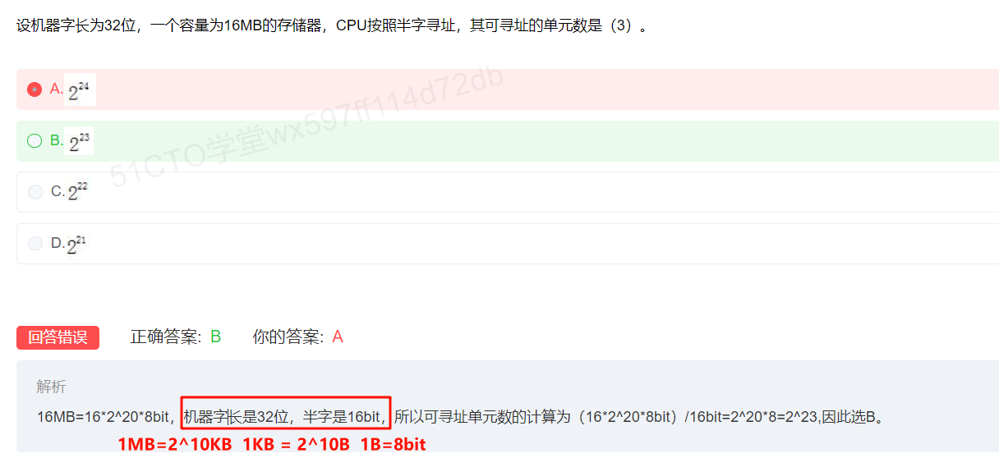
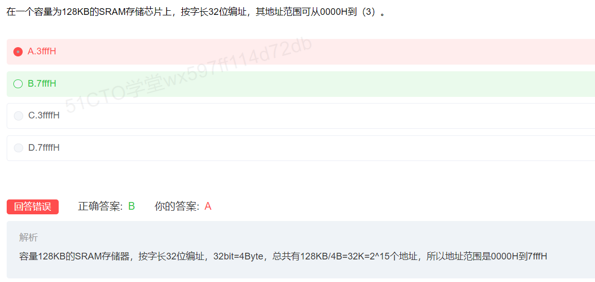

# 处理器

## 双核处理器

一个处理器 两个运算核心，从而提高计算能力

## 统一过程模型
起始阶段：起始阶段专注于项目的初创活动。

精化阶段：精化阶段在理解了最初的领域范围之后进行需求分析和架构演进。

构建阶段：构建阶段关注系统的构建，产生实现模型。

移交阶段：移交阶段关注于软件提交方面的工作，产生软件增量

## 安全协议

- HTTPS

- SFTP
- IPsec

## 汇编语言

- 汇编语言不能直接被计算机执行,需要编译成机器语言才能被计算机执行

## 多态

- 方法重载是一种静态多态，也称为编译时多态
- 覆盖属于运行时多态

## 白盒测试

（1）程序模块中的所有独立路径至少执行一次

（2）在所有的逻辑判断中，取“真”和取“假”的两种情况至少都能执行一次

（3）每个循环都应在边界条件和一般条件下各执行一次

（4）测试程序内部数据结构的有效性等

## 对面向对象软件的测试

（1）算法层：测试类中定义的每个方法。

（2）类层：测试封装在同一个类中的所有方法与属性之间的相互作用。

（3）模板层：测试一组协同工作的类之间的相互作用。

（4）系统层：把各个子系统组装成完整的面向对象软件系统，在组装过程中同时进行测试

## 常见的端口

POP3服务默认的TCP端口号 110

## 可寻址的单元数

解析: 128KB= 128 * 2^10 B , 32位 = 32bit/8bit=4B,   128 * 2^10 B/(4B)=2^15个地址

题目要求从0000H开始, 也就是说包括0000H在内,总共数2^15个地址, 即0000H+ (2^15), 由于包括了0000H,所以最终结果= 0000H+ (2^15) -1.

2^15 = 1000 0000 0000 0000 = 8 0 0 0H, 所以结果是 0000H+ 8 0 0 0H -1 = 7FFFH. 16进制每个位置的范围是0-F

