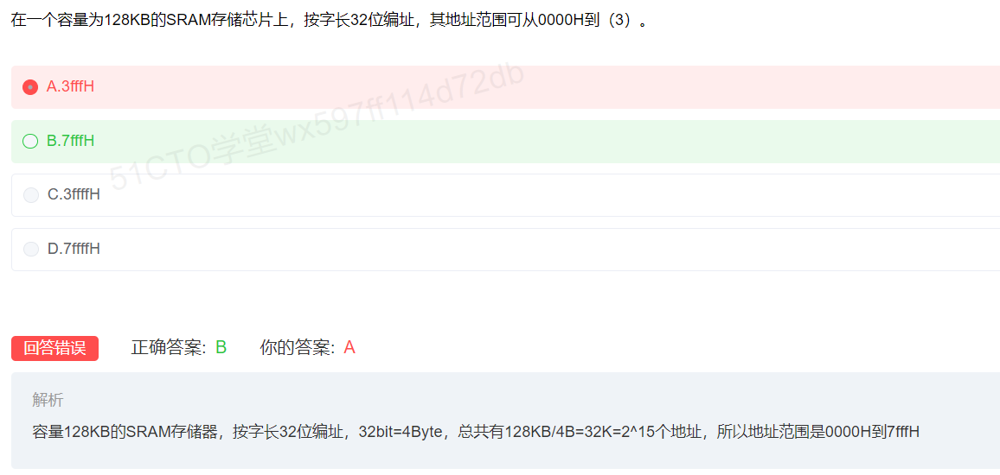
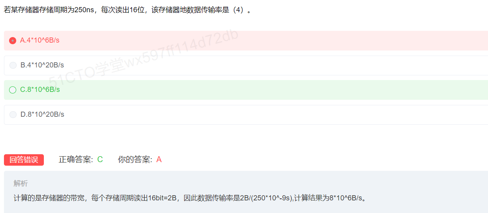

解析: 128KB= 128 * 2^10 B , 32位 = 32bit/8bit=4B,   128 * 2^10 B/(4B)=2^15个地址

题目要求从0000H开始, 也就是说包括0000H在内,总共数2^15个地址, 即0000H+ (2^15), 由于包括了0000H,所以最终结果= 0000H+ (2^15) -1.

2^15 = 1000 0000 0000 0000 = 8 0 0 0H, 所以结果是 0000H+ 8 0 0 0H -1 = 7FFFH. 16进制每个位置的范围是0-F

---

解析:  

- 存储周期是250ns,表示执行一次需要250ns, 1秒可以执行1s/250ns次 = 1*4/(250\*4\*10-9) = 109\*4/1000 = 4\*109/103=4\*106
- 16位/8bit=2B

数据传输率 = 2B \* 4 \* 106  = 8 \* 106
