# 处理器

## 双核处理器

一个处理器 两个运算核心，从而提高计算能力

## 统一过程模型
起始阶段：起始阶段专注于项目的初创活动。

精化阶段：精化阶段在理解了最初的领域范围之后进行需求分析和架构演进。

构建阶段：构建阶段关注系统的构建，产生实现模型。

移交阶段：移交阶段关注于软件提交方面的工作，产生软件增量

## 安全协议

- HTTPS

- SFTP
- IPsec

## 汇编语言

- 汇编语言不能直接被计算机执行,需要编译成机器语言才能被计算机执行

## 多态

> 在面向对象技术中，不同的对象收到**同一消息**可以**产生**完全**不同的结果**，这一现象叫做**多态**

- **方法重载**是一种**静态**多态，也称为**编译时**多态
- **覆盖**属于**运行时**多态

### 参数多态

应用最广泛的多态,被称为最纯的多态

### 包含多态

包含多态在许多语言中都存在,最常见的例子就是子类型化,即一个类型是另一个类型的子类型.

### 过载多态

过载多态是同一个名字在上下午中所代表的含义不同

### 强制多态


## 白盒测试

（1）程序模块中的所有独立路径至少执行一次

（2）在所有的逻辑判断中，取“真”和取“假”的两种情况至少都能执行一次

（3）每个循环都应在边界条件和一般条件下各执行一次

（4）测试程序内部数据结构的有效性等

## 对面向对象软件的测试

（1）算法层：测试类中定义的每个方法。

（2）类层：测试封装在同一个类中的所有方法与属性之间的相互作用。

（3）模板层：测试一组协同工作的类之间的相互作用。

（4）系统层：把各个子系统组装成完整的面向对象软件系统，在组装过程中同时进行测试

## 常见的端口

POP3服务默认的TCP端口号 110


## 可寻址的单元数


---


解析: 128KB= 128 * 2^10 B , 32位 = 32bit/8bit=4B,   128 * 2^10 B/(4B)=2^15个地址

题目要求从0000H开始, 也就是说包括0000H在内,总共数2^15个地址, 即0000H+ (2^15), 由于包括了0000H,所以最终结果= 0000H+ (2^15) -1.

2^15 = 1000 0000 0000 0000 = 8 0 0 0H, 所以结果是 0000H+ 8 0 0 0H -1 = 7FFFH. 16进制每个位置的范围是0-F

---


解析:  

- 存储周期是250ns,表示执行一次需要250ns, 1秒可以执行1s/250ns次 = 1*4/(250\*4\*10<sup>-9</sup>) = 10<sup>9</sup>\*4/1000 = 4\*10<sup>9</sup>/10<sup>3</sup>=4\*10<sup>6</sup>
- 16位/8bit=2B

数据传输率 = 2B \* 4 \* 10<sup>6</sup>  = 8 \* 10<sup>6</sup>

---

## 计算机系统

### CPU的组成（运算器与控制器）

#### 流程图

```
+-------------------+
|     开始指令周期    |
+-------------------+
          ↓
+-------------------+
| 1. 取指阶段 (Fetch) |
|   - PC → 内存地址    |
|   - 内存读取指令 → IR |
|   - PC自动+1或跳转   |
+-------------------+
          ↓
+-------------------+
| 2. 译码阶段 (Decode)|
|   - 解析IR中的指令   |
|   - 生成控制信号      |
+-------------------+
          ↓
+-------------------+
| 3. 执行阶段 (Execute)|
|   - ALU执行运算     |
|   - 计算内存地址/跳转  |
+-------------------+
          ↓
+-------------------+
| 是否需要访问内存？    | → [是] → 进入访存阶段
|       (判断)        | → [否] → 跳过访存阶段
+-------------------+ 
          ↓
+-------------------+
| 4. 访存阶段 (Memory) | ← 可选分支
|   - 读内存：地址→AR   |
|   - 写内存：数据→DR   |
+-------------------+
          ↓
+-------------------+
| 5. 写回阶段 (Write Back)| ← 可选分支
|   - 结果写入寄存器     |
+-------------------+
          ↓
+-------------------+
| 6. 中断检查         | → [有中断] → 处理中断
|   - 检查外部中断信号    | → [无中断] → 继续
+-------------------+
          ↓
+-------------------+
| 返回取指阶段         |
| (进入下一条指令周期)   |
+-------------------+
```

#### **详细步骤说明**

#### **1. 取指阶段 (Fetch)**

- **作用**：从内存中读取指令。
- **关键操作**：
  - **程序计数器（PC）** 提供当前指令的地址。
  - 内存根据地址读取指令，并存入 **指令寄存器（IR）**。
  - **PC 更新**：自动指向下一条指令地址（PC+1）或根据跳转指令修改。

#### **2. 译码阶段 (Decode)**

- **作用**：解析指令内容，生成控制信号。
- **关键操作**：
  - **指令译码器** 拆分指令的 **操作码（做什么）** 和 **操作数（对谁做）**。
  - **控制信号发生器** 根据操作码生成控制信号（如选择 ALU 操作类型）。

#### **3. 执行阶段 (Execute)**

- **作用**：执行指令的核心操作。
- **关键操作**：
  - **算术逻辑单元（ALU）** 执行运算（如加法、逻辑运算）。
  - 如果是跳转指令（如 `JMP`），计算目标地址并更新 PC。

#### **4. 访存阶段 (Memory Access，可选)**

- **作用**：读写内存数据（仅 `LOAD`/`STORE` 类指令需要）。
- **关键操作**：
  - **地址寄存器（AR）** 存储内存地址。
  - **数据寄存器（DR）** 临时保存读写的数据。

#### **5. 写回阶段 (Write Back，可选)**

- **作用**：将结果写回寄存器（仅需要保存结果的指令需要）。
- **关键操作**：将 ALU 结果或内存数据写入目标寄存器。

#### **6. 中断检查**

- **作用**：响应外部中断请求（非必需步骤）。
- **关键操作**：
  - 若有中断，保存当前 PC 值，跳转到中断处理程序。
  - 若无中断，继续执行下一条指令。

---


---


---


---

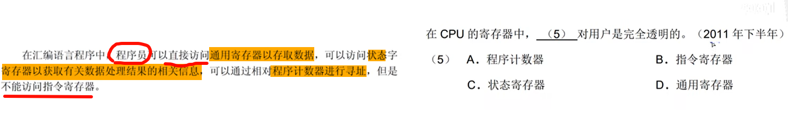

---


---


---


---


---


---

### 进制计算

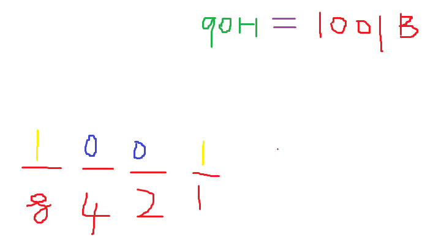

---

1K=1024B（字节Byte）= 2^12B = 1024*8bit(比特，也叫做位)

#### 题型(多练，避免算错)

给一个地址范围，一般都是按照字节编址

##### 2的n次方常用

2^0 = 1

2^1=2

2^3=8

2^4=16

2^5=32

2^6=64

2^7=128

2^8=256

2^9=512

2^10=1024

##### 16进制

A=10

B=11

C=12

D=13

E=14

F=15

##### 解题技巧

1. **数F前有多少位**。这个很容易出错，容易少数1位。导致选错
2. **1 KB= 2^10 B = 2^10  * 8 bit** = 4 * 16^4 B
3. **末尾+1-开始=(x)B** 

---


---


---


---

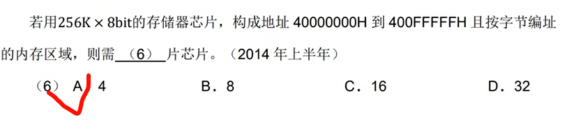

---


---


---


---


---


---

### 原码/反码/补码/移码

#### 知识点：

1. 最高位是符号位，符号位是0表示正数，符号位是1则表示负数
2. 正数的原反补码都一样（不包括0，因为0既不是正数，也不是负数），负数的反码=负数的原码按位求反（符号位不变，其他位按位取反），负数的补码=负数的反码+1
3. 对补码在进行1次补码等于原码
4. **-0=+0,0的原反补码都相同**。 特别注意   0 既不是正数也不是负数，代表空量的一个数

---


---


---


---

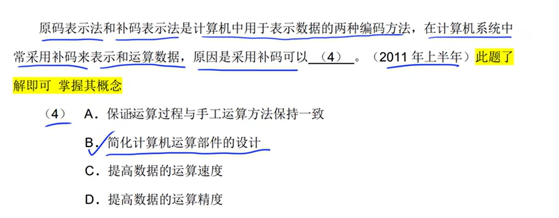

---

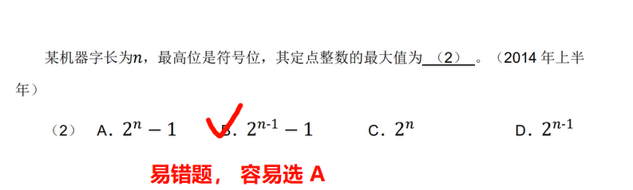

---


---

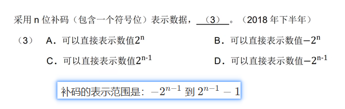

---

### 浮点数

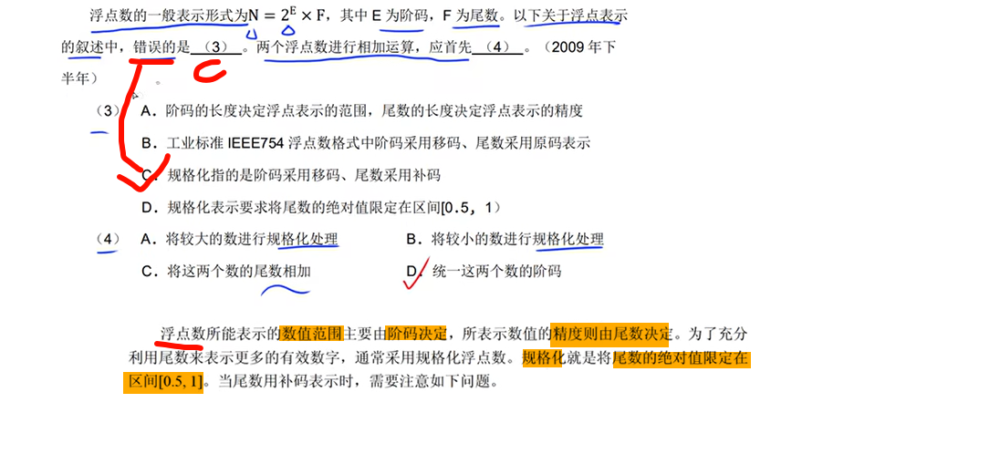

---

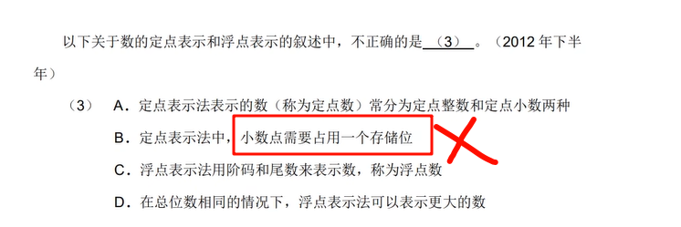

---

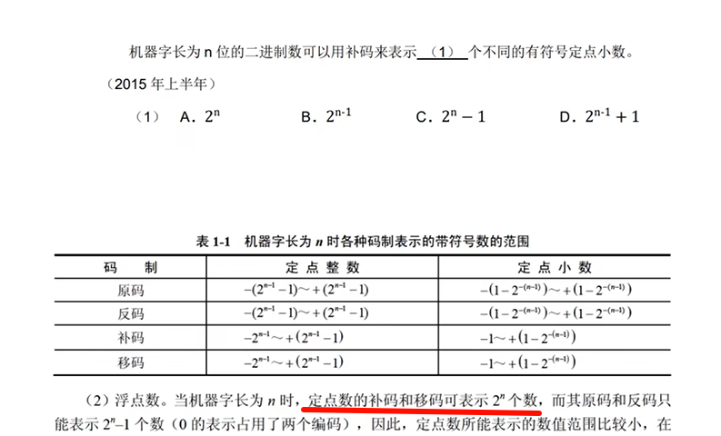


---

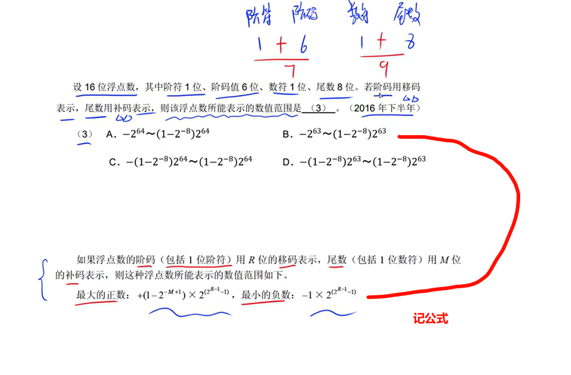

---

**多看多练**


---

### 寻址

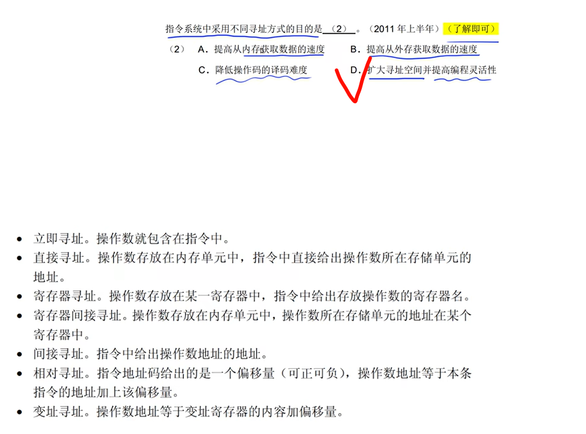

---

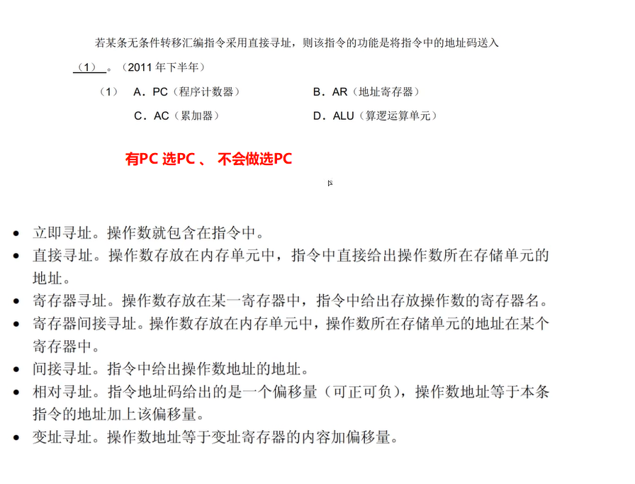

---


---

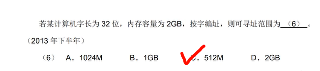

---


---


---

### 奇偶校验码/海明码/循环冗余码


