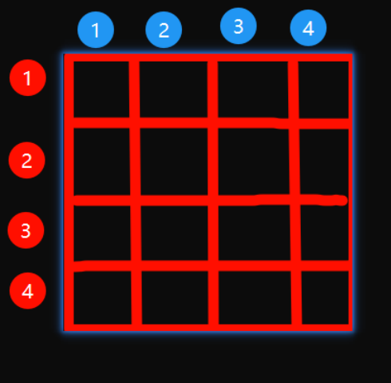

# 16 算法

## N皇后



### 非递归

```c
// 标准输入输出流
#include <math.h>
#include <stdio.h>

// 定义1个N x N的棋盘
// 这是一个宏定义，属于C语言的预处理指令
// 代码中所有出现 N 的地方都会被替换为 4
// 不可修改,调试的时候,看不到N(替换后符号消失)
// 定义1个标识符, 常量 4. 表示4个皇后
#define N 10

// 定义了一个名为 q 的整型数组
// 由于N=4,所以数组的大小为5
// 存储皇后的列号
int q[N + 1];

// 检查第j个皇后的位置是否合法
// 由于不同的皇后不会放在同一行,所以不用判断行
// 只需要判断两个皇后不在同一列并且不在一条斜线上, 即认为当前皇后的位置合法;反之不合法
// j表示当前正在摆放的第j个皇后
int check(int j) {
    // 如果当前皇后和它之前的每一个皇后相比,
    // 在同一行或者同一个斜线上,认为位置不合法,否则对比完它之前的所有皇后之后,位置都是合法的, 则认为位置合法
    for (int i = 1; i < j; ++i) {
        if (q[i] == q[j] || abs(i - j) == abs(q[i] - q[j])) {
            // 表示在同一列或者同一个斜线上.位置不合法
            return 0;
        }
    }
    return 1;
}

// 求解N皇后的方案
void queue() {
    // 从1开始,q[i]表示第i个皇后
    for (int i = 1; i <= N; ++i) {
        q[i] = 0; // 把每个皇后的列都定义为0,表示全都没有放入棋盘.反之>0,比如q[i] = 1,表示第1个皇后放在了第一行的第一列
    }

    // 方案数
    int answer = 0;

    // 表示正在摆放第j个皇后
    int j = 1;
    // i <=N 表示要摆放N个皇后
    while (j >= 1) {
        // 表示将第j个皇后,向右移动1个位置.
        // 初始的时候,表示将第1个皇后从棋盘外(q[0]移动到第一行的第1列)
        q[j]++;

        while (q[j] <= N && !check(j)) {
            // 这里必须要加上=N,如果不加.就会少一个越界的场景.导致由于越界后需要调整上一个皇后位置的场景丢失.最终导致数据错乱
            q[j] = q[j] + 1;
        }

        if (q[j] <= N) {
            if (j == N) { // 找到了N皇后的一组解
                answer++;
                printf("方案%d:  ", answer);
                for (int i = 1; i <= N; ++i) {
                    printf("%d,", q[i]);
                }
                printf("\n");
            } else {
                // 继续摆放下一个皇后的位置
                j++;
            }
        } else {
            // 越界,回溯
            q[j] = 0;
            j--;
        }
    }
}

int main(int argc, char const *argv[]) {
    queue();

    return 0;
}
```


### 递归

```c
#include <math.h>
#include <stdio.h>

#define N 3

int answer = 0;

// 定义1个一维数组
// 假设有4个皇后, 每个皇后占1行,
// j从1开始, 下标j表示第j个皇后,q[j]的值表示皇后的位置列.所以1个皇后的位置可以表示为 j,q[j].
// 即第j个皇后在第j行的第q[j]列
int q[N + 1];

/**
 * 检查当前皇后的位置是否合法
 * @param j 从1开始,表示当前正在被摆放的皇后的位置列
 * @return 1 表示合法;0表示不合法
 */
int check(int j) {
    for (int i = 1; i < j; i++) {
        // 当前摆放的皇后的列和以往的每一个皇后在同一列,则认为不合法;
        // 或者
        // 当当前皇后的行号-每一个皇后的行号的绝对值等于两个皇后的列号的绝对值,同样认为不合法
        if (q[i] == q[j] || abs(i - j) == abs(q[i] - q[j])) {
            return 0;
        }
    }
    return 1;
}

/**
 * 求解N皇后问题
 */
void queue(int j) {
    q[j] = q[j] +1;
    for (int i = 1; i <= N; ++i) {
        q[j] = i;
        if (check(j)) {
            if (j == N ) {
                //找到一组N皇后解
                answer++;
                printf("方案%d:  ", answer);
                for (int i = 1; i <=N ; ++i) {
                    printf("%d, ", q[i]);
                }
                printf("\n");
            } else {
                queue(j + 1);
            }
        }
    }
}

int main() {
    for (int j = 1; j <= N; ++j) {
        q[j] = 0;
    }

    // 一开始将第一个皇后放入到第一行的第一列
    queue(1);
    return 0;
}
```

## 归并排序

### 写法1

```c
#include <stdio.h>

void merge(int arr[], int begin, int mid, int end) {
    // 变量抽离出来,后续可能复用,并且看代码也清楚明了
    int left_len = mid - begin + 1;
    int right_len = end - mid;
    int left[left_len], right[right_len];

    // Copy data to temp arrays
    //把指定区间的数据拷贝到 左右两个数组中. 那么arr就可以置换出来了.也就不依赖arr了
    //换言之,arr的[begin,end]区间,可以直接覆盖值.少定义1个目标临时数组
    for (int i = 0; i < left_len; i++)
        left[i] = arr[begin + i];
    for (int j = 0; j < right_len; j++)
        right[j] = arr[mid + 1 + j];

    // Merge the temp arrays back into arr[begin..end]
    //定义目标数字从begin位置开始依次放入数据
    //这里选择新定义1个变量k,并且把begin赋值给k,避免造成begin污染
    //i<做集合的length,同理右边也是.为了防止数组越界
    //当这个循环结束后.说明至少有1边的数组已经全部放入到了目标数组.那么只需要将另外1个数组的剩余部分全部依次放入目标数组即可
    int i = 0, j = 0, k = begin;
    while (i < left_len && j < right_len) {
        if (left[i] <= right[j]) {
            arr[k++] = left[i++];
        } else {
            arr[k++] = right[j++];
        }
    }

    // Copy remaining elements of left[] if any
    while (i < left_len) {
        arr[k++] = left[i++];
    }

    // Copy remaining elements of right[] if any
    while (j < right_len) {
        arr[k++] = right[j++];
    }
}

void mergeSort(int arr[], int begin, int end) {
    if (begin < end) {
        int mid = begin + (end - begin) / 2;  // Avoid potential overflow
        mergeSort(arr, begin, mid);
        mergeSort(arr, mid + 1, end);
        merge(arr, begin, mid, end);
    }
}

int main() {
    int arr[] = {90, 1, 100, 5, 20};
    int n = sizeof(arr) / sizeof(arr[0]);

    mergeSort(arr, 0, n - 1);

    printf("Sorted array: ");
    for (int i = 0; i < n; i++) {
        printf("%d ", arr[i]);
    }
    return 0;
}
```

### 写法2 (推荐)

区别, 这种写法, 没有显式定义两个辅助数组

```html
#include <stdio.h>

/**
 * 归并排序分为3部分
 * 1. 拆分
 * 2. 求解
 * 3. 合并
 * @return
 */
void mergeSort(int pInt[5], int i, int i1);

void merge(int *pInt, int low, int mid, int high);

int main() {
    int arr[5] = {4, 3, 6, 2, 7};
    mergeSort(arr, 0, 4);
    for (int i = 0; i < 5; ++i) {
        printf("%d ,", arr[i]);
    }
    return 0;
}

void mergeSort(int arr[], int low, int high) {
    if (low < high) {
        int mid = (low + high) / 2;
        mergeSort(arr, low, mid);
        mergeSort(arr, mid + 1, high);
        merge(arr, low, mid, high);
    }
}

void merge(int arr[], int low, int mid, int high) {
    int tmpArr[1000]; //FIXME 这里应该读取C语言读取数组长度的方法
    for (int i = low; i <= high; ++i) {
        tmpArr[i] = arr[i];
    }
    int i = low;  //表示左边数组移动的指针(下标)
    int j = mid +1; //表示右边数组移动的指针
    int k = low; //表示目标数组拜访位置的指针
    while (i <= mid && j <= high) {
        if(tmpArr[i] <= tmpArr[j]){
            arr[k++] = tmpArr[i++];
        } else{
            arr[k++] = tmpArr[j++];
        }
    }
    while (i <= mid) arr[k++] = tmpArr[i++];
    while (j <= high) arr[k++] = tmpArr[j++];
}
```

