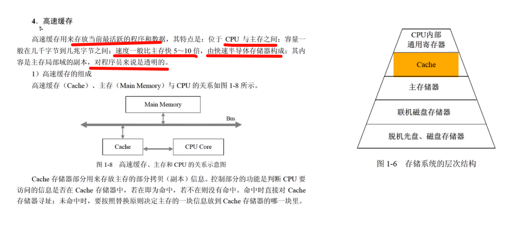
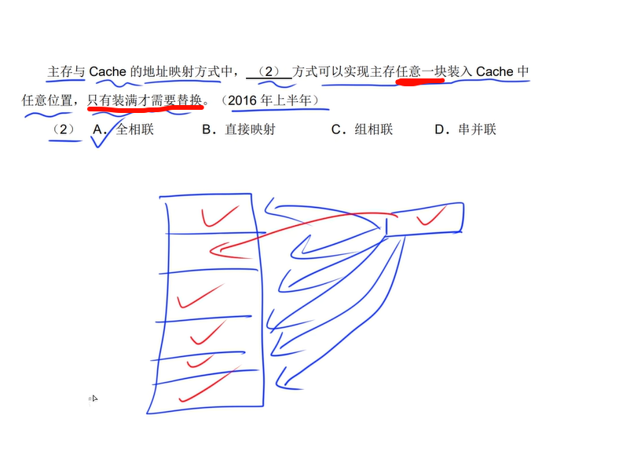
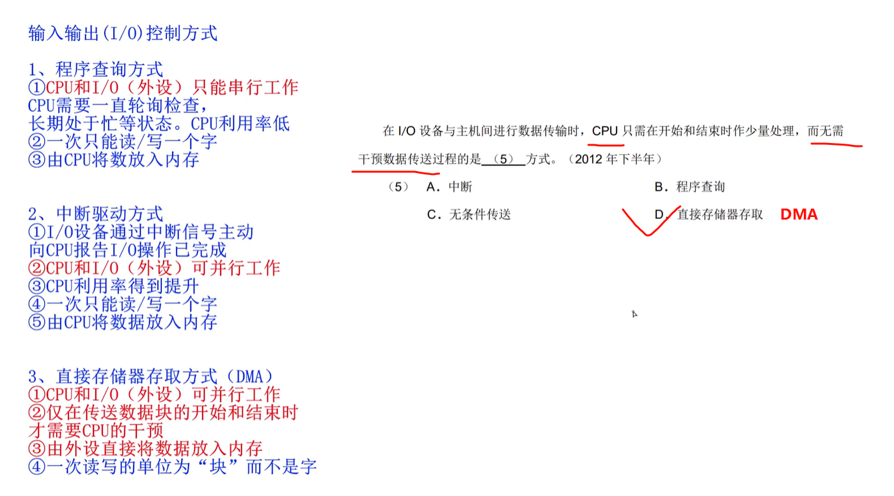
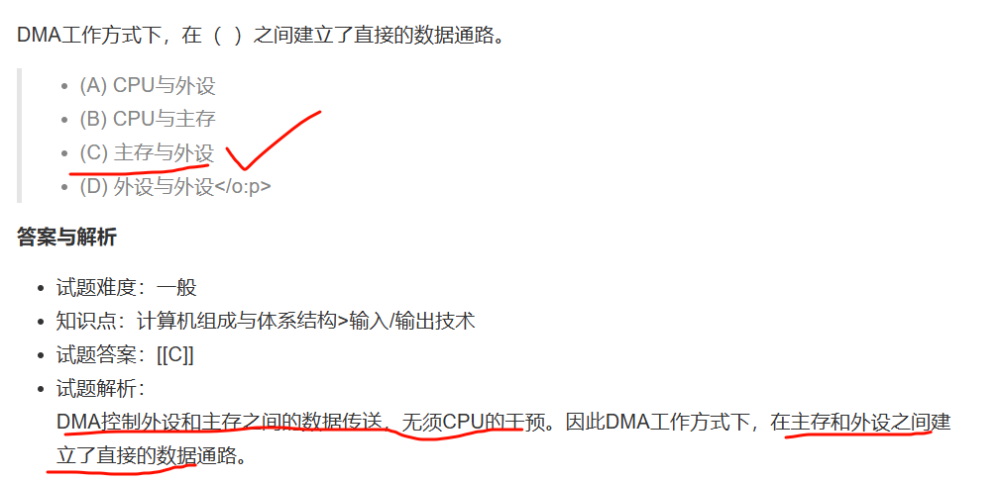
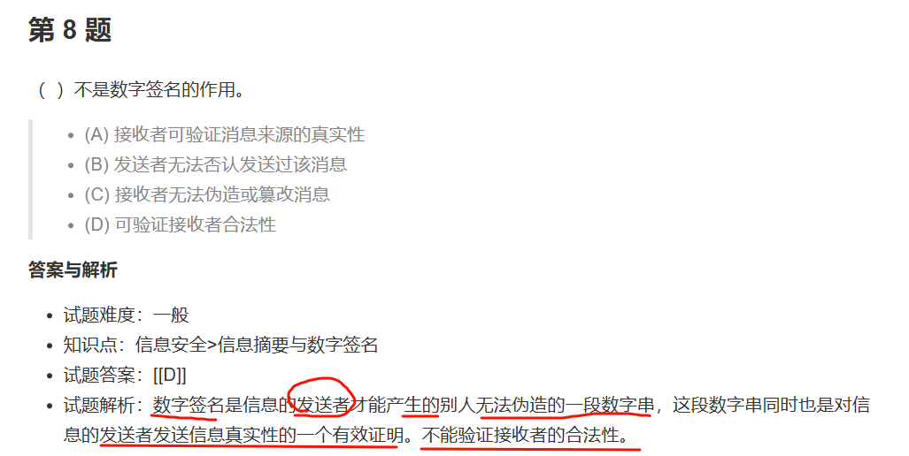
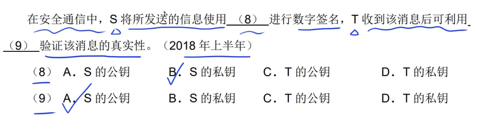
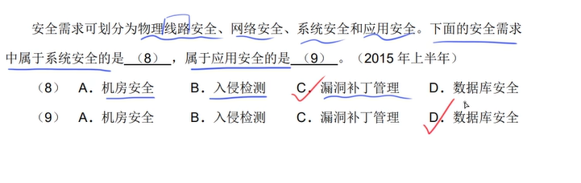

# 1 计算机系统

### CPU的组成（运算器与控制器）

#### 流程图

```
+-------------------+
|     开始指令周期    |
+-------------------+
          ↓
+-------------------+
| 1. 取指阶段 (Fetch) |
|   - PC → 内存地址    |
|   - 内存读取指令 → IR |
|   - PC自动+1或跳转   |
+-------------------+
          ↓
+-------------------+
| 2. 译码阶段 (Decode)|
|   - 解析IR中的指令   |
|   - 生成控制信号      |
+-------------------+
          ↓
+-------------------+
| 3. 执行阶段 (Execute)|
|   - ALU执行运算     |
|   - 计算内存地址/跳转  |
+-------------------+
          ↓
+-------------------+
| 是否需要访问内存？    | → [是] → 进入访存阶段
|       (判断)        | → [否] → 跳过访存阶段
+-------------------+ 
          ↓
+-------------------+
| 4. 访存阶段 (Memory) | ← 可选分支
|   - 读内存：地址→AR   |
|   - 写内存：数据→DR   |
+-------------------+
          ↓
+-------------------+
| 5. 写回阶段 (Write Back)| ← 可选分支
|   - 结果写入寄存器     |
+-------------------+
          ↓
+-------------------+
| 6. 中断检查         | → [有中断] → 处理中断
|   - 检查外部中断信号    | → [无中断] → 继续
+-------------------+
          ↓
+-------------------+
| 返回取指阶段         |
| (进入下一条指令周期)   |
+-------------------+
```

#### **详细步骤说明**

#### **1. 取指阶段 (Fetch)**

- **作用**：从内存中读取指令。
- **关键操作**：
  - **程序计数器（PC）** 提供当前指令的地址。
  - 内存根据地址读取指令，并存入 **指令寄存器（IR）**。
  - **PC 更新**：自动指向下一条指令地址（PC+1）或根据跳转指令修改。

#### **2. 译码阶段 (Decode)**

- **作用**：解析指令内容，生成控制信号。
- **关键操作**：
  - **指令译码器** 拆分指令的 **操作码（做什么）** 和 **操作数（对谁做）**。
  - **控制信号发生器** 根据操作码生成控制信号（如选择 ALU 操作类型）。

#### **3. 执行阶段 (Execute)**

- **作用**：执行指令的核心操作。
- **关键操作**：
  - **算术逻辑单元（ALU）** 执行运算（如加法、逻辑运算）。
  - 如果是跳转指令（如 `JMP`），计算目标地址并更新 PC。

#### **4. 访存阶段 (Memory Access，可选)**

- **作用**：读写内存数据（仅 `LOAD`/`STORE` 类指令需要）。
- **关键操作**：
  - **地址寄存器（AR）** 存储内存地址。
  - **数据寄存器（DR）** 临时保存读写的数据。

#### **5. 写回阶段 (Write Back，可选)**

- **作用**：将结果写回寄存器（仅需要保存结果的指令需要）。
- **关键操作**：将 ALU 结果或内存数据写入目标寄存器。

#### **6. 中断检查**

- **作用**：响应外部中断请求（非必需步骤）。
- **关键操作**：
  - 若有中断，保存当前 PC 值，跳转到中断处理程序。
  - 若无中断，继续执行下一条指令。

---


---


---


---


---


---


---


---


---


---

### 进制计算


---

1K=1024B（字节Byte）= 2^12B = 1024*8bit(比特，也叫做位)

#### 题型(多练，避免算错)

给一个地址范围，一般都是按照字节编址

##### 2的n次方常用

2^0 = 1

2^1=2

2^3=8

2^4=16

2^5=32

2^6=64

2^7=128

2^8=256

2^9=512

2^10=1024

##### 16进制

A=10

B=11

C=12

D=13

E=14

F=15

##### 解题技巧

1. **数F前有多少位**。这个很容易出错，容易少数1位。导致选错
2. **1 KB= 2^10 B = 2^10  * 8 bit** = 4 * 16^4 B
3. **末尾+1-开始=(x)B** 

---


---


---


---


---


---


---


---


---


---

### 原码/反码/补码/移码

#### 知识点：

1. 最高位是符号位，符号位是0表示正数，符号位是1则表示负数
2. 正数的原反补码都一样（不包括0，因为0既不是正数，也不是负数），负数的反码=负数的原码按位求反（符号位不变，其他位按位取反），负数的补码=负数的反码+1
3. 对补码在进行1次补码等于原码
4. **-0=+0,0的原反补码都相同**。 特别注意   0 既不是正数也不是负数，代表空量的一个数

---


---


---


---


---


---


---


---

### 浮点数


---


---


---


---

**多看多练**


---

### 寻址


---


---


---


---


---


---

### 奇偶校验码/海明码/循环冗余码 （多记概念）

#### 奇偶校验码

只校验，不纠错。 只有奇数个数据位发生错误，才会发现错误

#### 循环冗余校验码

模2运算来构造校验位

#### 海明码

- 码距必须要大于1
- 码距等于2，只能校验错误，不能就错误
- 码距>=3, 校验错误+纠错

---


---


---


---


---


---

### RISC和CISC


---


---


---


---


---

### 流水线

---


---


---


---


---

## 存储器


---


---


---


---


---

## Cache



---


---


---



---


---


---


---

## 中断


---


---


---


---


---


---


---


---


---


---



---



---

 

---


---

## 总线


---


---


---


---


---


---


---

## 加密技术与认证技术


---


---


---



---



---


---


---


---


---


---


---

## 加密算法

报文摘要：防止报文被篡改


---


---


---


---


---


---


---


---

## 可靠性公式


---


---


---


---


---


---


---



---

## 攻击

### 主动攻击

> 主动攻击的目的是**破坏系统完整性、可用性或真实性**，攻击者直接对数据或系统进行篡改或干扰。

1. **篡改（Tampering）**
   - 修改传输或存储中的数据。例如：篡改HTTP请求参数以获取未授权数据。
2. **伪装（Masquerade）**
   - 冒充合法用户或实体进行攻击。例如：伪造发件人地址发送钓鱼邮件。
3. **重放攻击（Replay Attack）**
   - 截获合法通信后重复发送，以欺骗系统。例如：重复提交已捕获的登录凭证。
4. **拒绝服务攻击（DoS/DDoS）**
   - 通过大量请求耗尽系统资源，导致服务瘫痪。例如：SYN洪水攻击。
5. **中间人攻击（MITM, Man-in-the-Middle）**
   - 攻击者插入通信链路，窃听或篡改数据。例如：伪造WiFi热点截取用户信息。
6. **恶意代码（Malware）**
   - 植入病毒、蠕虫、木马等破坏系统或窃取数据。
7. **SQL注入/XSS攻击**
   - 通过注入恶意代码操纵数据库或劫持用户会话（属于应用层主动攻击）

### 被动拦截

> 被动攻击的目的是**非法获取信息**，但不直接破坏系统或数据。攻击者通常隐蔽进行，难以被发现。

1. **窃听（Eavesdropping）**
   - 通过监听网络流量获取敏感信息（如密码、明文传输的数据）。
   - 例如：使用抓包工具（如Wireshark）截取未加密的HTTP通信。
2. **流量分析（Traffic Analysis）**
   - 分析通信模式（如频率、时间、数据量等）推断信息，即使数据已加密。
   - 例如：通过分析某服务器的流量峰值，推测其业务活动。
3. **信息收集（Information Gathering）**
   - 收集系统公开信息（如IP地址、端口、软件版本等），为后续攻击做准备。

- **被动攻击防御**：加密技术（如HTTPS、VPN）、最小化敏感信息暴露。
- **主动攻击防御**：防火墙、入侵检测系统（IDS）、数字签名、输入验证等。

---


---


---


---


---

## 解释 编译


---


----

## 符号表


---


---


