# 上午题 #9 设计模式

## 总览

- 工厂单例建原型:  **创建型模式**
- 世代外接享组合: **结构性模式**
- 剩下的(其他的)都是行为型模式共11个

### **创建型模式**(5个):

1. 工厂方法  (**创建型类**)
2. 抽象工厂方法 (创建型对象)
3. 单例模式 (创建型对象)
4. 建造者模式 (创建型对象)
5. 原型模式 (创建型对象)

### 结构性模式(7种):

1. 装饰器模式  (结构型对象)
2. 适配器模式  **特殊:** **既是**结构型对象模式 ,**也是**结构型类模式
3. 代理模式 (结构型对象)
4. 外观者模式 (结构型对象)
5. 桥接模式 (结构型对象)
6. 享元模式 (结构型对象)
7. 组合模式 (结构型对象)

### 行为型模式(11种)

1. 策略模式  (行为型对象)
2. 模板方法模式  (**行为型类模式**)
3. 观察者模式 (行为型对象)
4. 迭代子模式 (行为型对象)
5. 责任链模式 (行为型对象)
6. 命令模式 (行为型对象)
7. 备忘录模式 (行为型对象)
8. 状态模式 (行为型对象)
9. 访问者模式 (行为型对象)
10. 中介者模式 (行为型对象)
11. 解释器模式 (**行为型类模式**)

---

| **模式**     | **场景联想**                                           |
| :----------- | :----------------------------------------------------- |
| **单例**     | 公司只有一台打印机，所有人共用（**全局唯一**）。       |
| **工厂方法** | 麦当劳生产汉堡（子类决定具体产品, **一个产品**）。     |
| **抽象工厂** | 苹果店卖手机+耳机+电脑（**全家桶产品族**）。           |
| **适配器**   | 出国旅行用转换插头（接口不兼容→**兼容**）。            |
| **代理**     | 明星经纪人（控制访问，过滤请求）。                     |
| **装饰器**   | 给奶茶加珍珠、加椰果（**动态添加功能**）。             |
| **观察者**   | 微信订阅号（你关注公众号，它发文章你收**通知**）。     |
| **策略**     | 支付方式切换（支付宝/微信/银行卡，**算法可替换**）。   |
| **模板方法** | 泡茶**固定流程**（烧水→放茶叶→冲泡），但茶叶种类可变。 |
| **责任链**   | 请假**审批流程**（组长→经理→CEO，**层层传递**）。      |

## 单例模式 Singleton

### 用途

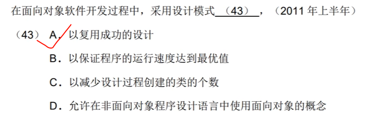

---

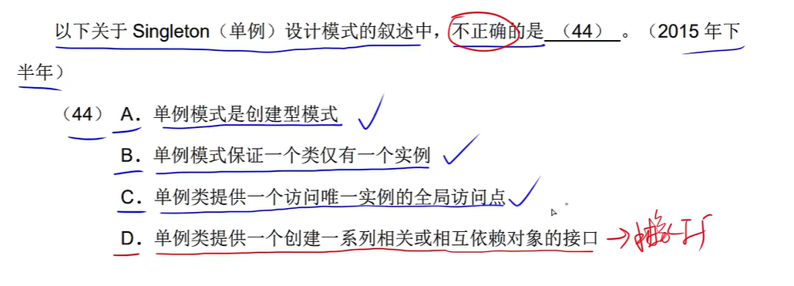

---

---

## 工厂方法模式 Factory

### 特点

1. **仅创建单一产品**，不涉及产品族
2. 

## 抽象工厂模式 Abstract Factory

### 特点

1. **创建多个产品族**
2. **多个抽象产品**接口
3. 1个工厂级产生多个产品

### 意图:

提供一个**创建一系列**相关或相互依赖对象的**接口**,而**无需指定**他们**具体的类**

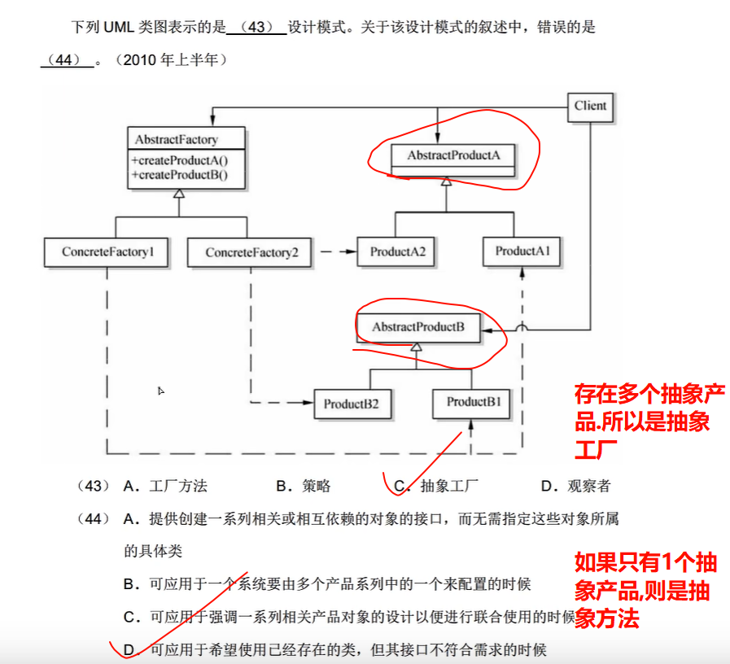

---

---

## 生成器模式(Builder)/建造者模式

### 特点

Builder模式适用于：

1. 当创建**复杂对象**的算法应该**独立于**该对象的**组成部分**以及它们的**装配方式**时。
2. 当**构造过程**必须**允许**被构造的**对象有不同的表示时**。

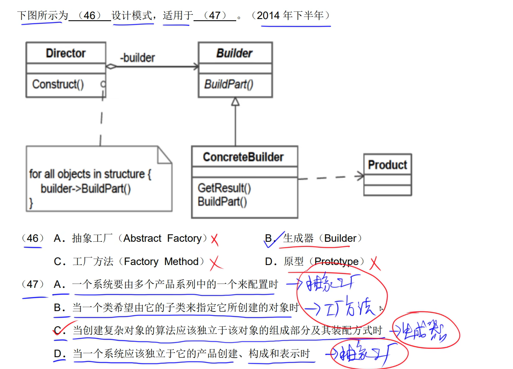

---

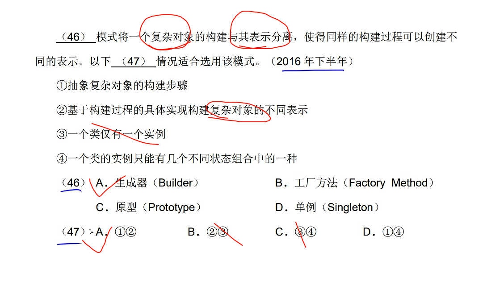

---

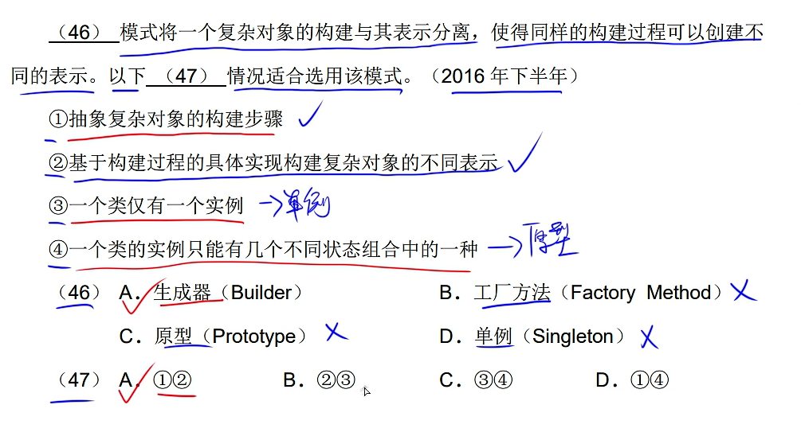

---

## 适配器模式 Adapter

### 意图:

将1个类的接口**转换**为客户希望的另1个类的接口

**转换原接口** 得到 **兼容的接口**

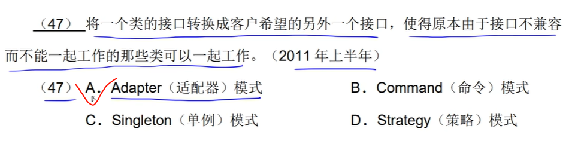

---

## 桥接模式 Bridge

### 意图:

将**抽象部分**与**实现**部分**分离**, 使他们可以**独立变化**

客户端操作的是抽象类,即抽象类是客户程序使用的主要接口

Bridge模式适用于：

1. **不希望**在**抽象**和它的**实现部分**之间**有**一个**固定**的**绑定关系**。例如，这种情况可能是因
   为，在程序运行时刻实现部分应可以被选择或者切换。
2. 类的抽象以及它的实现都应该可以通过**生成子类**的方法**加以扩充**。这是Bridge模式使
   得开发者可以对不同的抽象接口和实现部分进行组合，并分别对它们进行扩充。
3. 对一个抽象的实现部分的修改应对客户不产生影响，即**客户代码不必重新编译**。
   （C++）想对客户完全隐藏抽象的实现部分。
4. 有许多类要生成的**类层次结构**。
5. 想在多个对象间**共享实现**（可能使用引用计数），但同时要求客户并不知道这一点。

---

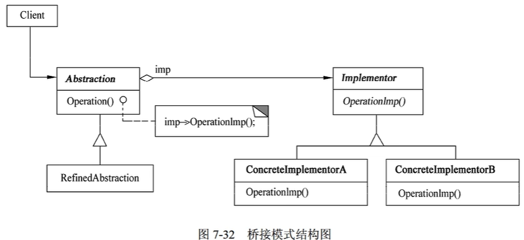

---

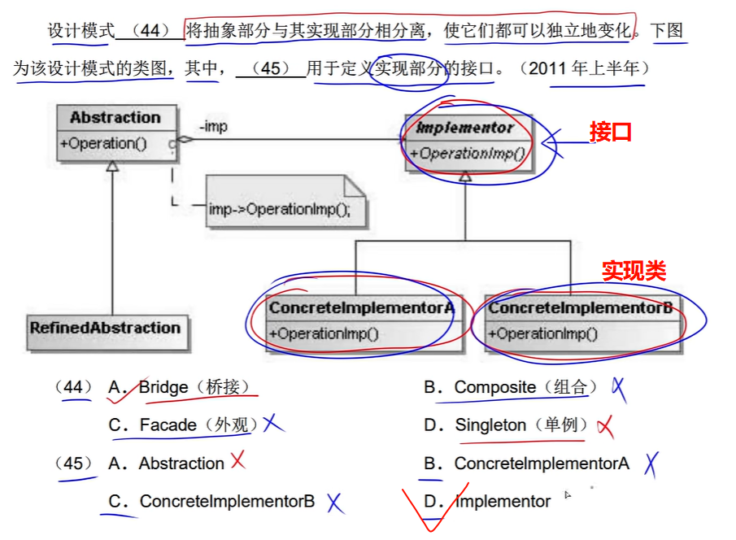

---

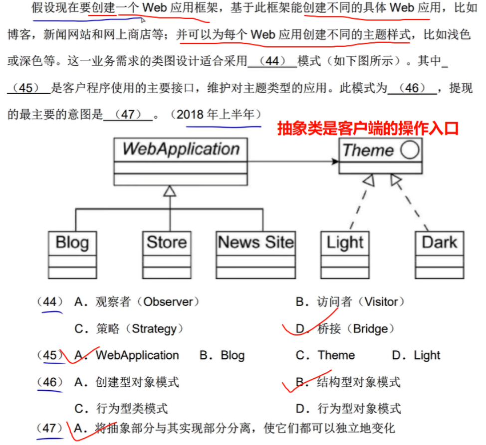

---

 ## 组合模式 Composite

### 意图

将对象**组合成树型结构**以表示“**部分-整体**”的的**层次结构**。Composite使  得用户对单个对象
和组合对象的使用具有一致性。

### 适用性

1. 想表示对象的**部分-整体层次结构**。
2. 希望用户**忽略组合对象与单个对象的不同**，用户将统一地使用组合结构中的所有对象。

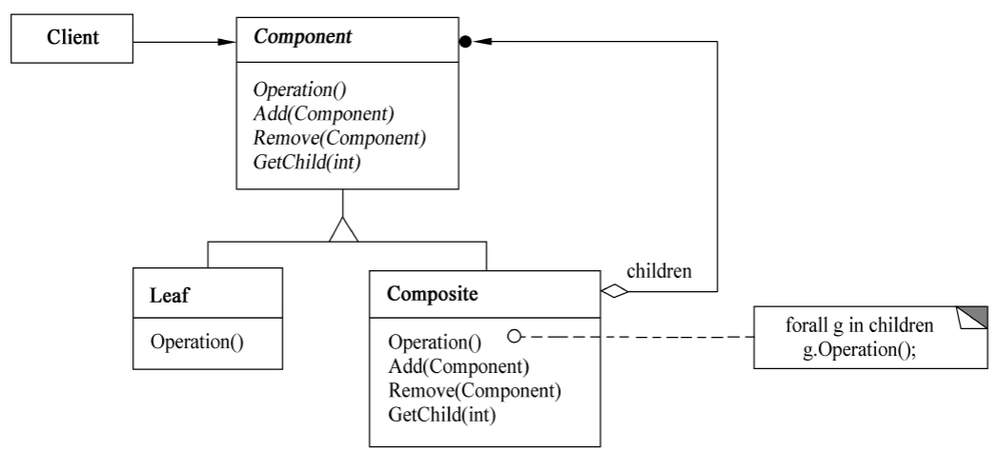

---

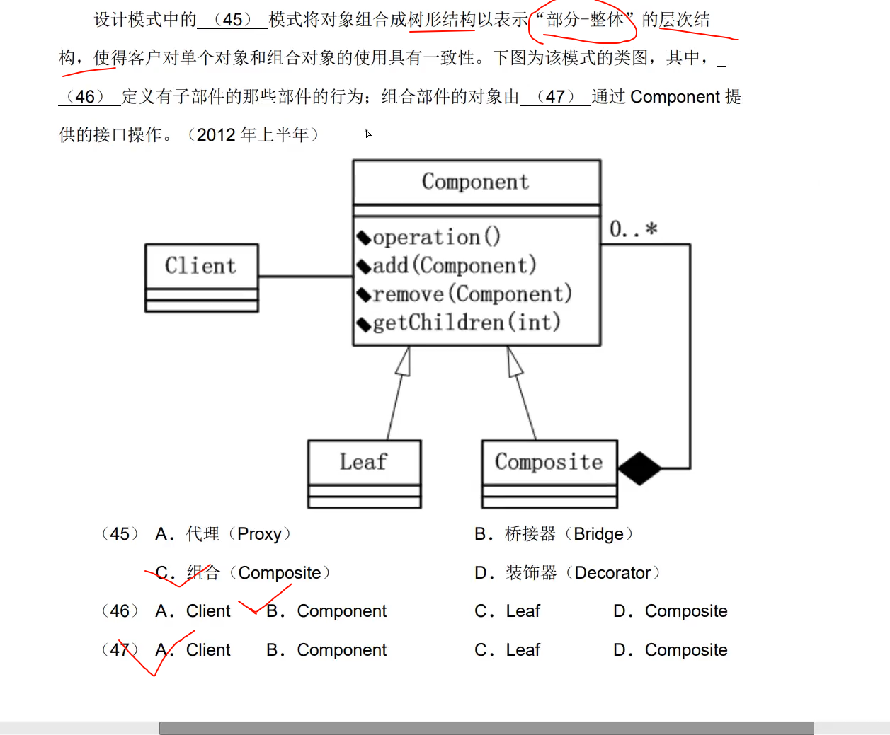

分析:

- **Component**：作为抽象基类，定义了所有部件（包括叶子`Leaf`和组合`Composite`）的通用接口（如`add()`、`remove()`）。
- `Composite`是`Component`的子类，实现有子部件的具体行为。
- `Leaf`是叶子节点，不包含子部件（可能抛出“不支持操作”异常）

---

---

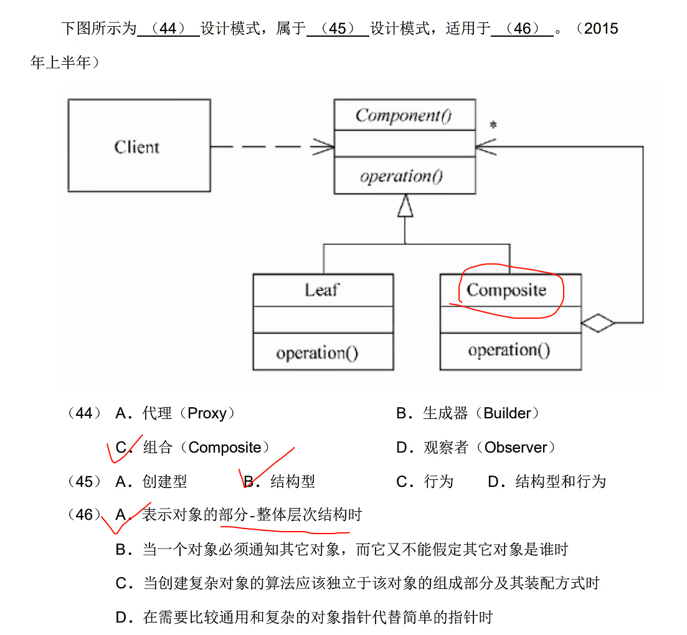

---

## 装配器模式 Decorator

### 意图

动态地**给对象添加一些职责**, **比生成子类更加灵活**

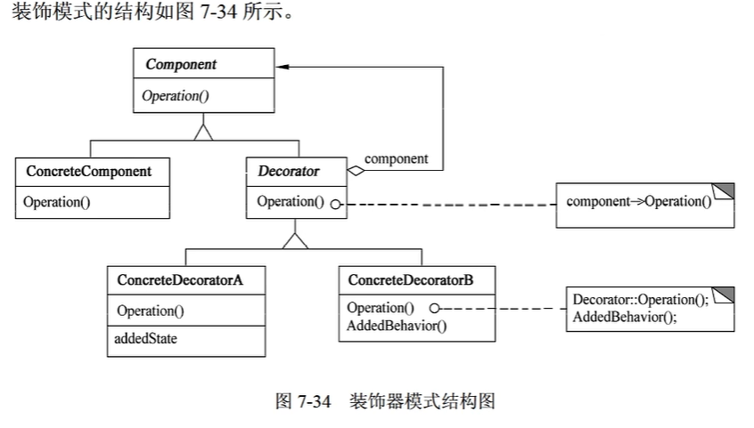

---

其中：
Component定义一个对象接口，可以给这些对象动态地添加职责。
ConcreteComponent定义一个对象，可以给这个对象添加一些职责。
Decorator 维持一个指向Component 对象的指针，并定义一个与 Component 接口一致
的接口。
ConcreteDecorator向组件添加职责。
### 适用性

1. 在不影响其他对象的情况下，以动态、透明的方式给单个对象添加职责
2.  处理那些可以撤销的职责。
3. 当不能采用生成子类的方式进行扩充时。一种情况是，可能有大量独立的扩展，为支
   持每一种组合将产生大量的子类，使得子类数目呈爆炸性增长。另一种情况可能是，
4. 由于类定义被隐藏，或类定义不能用于生成子类。

---

## 外观模式 Facade

## 意图

为子系统提供一致的界面,定义了一个高层接口, 使得子系统更加容易使用

将一系列对象**加以包装**以**简化接口**

## 结构

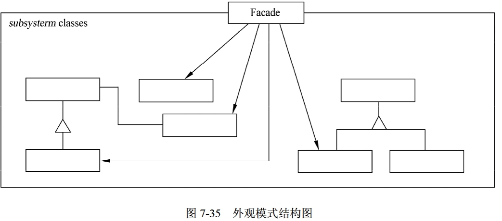

- Facade知道哪些**子系统**类负责处理请求；将客户的请求**代理**给适当的子系统对象。**不要混淆认为代理模式**
- **Subsystem** classes实现**子系统**的功能；处理有Facade对象指派的任务；没有Facade的
  任何相关信息，即没有指向Facade的指针。

---

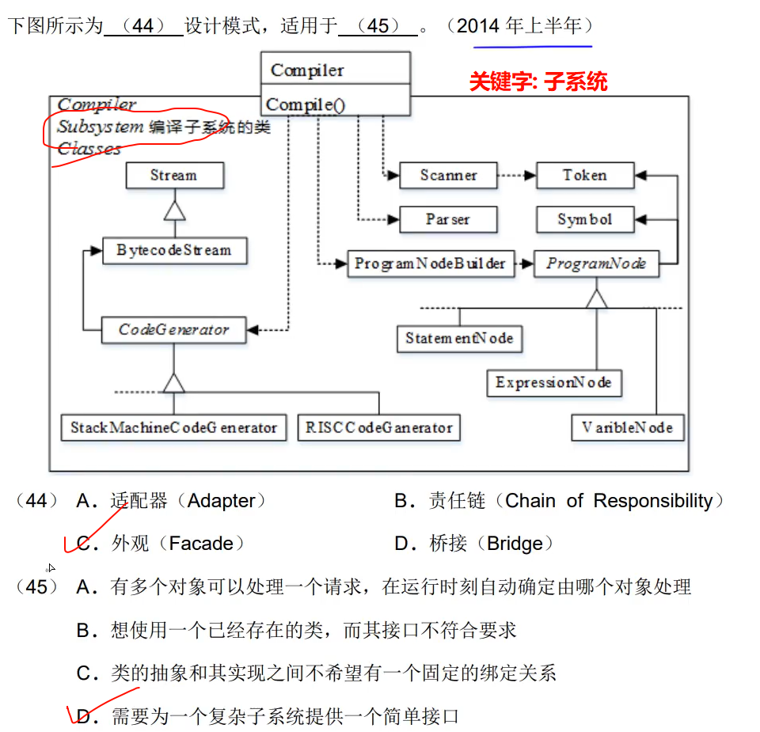

---

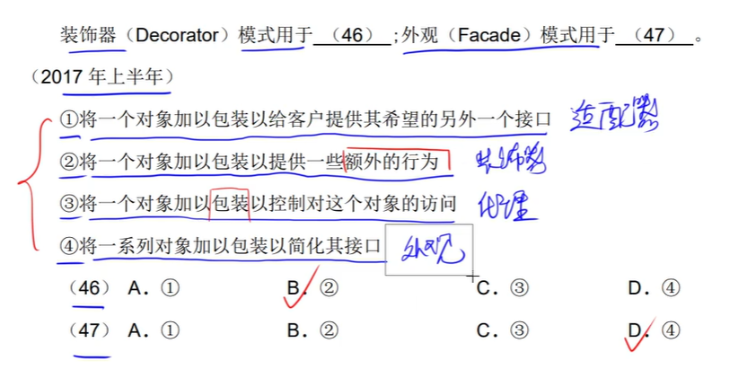

---

## 享元模式 Flyweight

### 意图

运用**共享技术**有效地**支持大量细粒度的对象**

### 结构

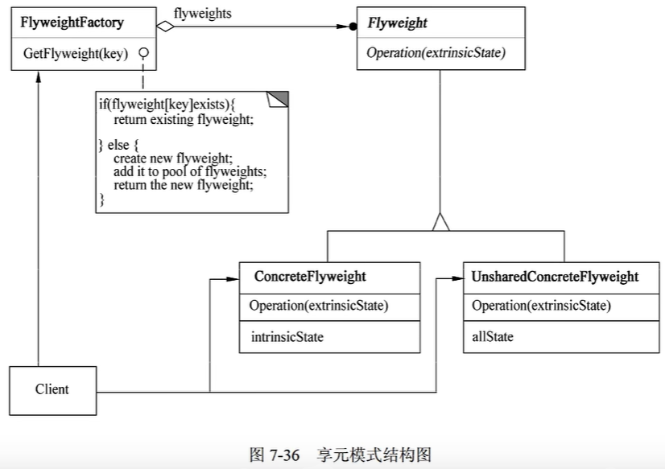

---

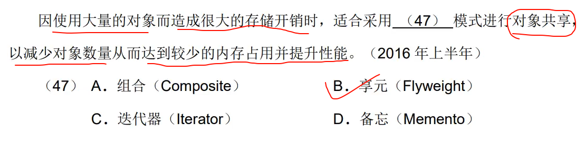

---

## 代理模式 Proxy

### 意图

通过**提供相同的接口**,**为其他对象**提供代理以**控制**这个**对象**的**访问**

### 结构

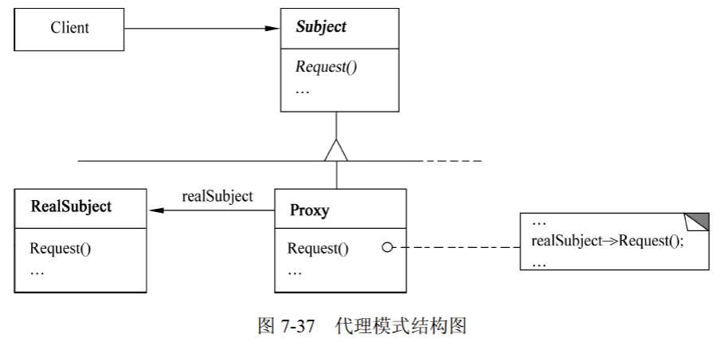

---

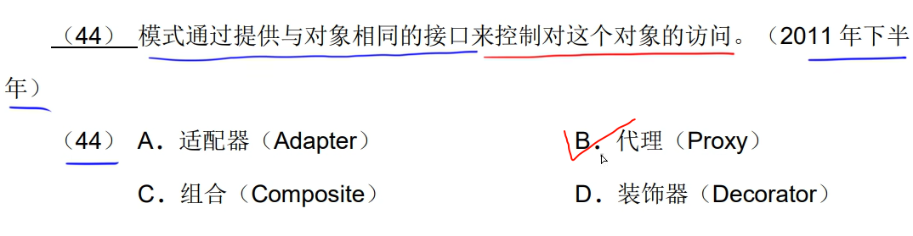

---

## 责任链模式 Chain Of Reponsibility

### 意图

**使多个对象都有机会处理请求**,从而**避免发送者和请求者之间的耦合**关系.将这些**对象连接成一条链**,并沿着这条链传递该请求,直到有一个对象处理它为止

### 结构

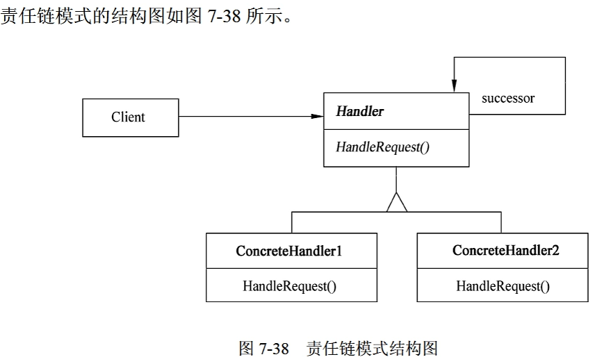

1. Handler定义一个处理请求的接口；（可选）实现后继链。
2. ConcreteHandler处理它所负责的请求；可访问它的后继者；如果可处理该请求，就处
   理它，否则将该请求转发给后继者。
3. Client向链上的具体处理者（ConcreteHandler）对象提交请求。

---

## 命令模式 Command

### 意图

将一个请求封装成一个对象,从而使得可以用不同的请求对客户进行**参数化**;对请求排队或记录日志,以及**支持可撤销的操作**

**抽象**出执行的**动作**以**参数化**某对象

### 结构

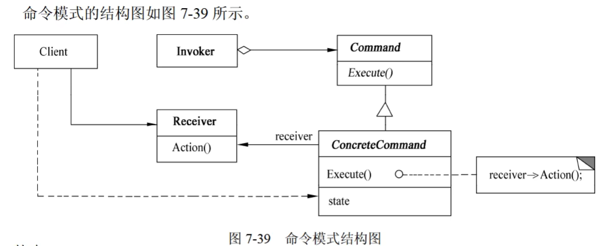

1. Command声明执行操作的接口。
2. ConcreteCommand将一个接收者对象绑定于一个动作；调用接收者相应的操作，以实
   现Execute。
3. Client创建一个具体命令对象并设定它的接收者。
4. Invoker要求该命令执行这个请求。
5. Receiver知道如何实施与执行一个请求相关的操作。任何类都可能作为一个接收者。

---

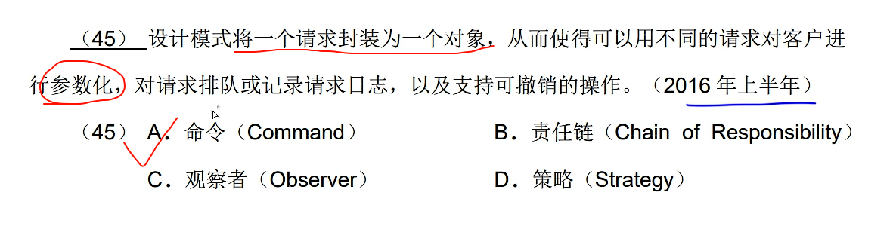

---

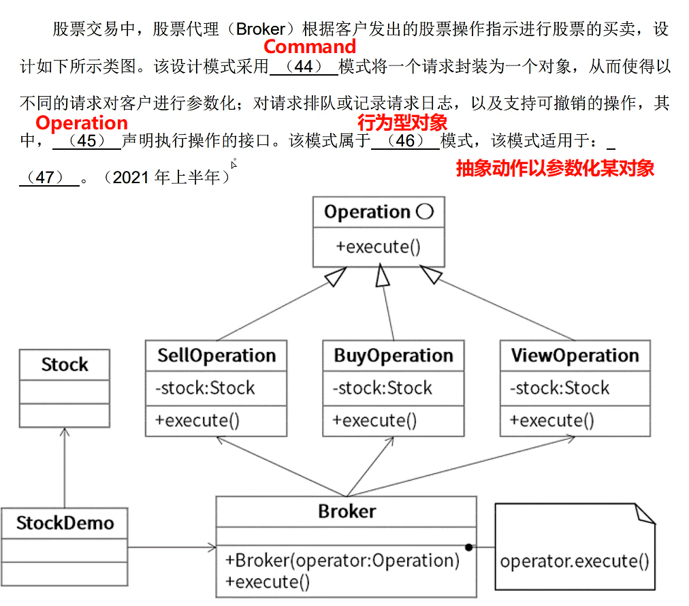

---

## 解释器模式 Expression

### 意图

给定一个语言，定义它的文法的一种表示，并定义一个解释器，这个解释器使用该表示来
解释语言中的句子。

### 结构

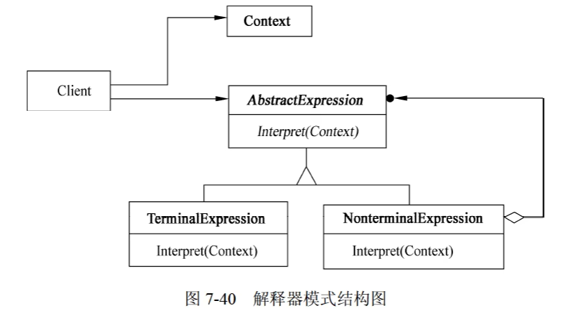

----

## 迭代器模式 Iterator

### 意图

提供一种方法顺序访问一个聚合对象中的各个元素,且不能暴漏该对象的内部表示.

### 结构

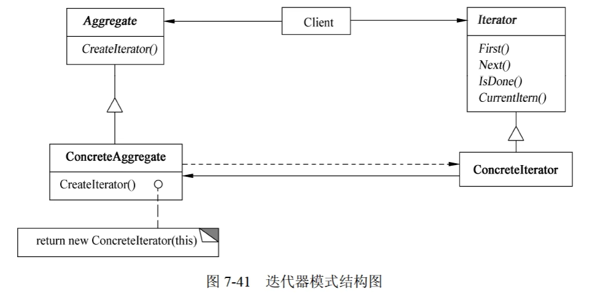

---

1. Iterator（迭代器）定义访问和遍历元素的接口。
2. ConcreteIterator（具体迭代器）实现迭代器接口；对该聚合遍历时跟踪当前位置。
3. Aggregate（聚合）定义创建相应迭代器对象的接口。
4. ConcreteAggregate（具体聚合）实现创建相应选代器的接口，该操作返回ConcreteIterator
   的一个适当的实例。

---

## 中介者模式 Meditor

## 意图

用一个**中介对象**来封装一系列的对象交互。中介者使各对象不需要显式地相互引用，从而
使其耦合松散，而且可以独立地改变它们之间的交互。

## 结构

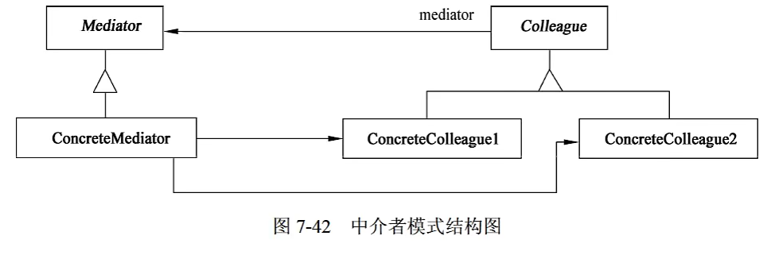

---

## 容易混淆点

### **现实类比**

| **场景**         | 单例模式              | 享元模式                         |
| :--------------- | :-------------------- | :------------------------------- |
| **公司唯一性**   | 只有1个CEO            | 只有1台咖啡机                    |
| **行为表现**     | CEO的决策影响全公司   | 咖啡机为每个人做不同口味的咖啡   |
| **错误实现后果** | 多个CEO会导致战略混乱 | 咖啡机若只能做一种口味会引发投诉 |

------

### **一句话总结**

- 如果“唯一性”要求**所有使用者必须同步状态**（如CEO的决策）→ 单例。
- 如果“唯一性”只是**物理限制**，但**各自使用独立**（如打印机任务）→ 享元。

单例模式可以强制实现唯一打印机，但会丧失个性化能力(不同的人想要打印不同的文件,如果使用单例模式,那么每个人打印出来的东西一模一样)。

享元模式才是既保证共享资源，又支持独立使用的设计！

- **共享部分**（内部状态）：打印机驱动、型号、IP地址。
- **独立部分**（外部状态）：张三打印PPT，李四打印Excel，内容互不影响

---

