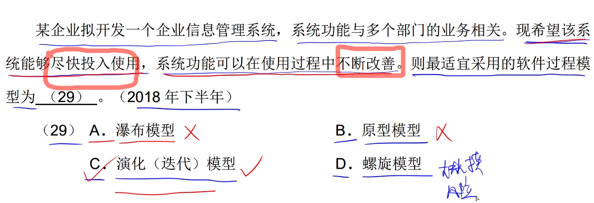
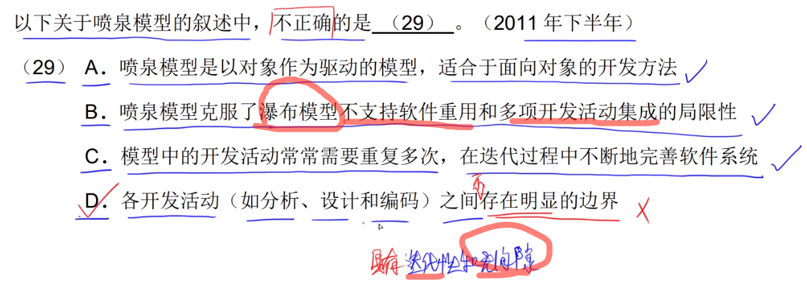
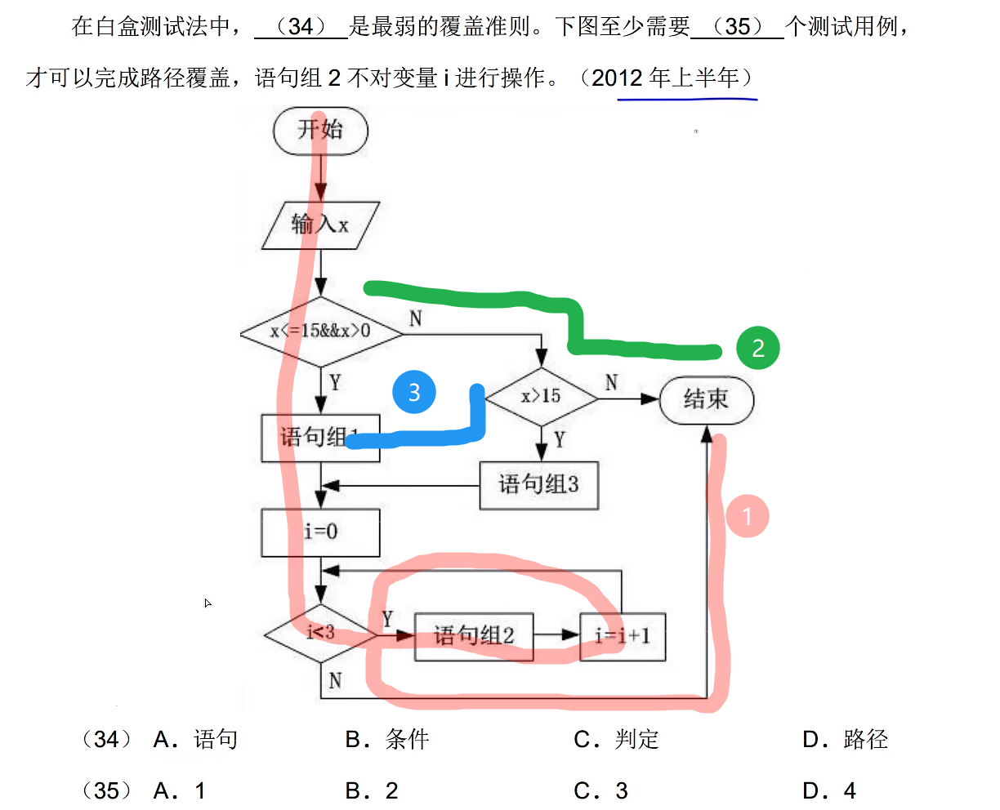

# 软件工程上

## 模型

### 瀑布模型

- 需求明确
- 做过类似项目
- 不会变化的需求. 难以适应变化的需求

---

---

### 增量模型

是瀑布模型的变体,拥有瀑布模型的所有优点,此外还有:

1. 第一个可交付版本的成本和时间少
2. 开发由增量表示的小系统所承担的风险较小
3. 很快发布了第一个版本, 可以减少用户需求的变更

缺点:管理所发生的成本,进度和配置的复杂性可能超出组织的能力

---

---

---

---

### 原型模型

适合用户需求不清，经常变化的情况，并且系统规模不大，不复杂的时候

---

---

---

### 螺旋模型

1. 风险评估
2. 大规模

---

---

### 喷泉模型

---

---

---

## 敏捷方法

### 极限编程 XP

---

---

### 水晶法 Crystal

---

### 并列争球法 Scrum

---

### 自适应 ASD

### 敏捷同一过程 AUP

----

---

---

---

----

---

## 系统设计

### 概要设计

#### 设计软件系统总体结构

关键字: 

- 模块划分
- 体系结构

#### 数据结构及数据库设计

#### 编写概要设计文档

#### 评审

---

---

#### 

---

---

## 系统测试

---

---

---

---

---

---

---

## 集成测试

---

---

## 测试方法

### 黑盒测试

---

---

---

---

---

### 白盒测试

---

---

---

#### 分支覆盖(判定覆盖)

---

2020 11月 第31题

---

---

---

---

