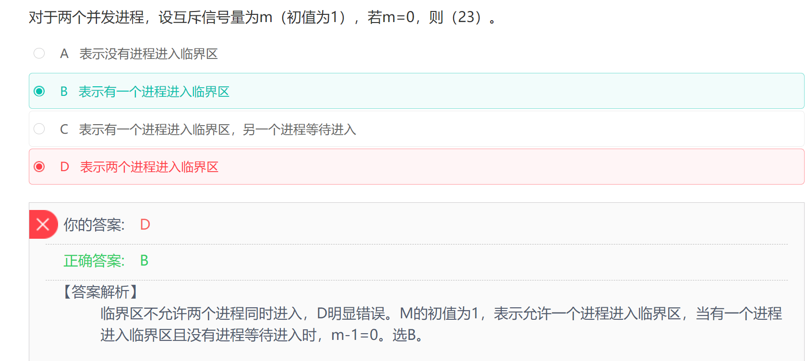
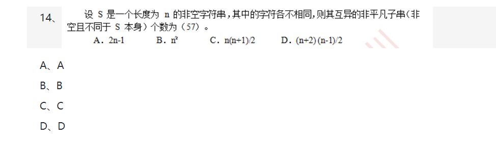
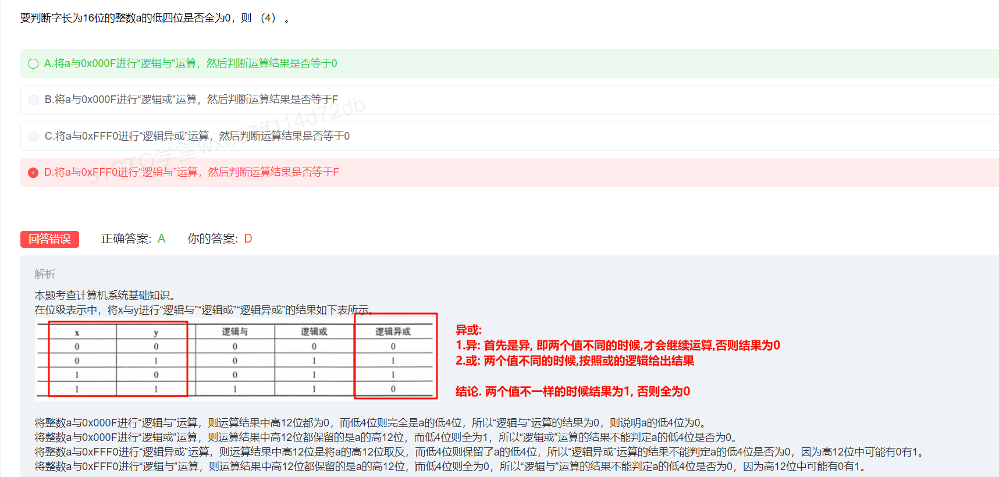

## IO系统

------

## 并发进程与互斥信号

### UML建模
- 用例图：主要用在面向对象需求分析阶段。系统在它的周边环境的语境中所提供的外部可见服务
- 对象图:   展示某一时刻一组对象以及它们之间的关系
- 活动图:   系统内从一个活动到另一个活动的流程
- 序列图:   以时间顺序组织的对象之间的交互活动
- 部署图：部署图描述系统中硬件和软件的物理架构，它描述构成系统架构的软件结构、处理器和设备

## 编译或解释
解释型: 不产生目标程序，每使用一次就要解释一次，运行效率低,可移植性好. 不会生成目标代码
编译型: 产生目标程序，运行效率高,可移植性差. 中间代码生成和代码优化不是必须的.  在编译方式下，必须进行词法、语法和语义分析，再产生源程序的目标代码

## 白盒测试原则

（1）程序模块中的所有独立路径至少执行一次

（2）在所有的逻辑判断中，取“真”和取“假”的两种情况至少都能执行一次

（3）每个循环都应在边界条件和一般条件下各执行一次

（4）测试程序内部数据结构的有效性等

---

## 非平凡子串

## 著作权

保护期限为作者终身及死后50年的，包括：发表权、使用权和获得报酬权

## 可移植性

适应性、易安装性、共存性和易替换性四个特性

## 媒体

表示媒体指的是为了传输感觉媒体而人为研究出来的媒体，借助于此种媒体，能有效地存储感觉媒体或将感觉媒体从一个地方传送到另一个地方。如语言编码、电报码、条形码等。

表现媒体指的是用于通信中使电信号和感觉媒体之间产生转换用的媒体。如输入、输出设备，包括键盘、鼠标器、显示器、打印机等。需要供电才可以使用的媒体/设备

## 复杂度

---

- 

### 知识专利

- 双重性：双重性是指知识产权中的独占性与公用性、排他性与共享性、私人性与社会性等多种形式的双重性特征。

- 独占性：是权利人所专有的权利。任何人未经权利人许可,都不得行使其权利(法律另有规定的除外)。

- 地域性：地域性是指知识专利的保护范围通常限于特定的国家或地区。

- 实践性：实践性在这里可以理解为知识技术或专利能够被实际运用或操作的特性。由于知识技术可以同时被多个人使用，这正好体现了其在实际应用中的广泛性和可操作性，即实践性。

---

---

