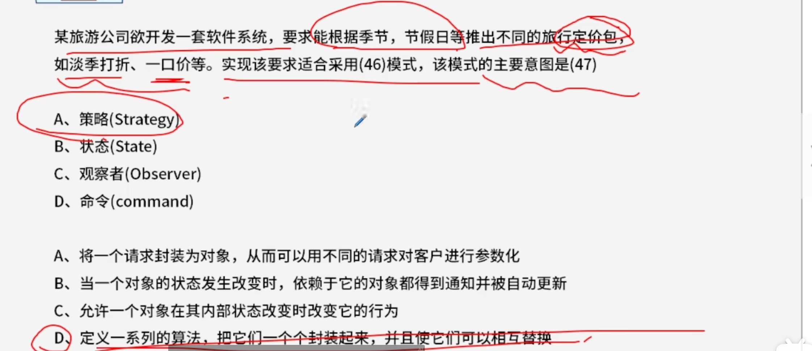

中断向量提供的是 【中断服务程序的入口地址】

---

---

---

---

---

---

---

---

---

## 增量模型

---

## 敏捷开发

## 控制耦合

---

---

---

---

---

---

---

---

----

---

D 如果要修正，结果为(1,)

---

---

---

---

---

---

## 风险

---

## 结构化开发

---

## 寄存器

---

## 机器字长

---

## 木马程序

---

## 防火墙

> 包过滤防火墙
>
> 代理服务防火墙

---

## 著作权

---

## 媒体

### 传输媒体

### 感觉媒体

### 表示媒体

表示媒体指的是为了传输感觉媒体而人为研究出来的媒体，借助于此种媒体，能有效地存储感觉媒体或将感觉媒体从一个地方传送到另一个地方。如语言编码、电报码、条形码等。

### 表现媒体

特别注意: 与电信号相关的,可以简单理解为有电的时候才能使用的

表现媒体指的是用于通信中使电信号和感觉媒体之间产生转换用的媒体。如输入、输出设备，包括键盘、鼠标器、显示器、打印机等。

---

## 复杂度

---

## 对称/非对称密钥

---

暂存运算结果 : 累加器

机器字长+符号位+定点整数最大值

---

## 商标

---

## 模块

---

## 估算模型

---

## 甘特图（ Gantt）

---

## 函数调用+形参+实参

---

## 符号表

