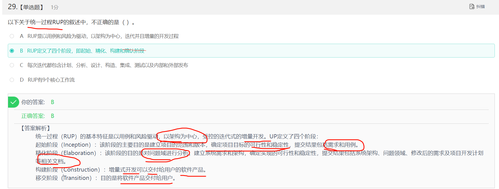

------

## 编译

------

## 位示图

------

## 并发进程

------

## 进程的页面变换

------

## 海明码

------

## OSI

------

## PKI公钥体系

------

## 沟通路径

------

## 短路

------

## 磁盘调度

------

------

## 流程图 McCabe方法

------

## 栈

------

## 哈夫曼树和哈夫曼编码

> [一看就懂的视频](https://www.bilibili.com/video/BV1hK4y1k7Wr/?spm_id_from=333.337.search-card.all.click&vd_source=388f01bb44f002e4de4c1a3c6ceb7302)

哈夫曼树，也叫二进制树，由0和1组成， 左边是0右边是1， 并且哈夫曼树的任意结点，要么没有叶子结点，要么由两个叶子结点。 

对于D选项， 缺少001，导致存在了1个叶子结点， 所以不能构成哈夫曼树

------

网友解析: https://blog.csdn.net/m0_37483148/article/details/109144984

------

## 二分查找

------

## IO系统

------

## 段页式存储

**注意:这里求的是最大段, 每段最大页,以及页的大小**

------

## 总线复用

## 并发进程与互斥信号

------

## 内聚类型

------

## 甘特图

不能清晰地反映出各任务之间的依赖关系

难以确定整个项目的关键所在

也不能反映计划中有潜力的部分

------

## 初始大顶堆

------

## 指令

------

## 芯片

解析: 400FFFFFH - 40000000H  + 1H = 000FFFFFH + 1H = 100000H = 1*$16^{5}$ = $(2^{4})^5$ = $2^{20}$​

256 = $2^{8}$

$2^{20}$ / $2^{8}$ / $2^{10}$ = $2^{20}$ / $2^{18}$ = $2^{2}$ = 4

------

## 系统页面

------

## 资源+进程竞争

6/3+1 = 3  发生死锁的最小值

------

## RUP

------

## 模型

------

## 关系

------

## 绑定

## 图

------

## 桥接模式

## 设计模式

抽象工厂模式（Abstract Factory）:提供一个接口，可以创建一系列相关或相互依赖的对象，而无需指定它们具体的类。

构建器模式（Builder）：将一个复杂类的表示与其构造相分离，使得相同的构建过程能够得出不同的表示。

工厂方法模式（Factory Method）：定义一个创建对象的接口，但由子类决定需要实例化哪一个类。工厂方法使得子类实例化的过程推迟。

原型模式（Prototype）：用原型实例指定创建对象的类型，并且通过拷贝这个原型来创建新的对象。

单例模式（Singleton）:保证一个类只有一个实例，并提供一个访问它的全局访问点。

适配器模式（Adapter）：将一个类的接口转换成用户希望得到的另一种接口。它使原本不相容的接口得以协同工作。

桥接模式（Bridge）：将类的抽象部分和它的实现部分分离开来，使它们可以独立地变化。

组合模式（Composite）：将对象组合成树型结构以表示“整体-部分”的层次结构，使得用户对单个对象和组合对象的使用具有一致性。

装饰模式（Decorator）：动态地给一个对象添加一些额外的职责。它提供了用子类扩展功能的一个灵活的替代，比派生一个子类更加灵活。

外观模式（Facade）:定义一个高层接口，为子系统中的一组接口提供一个一致的外观，从而简化了该子系统的使用。

享元模式（Flyweight）：提供支持大量细粒度对象共享的有效方法。

代理模式（Proxy）：为其他对象提供一种代理以控制这个对象的访问。

职责链模式（Chain of Responsibility）：通过给多个对象处理请求的机会，减少请求的发送者与接收者之间的耦合。将接收对象链接起来，在链中传递请求，直到有一个对象处理这个请求。

命令模式（Command）：将一个请求封装为一个对象，从而可用不同的请求对客户进行参数化，将请求排队或记录请求日志，支持可撤销的操作。

解释器模式（Interpreter）：给定一种语言，定义它的文法表示，并定义一个解释器，该解释器用来根据文法表示来解释语言中的句子。

迭代器模式（Iterator）：提供一种方法来顺序访问一个聚合对象中的各个元素，而不需要暴露该对象的内部表示。

中介者模式（Mediator）：用一个中介对象来封装一系列的对象交互。它使各对象不需要显式地相互调用，从而达到低耦合，还可以独立地改变对象间的交互。

备忘录模式（Memento）在不破坏封装性的前提下，捕获一个对象的内部状态，并在该对象之外保存这个状态，从而可以在以后将该对象恢复到原先保存的状态。

观察者模式（Observer）：定义对象间的一种一对多的依赖关系，当一个对象的状态发生改变时，所有依赖于它的对象都得到通知并自动更新。

状态模式（State）：允许一个对象在其内部状态改变时改变它的行为。

策略模式（Strategy）：定义一系列算法，把它们一个个封装起来，并且使它们之间可互相替换，从而让算法可以独立于使用它的用户而变化。

模板方法模式（Template Method）：定义一个操作中的算法骨架，而将一些步骤延迟到子类中，使得子类可以不改变一个算法的结构即可重新定义算法的某些特定步骤。

访问者模式（Visitor）：表示一个作用于某对象结构中的各元素的操作，使得在不改变各元素的类的前提下定义作用于这些元素的新操作

定义一系列的算法,把他们封装起来, 并且使得他们可以相互替换

## 原码 反码 补码

正数的原 反 补 一致

负数的反码: 符号位不变, 其余各位按位取反

负数的补码: 等于 反码+1

最高位是符号位, 0表示正数, 1表示负数

对补码再求一次补码,就得到了原码

+0 和 -0 的补码一样,如下

[+0]原码 = 0000 0000 = [+0]补码

[-0]原码 = 1000 0000, [-0]反码 = 1111 1111 ,[-0] = 补码 = [-0]反码 + 1  =  0000 0000

由于只使用 8 位二进制数表示，结果中的第 9 位会被丢弃，所以最终的补码是 0000000000000000

所以 无论是 +0 还是 -0，它们的补码表示都是相同的，即 0000000000000000

计算 -3-4

-3 -4 = -3 + (-4) = ((-3 + (-4))补码)补码

| 0    | 000  |
| ---- | ---- |
| 1    | 001  |
| 2    | 010  |
| 3    | 011  |
| 4    | 100  |
| 5    | 101  |
| 6    | 110  |
| 7    | 111  |

所以得到 -3 -4 = (1000 0011补码 + 1000 0100补码)补码 

1000 0011的补码 = 1111 1100 + 1 = 1111 1101

1000 0100的补码=1111 1011 + 1 =  1111 1100

所以 -3 -4 = (1111 1101 + 1111 1100)的补码 = (1111 1001)的补码 =  1000 0110 + 1 = 1000 0111 = -7

------

## TCP UDP 以及端口号

## UML

### UML中有4种关系
- 依赖是两个事物之间的语义关系，其中一个事物发生变化会影响另一个事物的语义
- 关联描述一组对象之间连接的结构关系
- 泛化是一般化和特殊化的关系，描述特殊元素的对象可替换一般元素的对象
- 实现是类之间的语义关系，其中的一个类指定了由另一个类保证执行的契约

### UML建模
- 用例图：主要用在面向对象需求分析阶段。系统在它的周边环境的语境中所提供的外部可见服务
- 对象图:   展示某一时刻一组对象以及它们之间的关系
- 活动图:   系统内从一个活动到另一个活动的流程
- 序列图:   以时间顺序组织的对象之间的交互活动
- 部署图：部署图描述系统中硬件和软件的物理架构，它描述构成系统架构的软件结构、处理器和设备

---

## 软件开发模型

- **螺旋模型**。综合了瀑布模型和原型模型中的演化模型的优点，还增加了风险分析，特别适用于庞大而复杂的、高风险的管理信息系统的开发
- **瀑布模型**是以文档为驱动的模型，适合需求明确的软件项目的模型，优点是容易理解，管理成本低，但缺乏灵活性，难以适应需求的变化，如果软件在后期出现需求变化，整个系统需要从头开始
- 

## 编译或解释
解释型: 不产生目标程序，每使用一次就要解释一次，运行效率低,可移植性好. 不会生成目标代码
编译型: 产生目标程序，运行效率高,可移植性差. 中间代码生成和代码优化不是必须的.  在编译方式下，必须进行词法、语法和语义分析，再产生源程序的目标代码

## 白盒测试原则

（1）程序模块中的所有独立路径至少执行一次

（2）在所有的逻辑判断中，取“真”和取“假”的两种情况至少都能执行一次

（3）每个循环都应在边界条件和一般条件下各执行一次

（4）测试程序内部数据结构的有效性等

## 项目估算

一般需要考虑规模、工作量、成本等因素，不包括类型。

## 贪心算法

---

## 非平凡子串

## 主动攻击

- 拒绝服务攻击
- 分布式拒绝服务（DDos）
- 信息篡改
- 资源使用
- 欺骗
- 伪装
- 重放

- 会话拦截

- 修改数据命令

## 著作权

保护期限为作者终身及死后50年的，包括：发表权、使用权和获得报酬权

## 可移植性

适应性、易安装性、共存性和易替换性四个特性

## 媒体

表示媒体指的是为了传输感觉媒体而人为研究出来的媒体，借助于此种媒体，能有效地存储感觉媒体或将感觉媒体从一个地方传送到另一个地方。如语言编码、电报码、条形码等。

表现媒体指的是用于通信中使电信号和感觉媒体之间产生转换用的媒体。如输入、输出设备，包括键盘、鼠标器、显示器、打印机等。需要供电才可以使用的媒体/设备

## 复杂度

## 存储设备按访问速度

通用寄存器 > Cache > 内存 > 硬盘

## 安全

机房安全属于物理安全，入侵检测属于网络安全，漏洞补丁管理属于系统安全，而数据库安全则是应用安全

## 螺旋模型

适应于:  

- 庞大而复杂
- 高风险

## 寻址速度

立即寻址最快，寄存器寻址次之，直接寻址最慢

## VIEW是超长指令字的简称

## 视频格式

MOV

## FTP

20和21，其中20为数据口(上传文件)，21为控制口

## 二叉树

最高有最多有2^h-1个结点

## 数据库设计

## 淘汰表

## RISC

---

## 计算机病毒是特殊小程序

## 组合结构图用于画出结构化类的内部内容。

## 顺序图由一组对象或参与者以及它们之间可能发送的消息构成。强调消息的时间次序的交互图。

## 通信图强调收发消息的对象或参与者的结构组织。强调的是对象之间的组织结构（关系）

---

### 函数依赖的Armstrong公理系统

- 自反律：若属性集Y 包含于属性集X，属性集X 包含于U，则X→Y 在R 上成立。(此处X→Y是平凡函数依赖)

- 增广律：若X→Y 在R 上成立，且属性集Z 包含于属性集U，则XZ→YZ 在R 上成立。

- 传递律：若X→Y 和 Y→Z在R 上成立，则X →Z 在R 上成立。

- 其他的所有函数依赖的推理规则可以使用这三条规则推导出。

- 合并规则：若X→Y，X→Z同时在R上成立，则X→YZ在R上也成立。

- 分解规则：若X→W在R上成立，且属性集Z包含于W，则X→Z在R上也成立。

- 伪传递规则：若X→Y在R上成立，且WY→Z，则XW→Z。

---

### 软件维护

---

### 计算机网络协议5层体系结构

- 传输层： 四层交换机 、四层的路由器

- 网络层：三层交换机、路由器

- 数据链路层：网桥、以太网交换机、网卡

- 物理层：中继器、集线器、双绞线

---

### CPU中的寄存器

- 指令寄存器**IR** 存储即将执行的指令
- 状态条件寄存器**PSW** 存储状态标志与控制标志
- 程序计数器**PC** 存储下一条要执行的指令的地址
- 主存地址寄存器**MAR** 保存当前CPU访问内存单元的地址
---

### UML类图建模

- 聚合关系：整体与部分生命周期不同，属于关联关系。 如计算机类与鼠标类

- 依赖关系：一个事物发生变化影响另一个事物。

- 泛化关系：表示两类事物之间的特殊/一般关系。

- 实现关系：接口和类的关系。

---

### 存储类别

- CPU对应的存储类别：寄存器

- Cache对应的存储类别：缓存

- 主存对应的存储类别：DRAM

- 辅存对应的存储类别：硬盘、光盘等

---

### 面向对象软件测试

- 算法层:测试类中定义的每个方法，基本相当于传统软件测试的单元测试。

- 类层:测试封装在同一个类中的所有方法与属性之间的相互作用。可以认为是面向对象测试中特有的模块测试。

- 模板层:测试一组协调工作的类之间的相互作用。大体上相当于传统软件测试中的集成测试。

- 系统层:把各个子系统组装成完整的面向对象软件系统。

---

### 面向对象系统设计原则

- 稳定抽象原则:此原则强调的是包的抽象程度与其稳定程度一致。

- 稳定依赖原则:此原则要求包之间的依赖关系都应该是稳定方向依赖的，即包要依赖的包要比自己更具有稳定性。

- 依赖倒置原则:此原则强调的是程序应该依赖于抽象接口，而不是具体的实现，从而降低客户与实现模块间的耦合。

- 无环依赖:这个原则明确指出，在组件的依赖关系在图中不允许存在环。从给出的设计描述中，包A、包B、包C之间的依赖关系形成了一个环，这直接违反了无环依赖原则。

---

### 关系表

- 投影：在关系表中选出若干属性列组成新的关系表

- 笛卡儿积：两表之间的乘积，组成之后的新表，属性列为两表的属性列，元组为两表的乘积

- 选择：选择满足某个条件的元组

- 差：指的是取一个表中存在而另一个表中不存在的记录

---

### 数据流图

由**数据流**、**外部实体**、**数据加工**和**数据存储**组成。

- 数据流（Data Flow）：数据流是数据在系统中从一个地方流向另一个地方的路径。它表示数据从数据源流向数据接收者（如处理过程、数据存储或另一个数据源）的方向。数据流通常用带箭头的线段表示。

- 外部实体（External Entity）：数据源是数据的起点，即数据的来源。它可以是用户、外部系统、设备或其他外部因素。在数据流图中，数据源通常用矩形表示，并标有相应的名称。

- 数据加工（Data Process）：数据加工是数据流图中对数据进行操作或变换的部分。它表示数据在系统内部如何被处理或转换。在数据流图中，处理过程用圆形或圆角矩形表示，并标有相应的名称和操作描述。

- 数据存储（Data Storage）：数据存储是系统中用于存储数据的部分。它可以是数据库、文件、内存中的数据等。在数据流图中，数据存储用两根平行线表示，并标有相应的名称。

---

### 算法

- SHA-1：这是一个哈希函数，用于生成数据的哈希值（或摘要）。

- AES：这是一个对称加密算法，它本身不使用哈希算法。AES 是一种块密码，用于加密和解密数据。

- DES：同样，这也是一个对称加密算法，不使用哈希算法。DES 是较早的加密标准，现在已经不再安全。

- RSA：这是一个公钥加密算法，它主要用于加密、解密和数字签名。

---

### 甘特图

- 一种进度管理工具
- 能清晰地描述每个任务从何时开始，到何时结束
- 任务的进展情况以及各个任务之间的并行性
- **不能清晰地反映**出各任务之间的**依赖关系**
- **难以确定**整个项目的**关键所在**
- **不能反映**计划中**有潜力的部分**

---

### 测试覆盖

- 语句覆盖（Statement Coverage）：也称为行覆盖，它关注的是程序中每一行代码是否至少被执行一次。这是最基本的测试覆盖标准，但往往只能发现简单的错误。

- 判定覆盖（Decision Coverage）：也称为分支覆盖，它要求程序中的每一个判定（例如if-else语句）的每一种可能结果（真或假）都至少发生一次。这比语句覆盖更全面，但可能仍会遗漏一些错误。

- 路径覆盖（Path Coverage）：它要求测试覆盖程序中所有可能的执行路径。这通常意味着测试需要遍历程序中所有可能的条件组合。路径覆盖是这些选项中最全面的测试覆盖方法，因为它考虑了程序中所有可能的执行路径。

- 条件覆盖（Condition Coverage）：它要求程序中的每一个条件（例如if语句中的条件）的每一种可能结果（真或假）都至少发生一次。虽然这比判定覆盖更全面，但它仍然可能遗漏一些错误，因为它不保证所有条件的组合都被测试到。

综上所述，路径覆盖是这些测试方法中覆盖程度最高的

---

### 知识专利

- 双重性：双重性是指知识产权中的独占性与公用性、排他性与共享性、私人性与社会性等多种形式的双重性特征。

- 独占性：是权利人所专有的权利。任何人未经权利人许可,都不得行使其权利(法律另有规定的除外)。

- 地域性：地域性是指知识专利的保护范围通常限于特定的国家或地区。

- 实践性：实践性在这里可以理解为知识技术或专利能够被实际运用或操作的特性。由于知识技术可以同时被多个人使用，这正好体现了其在实际应用中的广泛性和可操作性，即实践性。

---

### 风险

- 商业风险：商业风险通常与公司的战略决策、市场环境、竞争对手等有关。如果一个软件不符合公司的战略决策，那么它很可能会对公司的商业目标产生负面影响，导致商业风险。

- 项目风险：项目风险指在软件开发过程中遇到的预算和进度等方面的问题以及这些问题对软件项目的影响。这些风险可能会影响项目计划的实现，如果项目风险变成现实，就有可能影响项目的进度，增加项目的成本，甚至使软件项目不能实现。

- 开发风险：开发风险主要涉及软件开发过程中的技术问题、资源不足、时间延误等。

- 人员风险：人员风险通常与员工的技能、态度、离职率等有关。

---

**模块结构图**包括**模块**、**模块之间的调用关系**、**模块之间的通信**和**辅助控制符号**

---

**数据库**的基本表对应概念视图，存储文件对应内部视图，**视图**对应**用户视图**。

CPU保护程序计数器的主要目的是**为了使CPU在执行完中断服务程序时能返回到被中断程序的断点处**

在双核处理器中，双核是指**在 一 个 CPU 中集成两个运算核心以提高运算能力**

**系统总线在CPU之外**

CPU执行MOVRI，RO指令，CPU首先要完成的操作是从内存中读取该指令的指令操作码。取该指令的指令操作码，首先要做的就是将程序计数器的内容送到地址寄存器，即**PC→AR**

两个浮点数相加运算**首先进行对阶，阶码小的向阶码大的对齐**

在**补码**中0具有唯一编码。将**补码**的**符号位取反**可以得到**移码**。对于数字0来说移码与补码都是唯一的。

在计算机中，最适合进行数字加减运算的数字编码是**补码**，最适合表示浮点数阶码的数字编码是**移码**

定点小数表示中,**只有补码能表示 -1**

根据补码表示规则,当**数符与尾数小数点后第一位相异时**为**规格化数**, **阶码与数符和规格化与否无关**。

CRC码的格式为**n个数据位之后跟k个校验位**

流水线的**操作周期**应设计为时间**最长**的步骤的时间

## CISC和RISC(精简指令集计算机)

### RISC特点

- 指令系统中只包含使用**频率较高**但**不复杂**的指令
- 指令**长度固定**，**指令格式少**，**寻址方式少**(绝不出现存储器间接寻址方式)
- **只有存取数指令访问主存**，其他指令都在寄存器之间运算
- **大部分指令在一个机器周期内完成**，**采用流水技术**
- 采用**很多的通用寄存器**(以减少访存次数)
- **硬联逻辑控制(以尽快完成指令译码)，不用微程序控制技术**
- 采用**优化的编译**，以**有效地支持高级语言**

## CISC特点:

- 指令可以对主存单元中的数据直接进行处理。

DMA可以使数据在**主存（内存）和外设(I/O设备)**之间**直接传送**，在传送的过程中**不用CPU的干预**，由DMA的控制器控制总线完成数据的传送。

一个DMA传送只需要执行一个**总线周期**

**中断方式与DMA方式**都可实现外设与CPU之间的并行工作

## SRAM和DRAM

### SRAM

- 静止存取功能的内存
- 不需要刷新电路即能保存它内部存储的数据
- SRAM具有较高的性能
- 集成度较低,体积大,功耗大

### DRAM

- 动态随机存取存储器，最为常见的系统内存
- 只能将数据保持很短的时间
- DRAM使用电容存储，所以必须隔一段时间刷新一次，如果存储单元没有被刷新，存储的信息就会丢失

---

---

---

## 闪存（Flash Memory）

- 闪存掉电后信息不丢失
- 闪存以块为单位进行删除操作
- 闪存采用随机访问方式，所以速度很快
- 在嵌入式系统中可以用Flash来代替ROM存储器

---

词法分析遵循的是构词规则，语法分析遵循的是语法规则，中间代码生成遵循的是语义规则，并且语义规则可以定义一个程序的意义

---

以编译方式翻译C/C++源程序的过程中，静态检查在（**语义分析**）阶段处理

---
Java是**即时编译**程序
---
- 传值调用是将实参的值传给被调用函数的形参，因此实参可以是常量、变量、表达式或函数调用
- 传地址调用(或引用调用)的实质是将实参的地址传给被调用函数的形参，因此实参必须具有地址
---

OSI参考模型表示层的功能有数据解密与加密、压缩、格式转换等

---

**数据链路层**在物理线路上提供可靠的数据传输
---

VLANtag在OSI参考模型的**数据链路层**实现。
---
以太网交换机属于网络模型中(**数据链路层**)，管理的是(**帧**)
---
FTP协议占用两个标准的端口号：20和21，其中20为数据口(上传文件)，21为控制口。
---

POP3 协议默认端口： **110**.默认传输协议： **TCP**
---

无线wlan主要采用的是IEEE802.11标准。
---

SMTP和POP3都是基于TCP的协议，提供可靠的邮件通信
---

- 常用协议端口号情况如下：

- POP3：TCP的110端口，邮件收取。

- SMTP：TCP的25端口，邮件发送。

- FTP：TCP的20数据端口/21控制端口，文件传输协议。

- HTTP：TCP的80端口，超文本传输协议，网页传输。

- DHCP：UDP的67端口，IP地址自动分配。

- SNMP：UDP的161端口，简单网络管理协议。

- DNS：UDP的53端口，域名解析协议，记录域名与IP的映射关系。
---

网站被入侵以后数据库信息泄露了。

- 撞库：使用大量的一个网站的账号密码，去另一个网站尝试登陆。也就是基于用户代码重复度比较高的问题，使用被脱库的密码尝试其它网站。

- 洗库：黑客入侵网站在取得大量的用户数据之后，通过一系列的技术手段和黑色产业链将有价值的用户数据变现。

- 社工库：黑客将获取的各种数据库关联起来，对用户进行全方位画像。
---
VLAN不能隔绝**攻击和漏洞利用**
---

