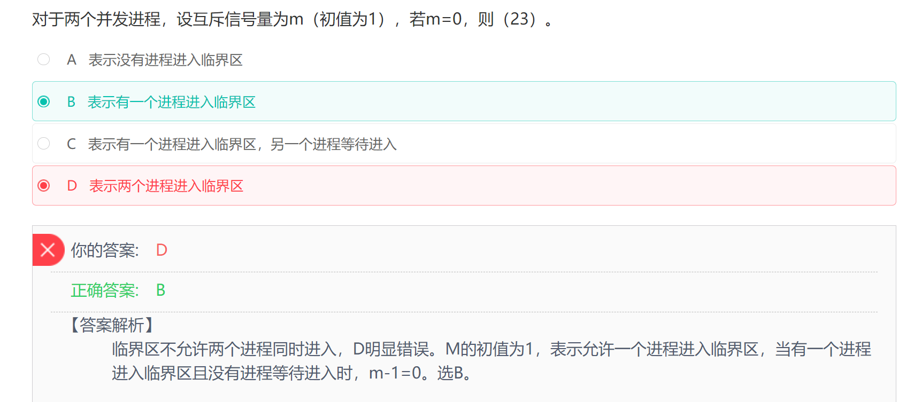

## 正规集

```
1
1. 正规式：给定元素形成的所有的正则表达式
2
​
3
2. 正规集：所有的正规式产生的结果的集合
```

如果我们有两个字符a、b，那么有以下几种常用正规式写法。


[方法参考](https://developer.aliyun.com/article/805908)

正规式a，表示单一字符a，对应的正规集{a}。

正规式a|b，表示单一字符a或者b，对应有2个元素的正规集{a,b}。

正规式ab，表示由两个字符ab的元素，对应只有1个元素的正规集{ab}。

正规式ab(a|b)，ab是确定的部分，然后再添加a或b，对应正规集{aba,abb}。

正规式a*，*表示任意个，对应正规集{Φ,a,aa,aaa,...}。

正规式(a|b)*，可以表示任意由a、b组成的串的集合，对应正规集{Φ,a,b,ab,aa,bb...}


题目


------


## 编译


------


## 位示图


------


## 并发进程


------

## 进程的页面变换


------


## 海明码


------

## 流水线


------

## OSI


------

## PKI公钥体系


------


## 沟通路径


------

## 短路


------


## 磁盘调度


------


------

## 流程图 McCabe方法


------

## 栈


------

## 哈夫曼树和哈夫曼编码

> [一看就懂的视频](https://www.bilibili.com/video/BV1hK4y1k7Wr/?spm_id_from=333.337.search-card.all.click&vd_source=388f01bb44f002e4de4c1a3c6ceb7302)


哈夫曼树，也叫二进制树，由0和1组成， 左边是0右边是1， 并且哈夫曼树的任意结点，要么没有叶子结点，要么由两个叶子结点。 

对于D选项， 缺少001，导致存在了1个叶子结点， 所以不能构成哈夫曼树

------


------

## 二分查找


------

## IO系统


------

## 段页式存储


**注意:这里求的是最大段, 每段最大页,以及页的大小**

------

## 总线复用


## 并发进程与互斥信号




------

## 内聚类型


------

## 甘特图


------

## 初始大顶项


------

## 指令


------


## 芯片


## 系统页面


------


## 资源+进程竞争


6/3+1 = 3  发生死锁的最小值

------

## RUP


------

## 模型


------

## 关系


------

## 绑定


## 图


------

## 桥接模式


---

## 多态


## 署名权 修改权 保护作品完整权的保护器不受限制

## 软件著作权属于自然人的, 自然人死亡之后, 集成署名权之外的其他权利, 即财产权利,所以不是所有权利

## 加工规格主要表达的是做什么,而不是怎么做, 所以加工描述的是加工策略,而不是加工细节

## 敏捷开发

### 极限编程XP

 强调计划永远赶不上变化, 因此无需开发人员在软件设计初期做太多的文档,同时提倡测试先行,是为了将BUG的几率降到最低

### 水晶方法(Crystal)

根据项目的规模和重要性来区别项目,并赋予相应的方法

### 并列争球法(Scrum)

使用迭代的方法, 把一段时间(如30天)的迭代作为一个冲刺,并按照需求的优先级来实现产品

### 自适应软件开发(ASD)

基于复杂自适用系统理论, 通过提高组织的自适应能力, 以应对极度变化难以预测的快速软件开发要求


---

## 耦合

### 数据耦合

两个模块之间有调用关系, 传递的是简单的数据值, 即值传递

### 标记耦合

传递的是数据结构

### 控制耦合

控制模块调用另一个模块,传递的是控制变量

### 公共耦合

通过一个公共的数据环境相互作用的模块间的耦合

---


