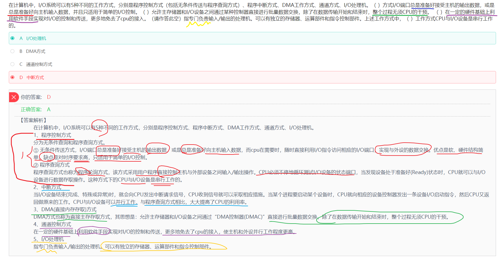
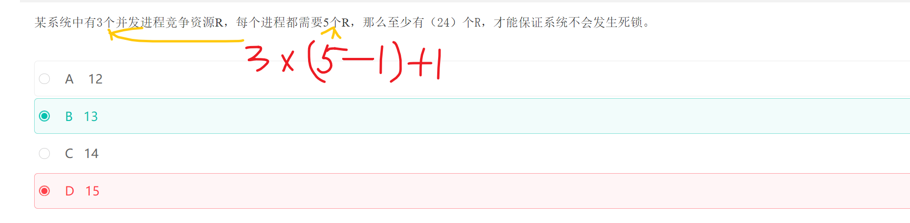

## 正规集

```
1
1. 正规式：给定元素形成的所有的正则表达式
2
3
2. 正规集：所有的正规式产生的结果的集合
```

如果我们有两个字符a、b，那么有以下几种常用正规式写法。


[方法参考](https://developer.aliyun.com/article/805908)

正规式a，表示单一字符a，对应的正规集{a}。

正规式a|b，表示单一字符a或者b，对应有2个元素的正规集{a,b}。

正规式ab，表示由两个字符ab的元素，对应只有1个元素的正规集{ab}。

正规式ab(a|b)，ab是确定的部分，然后再添加a或b，对应正规集{aba,abb}。

正规式a*，*表示任意个，对应正规集{Φ,a,aa,aaa,...}。

正规式(a|b)*，可以表示任意由a、b组成的串的集合，对应正规集{Φ,a,b,ab,aa,bb...}


题目


------


## 编译


------


## 位示图


------


## 并发进程


------

## 进程的页面变换


------


## 海明码


------

## 流水线


------

## OSI


------

## PKI公钥体系


------


## 沟通路径


------

## 短路


------


## 磁盘调度


------


------

## 流程图 McCabe方法


------

## 栈


------

## 哈夫曼树和哈夫曼编码

> [一看就懂的视频](https://www.bilibili.com/video/BV1hK4y1k7Wr/?spm_id_from=333.337.search-card.all.click&vd_source=388f01bb44f002e4de4c1a3c6ceb7302)


哈夫曼树，也叫二进制树，由0和1组成， 左边是0右边是1， 并且哈夫曼树的任意结点，要么没有叶子结点，要么由两个叶子结点。 

对于D选项， 缺少001，导致存在了1个叶子结点， 所以不能构成哈夫曼树

------


网友解析: https://blog.csdn.net/m0_37483148/article/details/109144984


------

## 二分查找


------

## IO系统




------

## 段页式存储


**注意:这里求的是最大段, 每段最大页,以及页的大小**

------

## 总线复用


## 并发进程与互斥信号





------

## 内聚类型


------

## 甘特图


不能清晰地反映出各任务之间的依赖关系

难以确定整个项目的关键所在

也不能反映计划中有潜力的部分

------

## 初始大顶堆


------

## 指令


------


## 芯片


解析: 400FFFFFH - 40000000H  + 1H = 000FFFFFH + 1H = 100000H = 1*$16^{5}$ = $(2^{4})^5$ = $2^{20}$​

256 = $2^{8}$

$2^{20}$ / $2^{8}$ / $2^{10}$ = $2^{20}$ / $2^{18}$ = $2^{2}$ = 4

------


## 系统页面


------


## 资源+进程竞争


6/3+1 = 3  发生死锁的最小值

------

## RUP


------

## 模型


------

## 关系


------

## 绑定


## 图


------

## 桥接模式


## 设计模式

抽象工厂模式（Abstract Factory）:提供一个接口，可以创建一系列相关或相互依赖的对象，而无需指定它们具体的类。

构建器模式（Builder）：将一个复杂类的表示与其构造相分离，使得相同的构建过程能够得出不同的表示。

工厂方法模式（Factory Method）：定义一个创建对象的接口，但由子类决定需要实例化哪一个类。工厂方法使得子类实例化的过程推迟。

原型模式（Prototype）：用原型实例指定创建对象的类型，并且通过拷贝这个原型来创建新的对象。

单例模式（Singleton）:保证一个类只有一个实例，并提供一个访问它的全局访问点。

适配器模式（Adapter）：将一个类的接口转换成用户希望得到的另一种接口。它使原本不相容的接口得以协同工作。

桥接模式（Bridge）：将类的抽象部分和它的实现部分分离开来，使它们可以独立地变化。

组合模式（Composite）：将对象组合成树型结构以表示“整体-部分”的层次结构，使得用户对单个对象和组合对象的使用具有一致性。

装饰模式（Decorator）：动态地给一个对象添加一些额外的职责。它提供了用子类扩展功能的一个灵活的替代，比派生一个子类更加灵活。

外观模式（Facade）:定义一个高层接口，为子系统中的一组接口提供一个一致的外观，从而简化了该子系统的使用。

享元模式（Flyweight）：提供支持大量细粒度对象共享的有效方法。

代理模式（Proxy）：为其他对象提供一种代理以控制这个对象的访问。

职责链模式（Chain of Responsibility）：通过给多个对象处理请求的机会，减少请求的发送者与接收者之间的耦合。将接收对象链接起来，在链中传递请求，直到有一个对象处理这个请求。

命令模式（Command）：将一个请求封装为一个对象，从而可用不同的请求对客户进行参数化，将请求排队或记录请求日志，支持可撤销的操作。

解释器模式（Interpreter）：给定一种语言，定义它的文法表示，并定义一个解释器，该解释器用来根据文法表示来解释语言中的句子。

迭代器模式（Iterator）：提供一种方法来顺序访问一个聚合对象中的各个元素，而不需要暴露该对象的内部表示。

中介者模式（Mediator）：用一个中介对象来封装一系列的对象交互。它使各对象不需要显式地相互调用，从而达到低耦合，还可以独立地改变对象间的交互。

备忘录模式（Memento）在不破坏封装性的前提下，捕获一个对象的内部状态，并在该对象之外保存这个状态，从而可以在以后将该对象恢复到原先保存的状态。

观察者模式（Observer）：定义对象间的一种一对多的依赖关系，当一个对象的状态发生改变时，所有依赖于它的对象都得到通知并自动更新。

状态模式（State）：允许一个对象在其内部状态改变时改变它的行为。

策略模式（Strategy）：定义一系列算法，把它们一个个封装起来，并且使它们之间可互相替换，从而让算法可以独立于使用它的用户而变化。

模板方法模式（Template Method）：定义一个操作中的算法骨架，而将一些步骤延迟到子类中，使得子类可以不改变一个算法的结构即可重新定义算法的某些特定步骤。

访问者模式（Visitor）：表示一个作用于某对象结构中的各元素的操作，使得在不改变各元素的类的前提下定义作用于这些元素的新操作


定义一系列的算法,把他们封装起来, 并且使得他们可以相互替换


## 原码 反码 补码

正数的原 反 补 一致

负数的反码: 符号位不变, 其余各位按位取反

负数的补码: 等于 反码+1

最高位是符号位, 0表示正数, 1表示负数

对补码再求一次补码,就得到了原码

+0 和 -0 的补码一样,如下

[+0]原码 = 0000 0000 = [+0]补码

[-0]原码 = 1000 0000, [-0]反码 = 1111 1111 ,[-0] = 补码 = [-0]反码 + 1  =  0000 0000

由于只使用 8 位二进制数表示，结果中的第 9 位会被丢弃，所以最终的补码是 0000000000000000

所以 无论是 +0 还是 -0，它们的补码表示都是相同的，即 0000000000000000


计算 -3-4

-3 -4 = -3 + (-4) = ((-3 + (-4))补码)补码

| 0    | 000  |
| ---- | ---- |
| 1    | 001  |
| 2    | 010  |
| 3    | 011  |
| 4    | 100  |
| 5    | 101  |
| 6    | 110  |
| 7    | 111  |

所以得到 -3 -4 = (1000 0011补码 + 1000 0100补码)补码 

1000 0011的补码 = 1111 1100 + 1 = 1111 1101

1000 0100的补码=1111 1011 + 1 =  1111 1100

所以 -3 -4 = (1111 1101 + 1111 1100)的补码 = (1111 1001)的补码 =  1000 0110 + 1 = 1000 0111 = -7


------

## TCP UDP 以及端口号


## UML


### UML中有4种关系
- 依赖是两个事物之间的语义关系，其中一个事物发生变化会影响另一个事物的语义
- 关联描述一组对象之间连接的结构关系
- 泛化是一般化和特殊化的关系，描述特殊元素的对象可替换一般元素的对象
- 实现是类之间的语义关系，其中的一个类指定了由另一个类保证执行的契约

### UML建模
- 用例图：主要用在面向对象需求分析阶段。系统在它的周边环境的语境中所提供的外部可见服务
- 对象图:   展示某一时刻一组对象以及它们之间的关系
- 活动图:   系统内从一个活动到另一个活动的流程
- 序列图:   以时间顺序组织的对象之间的交互活动
- 部署图：部署图描述系统中硬件和软件的物理架构，它描述构成系统架构的软件结构、处理器和设备


---

## 软件开发模型

螺旋模型。综合了瀑布模型和原型模型中的演化模型的优点，还增加了风险分析，特别适用于庞大而复杂的、高风险的管理信息系统的开发

## 编译或解释
解释型: 不产生目标程序，每使用一次就要解释一次，运行效率低
编译型: 产生目标程序，运行效率高

## 白盒测试原则

（1）程序模块中的所有独立路径至少执行一次

（2）在所有的逻辑判断中，取“真”和取“假”的两种情况至少都能执行一次

（3）每个循环都应在边界条件和一般条件下各执行一次

（4）测试程序内部数据结构的有效性等

## 项目估算

一般需要考虑规模、工作量、成本等因素，不包括类型。

## 贪心算法


---

## 非平凡子串


## 主动攻击

- 拒绝服务攻击
- 分布式拒绝服务（DDos）
- 信息篡改
- 资源使用
- 欺骗
- 伪装
- 重放

- 会话拦截

- 修改数据命令

## 著作权

保护期限为作者终身及死后50年的，包括：发表权、使用权和获得报酬权

## 可移植性

适应性、易安装性、共存性和易替换性四个特性

## 媒体

表示媒体指的是为了传输感觉媒体而人为研究出来的媒体，借助于此种媒体，能有效地存储感觉媒体或将感觉媒体从一个地方传送到另一个地方。如语言编码、电报码、条形码等。

表现媒体指的是用于通信中使电信号和感觉媒体之间产生转换用的媒体。如输入、输出设备，包括键盘、鼠标器、显示器、打印机等。需要供电才可以使用的媒体/设备

## 复杂度


## 存储设备按访问速度

通用寄存器 > Cache > 内存 > 硬盘

## 安全

机房安全属于物理安全，入侵检测属于网络安全，漏洞补丁管理属于系统安全，而数据库安全则是应用安全

## 螺旋模型

适应于:  

- 庞大而复杂
- 高风险

## 寻址

立即寻址最快，寄存器寻址次之，直接寻址最慢

## VIEW

超长指令字的简称

## 视频格式

MOV

## FTP

20和21，其中20为数据口(上传文件)，21为控制口

## 二叉树

最高有最多有2^h-1个结点
