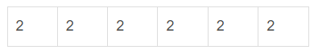

## [转载于 https://blog.csdn.net/weixin_55085468/article/details/122736447](https://blog.csdn.net/weixin_55085468/article/details/122736447)

1、假设顺序表第 1 个元素的内存地址是 100，每个元素占用 2 字节内存空间，则第 5 个元素的内存地址是 ——。
答案：108

分析：
定义顺序表：将元素顺序地存放在一块连续的存储区里，元素间的顺序关系由它们的存储顺序自然表示。一维数组在内存中占用的存储空间就是一组连续的存储区域，一般程序设计语言中，使用数组非常合适

计算地址：Loc =Loc0 + （n-m)*b

Loc 为内存地址

Loc0为初始地址

n-m为两个元素相距几个元素

b为字节数



如图，每个元素占2个字节内存空间，即可得到：100+2*（5-1）=108


---

---


2、已知二维数组 A 按行优先方式存储，每个元素占用 1 个存储单元。若元素 A[0][0] 的存储地址是 100，A[3][3] 的存储地址是 220，则元素 A[5][5] 的存储地址是：——。
答案：300

首先给出公式：Loc = Loc0 +k* [m *(i) + (j)]

解析：对于数组 ```A [i][j]```,

Loc 为储存地址

Loc0为初始地址

k为存储单元

i，j为所求元素数组行列，m为二维数组 ```A[m][n]``` 的行

注意哦：此时，按行优先方式存储

所以，我们首先要求出该二维数组的列为多少？

根据公式，220 = 100 + 1*（3*m+3)    m = 39

则 则元素 ```A[5][5]``` 的存储地址是：

100 + 1*（5*39 + 5）= 300 