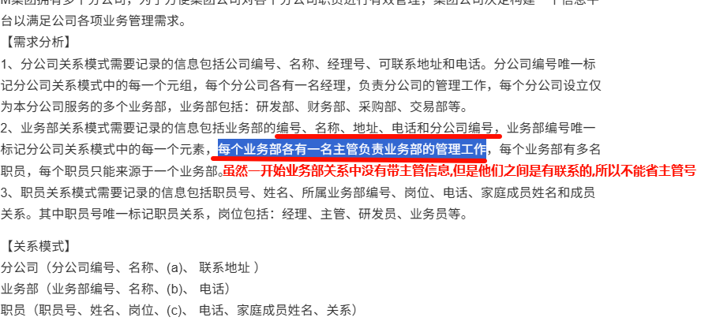

# 做题心得总结

## 结构化开发

### 给出实体名称

第一道大题找实体E1到En
实体的特点是: 主语, 名词, 找实体就是找名词

#### 结合数据流和加工来看,描述一般是, 某一个**加工**接收**XXX**的数据,举例

解析: 数据接收这个加工接收到了充电数据, 接收, 是指数据流流入, 既然接收的是**计量装置**的数据,那么E1就是**计量装置**

---

#### 向XXX发出/发送什么, XXX接收了什么, 结合子图,得到XXX就是对应的实体,举例

---

#### XXX根据什么做了什么,这里的XXX就是实体,如下

### 给出数据存储的名称

#### 关键词, **信息** / **文件** / **表** , 发现这类关键词的时候, 表示当前的存储名称以这些关键字结尾

---

#### 没有关键字出现的时候, 可以不写关键字后缀,也可以加后缀 表

---

## 数据库设计

### 不需要补全题目没要求的子实体

> [画图. 题目明确指出画出联系, 即便题干中有子实体在图中没出现. 只要所在的联系与没出现的实体没关系, 都不用补全实体](https://ebook.qicoder.com/%E8%BD%AF%E4%BB%B6%E8%AE%BE%E8%AE%A1%E5%B8%88/notes/2020%E8%BD%AF%E8%AE%BE%E4%B8%8B%E5%8D%88%E6%A1%88%E4%BE%8B%E9%A2%98.html#%E7%AC%AC-2-%E9%A2%98)

---

### 两个实体有联系, 要把单个关系的主键加入到另外一个实体中

> 特别注意这一点. 会导致扣分. 补全属性错了. 会导致第3问也一起错. 错一道就是错两道

---

