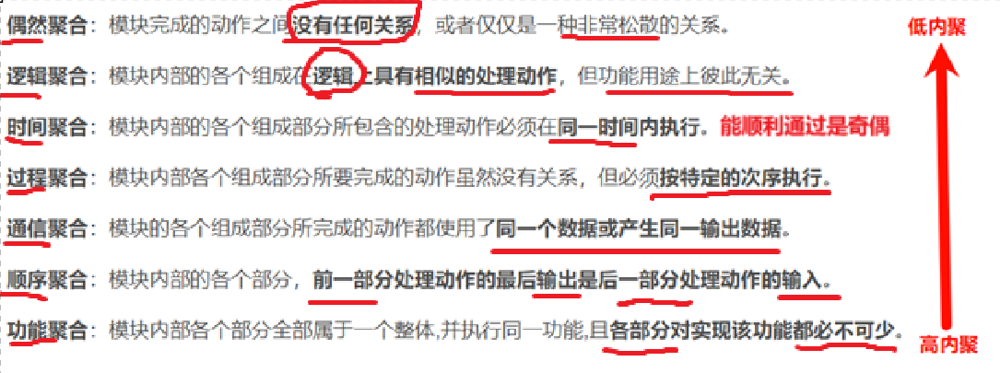
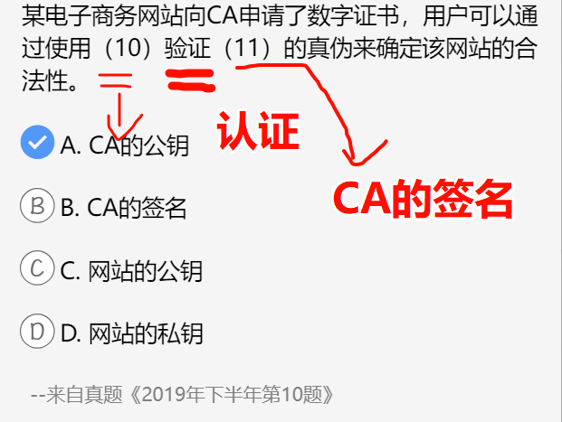
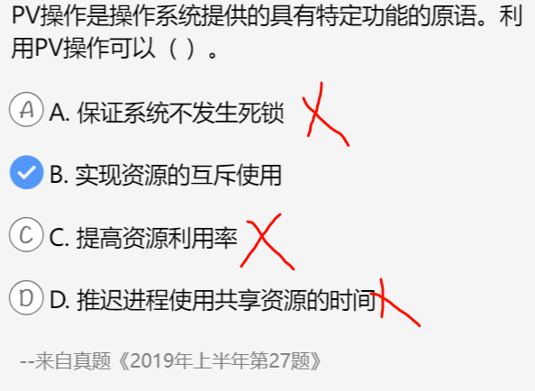
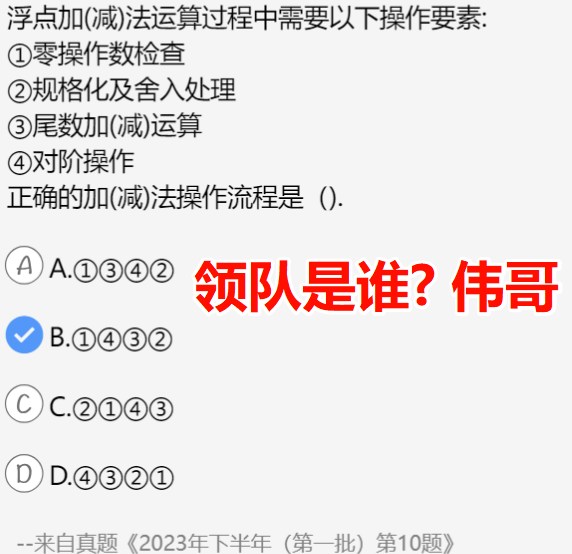
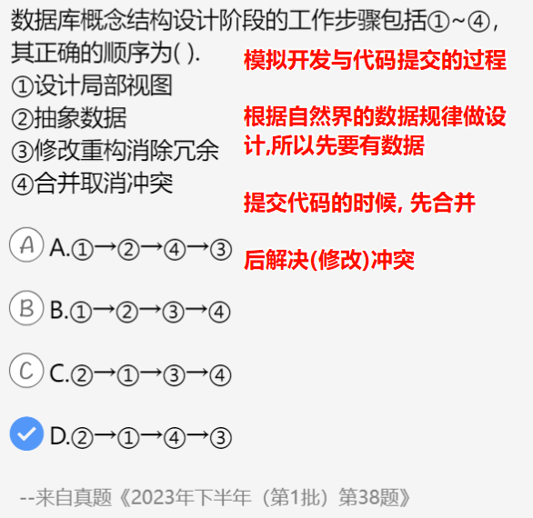
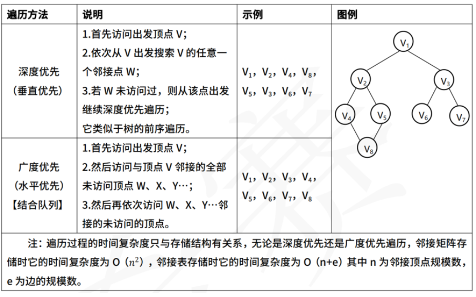
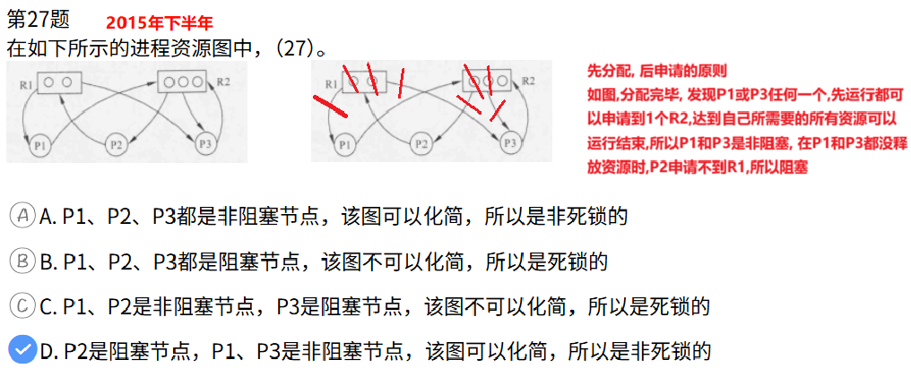

---

---

---

---

---

---

---

---

---

**吴书记控制外部公共内容**

---

---

---

---

---

---

---

---

---

---

---

---

---

---

---

---

常见的二叉树

---

---

---

---

---

---

---

---

---

---

---

---

---

---

---

---

---

进程与资源: **死锁**

---

---

---

---

---

---

---

软件工程的基本要素包括方法、工具和过程

---

---

---

---

---

---

---

---

---

---

---

---

电梯调度算法与单向扫描算法

---

---

---

---

---

---

---

---

---

0.01 = 2^-2  

n=3时,表示的最大定点小数=0.11B = (1-0.01)B = (1-2^-(3-1)),  -(3-1)次方表示是一个定点小数

---

---

---

---

---

