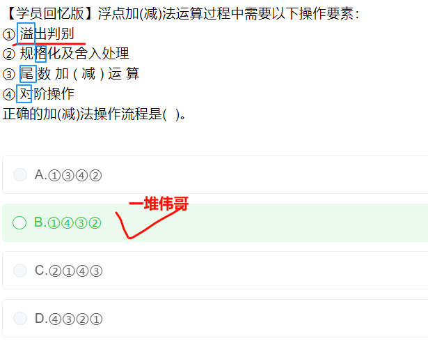

# 错题集整理-上午题

2024-9-25 17:07:29

## 链表

**解析:**

A选项，链表**每增加一个节点**，数据存储**空间随着变大**,A选项正确

B选项，链表元素由**数据域**和**指针域**组成，**指针域**用于**指向**直接**后继**的**元素的地址**，由于**链表元素不一定是连续的**，因此**整个链表的存取必须从头指针开始**,B选项错误

C选项，**插入和删除操作不需要移动元素**，指向**改变指针域的指向即可**，C选项正确

D选项，**链表不需要连续的存储空间存储**，因此**无需实现估计存储空间大小**，D选项正确

---

## 统一过程模型

**解析:**

**谐音记忆: 演进 , 精化**

**起始**阶段：起始阶段专注于**项目的初创活动**。

**精化**阶段：精化阶段**在理解了最初的领域范围之后**进行**需求分析**和**架构演进**。

**构建**阶段：构建阶段**关注系统的构建，产生实现模型**。

**移交**阶段：移交阶段关注于**软件提交**方面的工作，**产生软件增量**。

---

## 面向对象

---

## 加密算法

---

## 哈夫曼

**每个字符一开始都是叶子结点**

---

## 基于构建的开发

**基于构件的开发**是指**利用预先打包的构件**来**构造应用**系统。构件可以是**组织内部开发的构件**，也可以是**商品化成品软件构件**。基于构件的开发模型具有许多**螺旋模型的特点**，它本质上**是演化模型**，需要**以迭代方式**构建软件。其不同之处在于，基于构件的开发模型**采用预先打包的软件构件开发应用系统**

---

## 设计模块

## 数据库

---

## 算法

### 折半查找

---

## 贪心策略

**贪心算法**是指在对问题求解时，**总是** **做出**  **在当前看来是最好的选择**。

- **分数背包**即**部分背包**问题，物品**可选择部分或全部**放**进背包**，**直至装满背包**，通过贪心算法求解**可将单位价值最大的物品**  **优先 ** **放入背包**，**以实现**背包物品价值的**最大化**

- **0-1背包**指物品**整体放入**或**不放入**背包，**因此不一定能完全装满背包**，采用贪心算法可以取得**局部最优解**，但**不一定是全局最优解**；
- **旅行商**问题是指旅行商要到若干个城市旅行，**每访问一个城市后**, 都会**回到最初开始的城市**，**用贪心法不一定能求得最优解**；
- **最长公共子序列**用贪心法也**不一定能求得最优解**

---

## 白盒测试

**白盒测试**原则如下：

（1）**所有独立路径至少执行一次**

（2）取“**真**”和取“**假**”的两种**逻辑判断**至少都能执行一次

（3）每个**循环**都应在**边界**条件和**一般**条件下各执行一次

（4）测试程序**内部数据结构**的**有效性**等

---

### 判定覆盖

使程序中**每条分支**都至少执行一次

---

设计2个测试用例执行路径：

①②③④⑦⑧⑨⑩;①②③⑤⑦⑥③

或者

①②③④⑦⑥③;①②③⑤⑦⑧⑨⑩

即可满足判定覆盖。

### 语句覆盖

---

---

---

### 路径覆盖

取足够的测试用例，使得程序的**每条可能执行到的路径都至少经过一次**（如果程序中有环路，则要求**每条环路路径至少经过一次**）

如图:如图**每个判断都需要两个用例**，因此需要6个测试用例

---

---

---

---

## 黑盒测试

### 因果图鱼骨图(又名因果图、石川图)

是一种发现问题“根本原因”的分析方法，常用在项目管理中，黑盒测试也可以使用该方法

### 有效等价类

### 边界值分析

对**输入**或**输出**的**边界值**进行测试的一种黑盒测试方法

## 甘特图

---

## 重载和重写

---

## 浮点数

---

## 系统总线

**解析**

按连接部件不同，**总线**可分为：**片内总线**、**系统总线**、**通信总线**。

**片内总线**是芯片内部的总线，如**CPU内**部的总线。

**系统总线**是**CPU**、**主存**、**I/O设备各大部件**之间的信息传输线。

**通讯总线**用于**计算机系统之间或与其他系统之间**的通信。

---

---

## OSI参考模型

**解析**

1．应用层（第7层）：直接与用户和应用程序交互，提供网络服务，如HTTP、FTP等。

2．表示层（第6层）：负责数据格式的转换、压缩和加密，确保不同系统之间的兼容性。

3．会话层（第5层）：管理会话和连接，控制对话的建立、维护和终止。

4．传输层（第4层）：提供端到端的通信，确保数据完整性和顺序，如TCP和UDP。

5．网络层（第3层）：负责数据包的路由和转发，处理逻辑地址，如IP协议。

6．数据链路层（第2层）：管理物理地址和错误检测，确保数据在同一网络内的传输。7．物理层（第1层）：处理物理媒介的传输，涉及电气信号、光信号和传输介质

---

## 软件著作权

**解析**

1. **署名权不可以继承,** 看到所有权利的时候, 需要想到**署名权**
2. **学习和研究**, 可以不向软件著作权人支持报酬
3. 部分或者全部转让, 这里的“全部”通常指的是**经济权利**，例如**复制权、发行权、改编权**等，**但不包括署名权**。**署名权始终属于原作者，不能转让**

---

## 敏捷开发

**解析**

**极限编程**: **测试先行**,计划赶不上变化

**水晶法**: 项目规模,重要性

**并列争球法**: 30天作为一个**冲刺**

**自适应ASD**: 复杂自适用, **提高组织的自适用能力**

---

## UML

### 序列图

**特征**

1. **有垂直生命线**
2. **有水平消息箭头**.强调消息传递的**时间顺序**

---

### 用例图

#### **特征**

1. **椭圆形**的**用例框**

#### 概念

系统在它的**周边环境**的语境中所提供的**外部**可见服务

### 类图

### 协作图

#### **特征**

1. 对象之间的**链接线**，**标注消息序号**，强调对象关系

#### 概念

### 状态图

#### **特征**

1. **圆角矩形**

箭头表示状态之间的转移，突出状态变化

#### 概念

### 活动图

#### **特征**

**开始**和**结束**用**圆形**表示，**活动用矩形表示**，控制流用**箭头**连接

#### 概念

系统内从一个活动到另一个活动的流程

### 组件图

#### 特征

#### 概念

### 部署图

#### 特征

#### 概念

### 对象图

#### 特征

#### 概念

展示某一时刻一组对象以及它们之间的关系

---

## 设计模式

### 命令模式

将一个请求封装为对象，从而可以用不同的请求对客户进行参数化

### 观察者模式

当一个对象的状态发生改变时，依赖于它的对象都得到通知并被自动更新

### 状态模式

允许一个对象在其内部状态改变时改变它的行为

### 策略模式

定义一系列的算法，把它们一个个封装起来，并且使它们可以相互替换

举例: 要求能**根据**季节，节假日等推出**不同的**旅行定价包，如淡季打折、一口价等

---

## 入侵防御系统

## 认证方式安全性

---

## CA

---

---

## 软件可维护性

---

## 虚拟存储

---

---

---

---
## SSL

---

## 管道过滤器

## Python

1. 没有内置的switch...case语句
2. 

## 页式存储

---

## CPI 与 MIPS

---

## 活动图计算题

---

---

---

---

---

---

---

---

## 加工

---

### 项目管理

## 风险管理

---

---

## 软件设计

---

## 软件测试

---

---

## 系统可维护性

---

---

